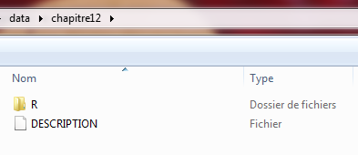
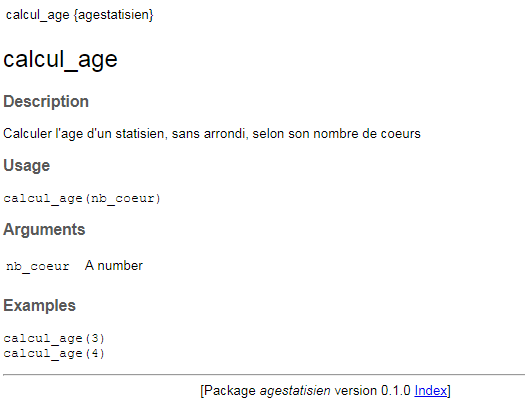
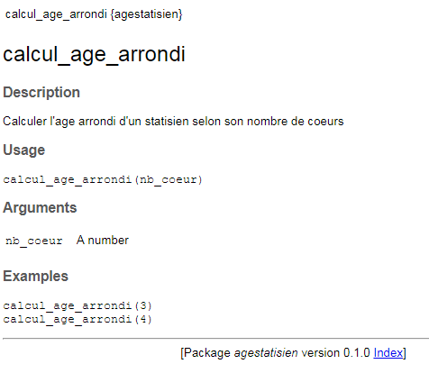
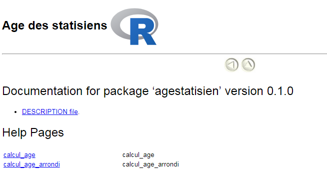

```{r setup, include=FALSE}
library(rio)
file.copy(from = system.file(package = "funcampR","data","chapitre12/DESCRIPTION"),
         to = "DESCRIPTION")
file.copy(from = system.file(package = "funcampR","data","chapitre12/R/sortilege_age.R"),
          to = "sortilege_age.R")

```


```{r, echo=FALSE, results='hide', message=FALSE}
description <- paste0(readLines("DESCRIPTION"), collapse = "\n")
pgm <- paste0(readLines("sortilege_age.R"), collapse = "\n")
```


## Pour ne pas se noyer dans un océan magique


En accompagnant icaRius dans son épopée, vous avez accompli d'incroyables progrès sur les terres runiques : vous voici désormais capable d'utiliser les sortilèges du grimoire IgoR, et même, de créer vos propres sortilèges ! Mais attention à ne pas vous noyer dans l'immensité de cette magie ! 

Quant à icaRius, le voilà bien embêté : il lui faut traverser un lac pour rejoindre une île. Mais il  ne sait pas encore nager : impossible pour lui de traverser l'étendue d'eau qui bloque son chemin. Le Mage FebeleR est là pour aider icaRius et lui apprendre, en accéléré, à traverser le lac. Pour cela, il doit s'approprier un nouveau sortilège, le sortilège `palme()`. Mais il n'a pas le mode d'emploi ! 

Catastrophe ! Pourtant, c'est bien connu de tous les statisiens : pour qu'un sortilège puisse être utilisé dans les règles de l'art, il faut écrire son mode d'emploi.  Autrement dit, expliquer ce que fait le sortilège, renseigner les ingrédients nécessaires et préciser ce que l'on obtient pour que chacun puisse utiliser ce sortilège (sans jouer au savant fou). Les paragraphes suivants vous présentent les arcanes de cet art ô combien vénéré des statisiens : l'art de documenter son sortilège.

C'est ce qui vous permettra de répondre à la question du Mage FebeleR : "quel est le mot magique qui permet de documenter les sortilèges, et d'apprendre à s'en servir ?". 


## Une grammaire pour décrire

Pour cela, la langue des runes prévoit une grammaire particulière, que le statisien se doit de respecter. Vous avez déjà connaissance du caractère `#` qui permet d'écrire des commentaires en complément du code R. Par exemple :

```{r}
# Ceci est un commentaire avant une ligne de code R
nb_coeur <- 3
```

Pour documenter un sortilège, la langue des Runes a recours à une forme complémentaire de commentaires, qui commence cette fois par les deux caractères accolés `#'`  (dièse et apostrophe). Puis des notions clés peuvent être rédigées, par une liste prédéfinie de termes qui commencent toujours par `@`, selon le formalisme `@notion_a_documenter`. Par exemple, pour documenter le titre d'un sortilège, le statisien utilisera @title:

```{r}
#' @title mon_super_sortilege
mon_super_sortilege <- function(n,p) { 
n^p
}
```

Ici, le sortilège `mon_super_sortilege()`, qui permet de calculer la puissance p du nombre n qui lui est donné en entrée, est documenté sur la toute première ligne en précisant son titre via `#' @title mon_super_sortilege`.

Bon, pas très utile à ce stade, vous en conviendrez... Continuons, en apportant une description littérale du sortilège avec @description :

```{r}
#' @title mon_super_sortilege
#' @description sortilège pour porter un nombre n à la puissance p
mon_super_sortilege <- function(n,p) { 
n^p
}
```

Voilà qui permet déjà à un lecteur de mieux comprendre ce que le sortilège permet de faire... Continuons, en précisant les ingrédients du sortilège. Un ingrédient se trouve décrit par le terme @param (pour faire référence à la notion de **param**ètre). Il faut une ligne distincte pour chaque ingrédient d'un sortilège.

```{r}
#' @titre mon_super_sortilege
#' @description sortilège pour porter un nombre n à la puissance p
#' @param n Un nombre
#' @param p Un nombre
mon_super_sortilege <- function(n,p) { 
n^p
}
```

Dans cet exemple, les deux ingrédients n et p sont documentés, en précisant que n comme p doivent être des nombres. Voilà qui permet d'éviter d'utiliser le sortilège avec un ingrédient incompatible, comme du texte, ce qui produirait une erreur. Par exemple

```{r, eval=FALSE}
# Un sortilège qui n'est pas documenté...
mon_super_sortilege <- function(n,p) { 
n^p
}
#... se trouve mal utilisé
mon_super_sortilege(2,"toto")
```

Il peut être utile aussi de donner des exemples d'utilisation du sortilège, avec le terme @examples - l'occasion de laisser libre cours à sa créativité ! Il suffit d'écrire une seule fois @examples puis de le faire suivre de plusieurs exemples (idéalement, 2 ou 3 cas d'usage)

```{r}
#' @titre mon_super_sortilege
#' @description sortilège pour porter un nombre n à la puissance p
#' @param n Un nombre
#' @param p Un nombre
#' @examples
#' mon_super_sortilege(2,3)
#' mon_super_sortilege(10,2)
mon_super_sortilege <- function(n,p) { 
n^p
}
```

## Un peu de pratique

Au fait, c'est l'occasion de documenter les sortilèges écrits par vos soins pour calculer l'âge d'icaRius. Commençons par la version simplifiée, sans calcul de l'arrondi, avec `calcul_age()` :

```{r}
calcul_age <- function(nb_coeur) { 
  nb_coeur * pi^2 - 2 * nb_coeur
}
```

A vous de documenter ce sortilège. Dans la fenêtre ci-dessous, vous pouvez écrire librement, sans crainte aucune de commettre une erreur (rien ne sera exécuté par R).

```{r, echo=FALSE}
library(shiny)
library(shinyAce)

init <- "# Compléter ci-dessous la documentation
#' @title ???
#' @description ???
#' @param ???
#' @examples
#' ???
#' ???
calcul_age <- function(nb_coeur) { 
  nb_coeur * pi^2 - 2 * nb_coeur
}
"

shinyApp(

ui = fluidPage(
    fluidRow(
      column(
        12,
        aceEditor("code", mode = "r", height = "200px", value = init)
      )
    )
  ),

  server = function(input, output, session) {

    },

  options = list(height = 250)
)
```

Vous avez terminé ? Votre documentation devrait ressembler peu ou prou à ce qui figure ci-dessous. 

><details><summary><font size="3">Pour afficher la solution, cliquez ici</font></summary>
><p><font size="2">
>
>
>```{r}
>#' @title calcul_age
>#' @description Calculer l'âge d'un statisien, sans arrondi, selon son nombre de coeurs
>#' @param nb_coeur Un nombre
>#' @examples
>#' calcul_age(3)
>#' calcul_age(4)
>calcul_age <- function(nb_coeur) { 
>  nb_coeur * pi^2 - 2 * nb_coeur
>}
>```

Continuons désormais notre documentation avec le sortilège `calcul_age_arrondi()`. Nous allons dans ce cas utiliser l'écriture du sortilège qui comprend l'usage du pipe `%>%`, soit :

```{r, eval=FALSE}
calcul_age_arrondi <- function(nb_coeur){
  calcul_age(nb_coeur)
    %>% round()
}
```

Souvenez-vous : le pipe `%>%` est un symbole apporté par l'ensemble de sortilèges appelé `tidyverse` (voir chapitres 4 et 8). Dans la documentation, il faut préciser ce lien entre notre sortilège et les autres ressources dont il dépend. Pour cela, nous vous invitons à utiliser le terme @import suivi du nom du package concerné. Dans le cas d'espèce, nous ajouterons donc la ligne :

```{r, eval=FALSE}
#' @import tidyverse
```

Notre documentation devient :
```{r, eval=FALSE}
#' @title calcul_age_arrondi
#' @description calculer l'âge arrondi d'un statisien selon son nombre de coeurs
#' @param nb_coeur Un nombre
#' @import tidyverse
#' @examples
#' calcul_age_arrondi(3)
#' calcul_age_arrondi(4)
calcul_age_arrondi <- function(nb_coeur){
  calcul_age(nb_coeur)
    %>% round()
}
```


## Assemblez la documentation de vos sortilèges

La rédaction de cette documentation peut vous sembler fastidieuse, et d'un intérêt limité. Certes, pour des sortilèges élémentaires, le statisien pourrait appréhender, à la seule lecture du code, ce dont il retourne - mais pour des sortilèges plus complexes, une documentation est incontournable pour éviter des erreurs. 

L'usage systématique des conventions de documentation vous aidera grandement dans la suite de votre apprentissage de la langue des Runes, mais aussi dans l'organisation de vos travaux statistiques (ou magiques). Car la documentation des sortilèges est le tout premier pas pour rédiger votre propre grimoire !

Souvenez-vous du chapitre 8, "la plume d'IgoR" : *Ajouter une extension à R, c'est comme ajouter un nouveau chapitre dans votre grimoire IGoR. Et ce chapitre comprend plusieurs sortilèges, c'est-à-dire des `fonctions` complémentaires, qui vous simplifieront la vie dans votre quête statistique.* 

Jusqu'alors, vous avez appris à utiliser les pouvoirs magiques des autres en ouvrant les chapitres qu'ils ont écrits (en installant des packages). En documentant chacune de vos fonctions, vous débutez vous-mêmes l'écriture d'un nouveau "chapitre", c'est-à-dire d'un package dont vous serez l'auteur ! Ce dernier peut servir à réunir vos traitements statistiques, vos sortilèges et la documentation qui l'accompagne. Libre à vous ensuite de garder ce chapitre pour votre strict usage personnel, ou le partager avec d'autres collègues.

Découvrons ensemble comment organiser les ressources magiques à cet effet. 

Si vous participez au Funcamp-R en présentiel, vous trouverez sur votre clef USB nommée FUNCAMP, un ensemble d'éléments ont été regroupés dans le répertoire `\data\chapitre12`. A l'intérieur, un répertoire sobrement intitulé R et un fichier nommé DESCRIPTION. 



Si vous suivez le funcamp en ligne, ces mêmes ressources ont été préchargées en ligne. Ainsi, votre console R pourra lire les programmes et enregistrer les modifications directement.

Vous l'avez deviné, le répertoire R servira à stocker les programmes R écrits en langue des runes. Le fichier sortileges_age.R a été chargé ci-dessous. Vous voyez apparaître nos sortilèges... mais vous constaterez que la documentation est incomplète. Damned ! A vous de réparer cet impair. Vous pouvez éditer "en ligne" le programme et le sauvegarder également en ligne. Puis, une fois l'opération achevée, téléchargez le fichier modifié pour le garder sur votre poste de travail.


```{r, echo=FALSE, warning=F}
library(shiny)
library(shinyAce)
library(readr)

init <- "#' @title ???
#' @description ???
#' @param ???
#' @examples
#' ???
#' ???
calcul_age <- function(nb_coeur) { 
 nb_coeur * pi^2 - 2 * nb_coeur
}

#' @title ???
#' @description ???
#' @param ???
#' @import ???
#' @examples
#' ???
#' ???
calcul_age_arrondi <- function(nb_coeur) { 
 calcul_age(nb_coeur)
   %>% round()
}
"

shinyApp(

ui = fluidPage(
    fluidRow(
      column(
        12,
        aceEditor("code", mode = "r", height = "300px", value = init),
        actionButton("eval", "Sauvegarder en ligne le programme"),
        actionButton("load", "Recharger en ligne le programme"),
        actionButton("reset", "Reprendre à zéro")
      )
    ),
    fluidRow(
      column(
        12,
        downloadButton('download_edited_pgm',"Télécharger le programme modifié")
      )
    )
  ),

  server = function(input, output, session) {

    dir.create("chapitre12")
    dir.create("chapitre12/R")
    file.create("chapitre12/DESCRIPTION")
    file.create("chapitre12/R/sortilege_age.R")  
    
    fileConn<-file("chapitre12/DESCRIPTION")
    writeLines(description, fileConn)
    close(fileConn)

    fileConn<-file("chapitre12/R/sortilege_age.R")
    writeLines(pgm, fileConn)
    close(fileConn)
      
    output$download_edited_pgm <- downloadHandler(
      filename = function(){
        paste("sortilege_age-", Sys.Date(), ".R", sep = "")
      },
      content = function(file) {
        writeLines(isolate(input$code), file)
      }
    )
  
    observeEvent(input$eval,{
      
        fileConn<-file("chapitre12/R/sortilege_age.R")
        writeLines(isolate(input$code), fileConn)
        close(fileConn)
    })
  
    observeEvent(input$load,{
        
        reload <- paste0(readLines("chapitre12/R/sortilege_age.R"), collapse = "\n")
        updateAceEditor(session, editorId = "code", value = reload)  
  
    })
      
    observeEvent(input$reset,{
        updateAceEditor(session, editorId = "code", value = init)    
    })
    
  },

  options = list(height = 400)
)
```

Vous avez terminé ? Votre documentation devrait ressembler peu ou prou à ce qui figure ci-dessous. Si ce n'est pas le cas, corrigez la rédaction et cliquez de nouveau sur "enregistrer"

><details><summary><font size="3">Pour afficher la solution, cliquez ici</font></summary>
><p><font size="2">
>
>
>```{r}
>#' @title calcul_age
>#' @description Calculer l'âge d'un statisien, sans arrondi, selon son nombre de coeurs
>#' @param nb_coeur A number
>#' @examples
>#' calcul_age(3)
>#' calcul_age(4)
>calcul_age <- function(nb_coeur) { 
>  nb_coeur * pi^2 - 2 * nb_coeur
>}

>#' @title calcul_age_arrondi
>#' @description Calculer l'âge arrondi d'un statisien selon son nombre de coeurs
>#' @param nb_coeur A number
>#' @import tidyverse
>#' @examples
>#' calcul_age_arrondi(3)
>#' calcul_age_arrondi(4)
calcul_age_arrondi <- function(nb_coeur) { 
 calcul_age(nb_coeur) %>% round()
>}
>```


## Prenons un bol d'R

Voilà, vous avez modifié votre programme R. Nous allons maintenant "produire" la documentation, pour qu'elle puisse être lue plus facilement par les utilisateurs de vos sortilèges. Pour cela, nous allons utiliser l'ensemble magique `roxygen2`, qui automatise la création de documentation.

Il faut d'abord installer le package correspondant, puis le charger :

```{r, eval=FALSE}
install.packages("roxygen2")
library(roxygen2)
```

Puis nous allons utiliser le sortilège `roxygenize()`, qui va apporter un peu d'oxygène documentaire à notre langue des runes ;-). Le sortilège a besoin d'un seul ingrédient : le chemin vers le répertoire où se trouve nos ressources statistiques. Ici, c'est le chemin vers le répertoire qui contient le fichier DESCRIPTION, qui sert de balise pour organiser ces ressources. Si vous suivez le funcamp en présentiel, la clef USB qui vous a été confiée contient ainsi les ressources dans un chemin du type `E:/data/chapitre12` ou `F:/data/chapitre12`.

```{r, eval=FALSE}
# Si votre clef USB FUNCAMP figure sur la lettre E:
roxygenize("E:/data/chapitre12")
```

Si vous suivez ce tutoriel en ligne, vous pouvez toutefois appliquer le sortilège directement sur les ressources "en mémoire"

```{r, eval=FALSE}
# Si sous utilisez une version en ligne du tutoriel
roxygenize("chapitre12")
```

A vous de jouer !

```{r, echo=FALSE, warning=F}
library(shiny)
library(shinyAce)
library(utils)

init2 <- "# Chargez le package roxygen2

# Lancez la construction de la documentation en indiquant le chemin

# Appuyez sur le bouton pour générer la documentation
"

shinyApp(

ui = fluidPage(
    fluidRow(
      column(
        12,
        aceEditor("code", mode = "r", height = "150px", value = init2),
        actionButton("eval", "Générer la documentation")
      )
    ),
    fluidRow(
      column(
        12,
        downloadButton('download_ressources',"Télécharger l'ensemble des ressources produites")
      )
    ),
    fluidRow(
      column(
        12,
        verbatimTextOutput("output")
      )
    )
  ),

  server = function(input, output, session) {

    output$download_ressources <- downloadHandler(
      filename = function(){
        paste("chapitre12-", Sys.Date(), ".zip", sep = "")
      },
      content = function(file) {
        zip("chapitre12.zip","chapitre12")
        file.copy("chapitre12.zip",file)
      },
      contentType = "application/zip"
    )
    
    output$output <- renderPrint({
      input$eval
      eval(parse(text = isolate(input$code)))    
    })
  
  },

  options = list(height = 300)
)
```


Une fois lancé le sortilège `roxygenize()`, vous devriez voir apparaître quelques lignes :

```{xml}
Writing NAMESPACE
Writing calcul_age.Rd
Writing calcul_age_arrondi.Rd
```

De nouveaux fichiers ont été créés. Le fichier NAMESPACE va garder la trace des packages que le statisien doit maîtriser en amont pour pouvoir utiliser vos sortilèges. Ici par exemple, il y a un package nécessaire, à savoir `tidyverse`, puisque nous avons utilisé le symbole du pipe `%>%`dans le sortilège `calcul_age_arrondi()`. Le contenu de ce fichier est très sommaire : 

```{xml}
# Generated by roxygen2: do not edit by hand
import(tidyverse)
```

Dans le répertoire "chapitre12" où se trouvent les ressources pour vos sortilèges, un nouveau sous-répertoire apparaît, intitulé **man** : il sert à héberger, grâce aux conventions de documentation que vous venez d'apprendre, le **man**uel d'utilisation de vos sortilèges. 


C'est dans ce répertoire **man** qu'ont été placés les nouveaux fichiers nommés `calcul_age.Rd` et `calcul_age_arrondi.Rd`. Nous n'allons pas chercher à les ouvrir, mais sachez qu'ils permettent au statisien de lire votre documentation, sortilège par sortilège, dans une mise en page plus agréable, sans les sibyllines inscriptions comme `#' @title` ou d'autres hiéroglyphes. A l'issue de votre aventure icaRius, vous découvrirez comment des logiciels d'aide au développement en R comme Rstudio permettent de feuilleter cette documentation, sous la forme suivante :






Il nous reste enfin à compléter la courte fiche signalétique qui regroupe toutes vos ressources magiques : le fichier `DESCRIPTION`. Là encore, nous ne chercherons pas l'éditer ensemble. Mais voici un exemple de contenu, illustrant le type d'informations qu'il est intéressant de donner :

```{txt}
Package: nomdupackage
Type: Package
Title: Le titre de votre package
Version: 0.1.0
Author: auteur de votre package
Maintainer: Celui qui va maintenir le package <toto@email.com>
Description: Description un peu plus complète du contenu du package
    Attention à utiliser quatre "espace" pour toute ligne supplémentaire
```

Par exemple :

```{txt}
Package: agestatisiens
Type: Package
Title: Age des statisiens
Version: 0.1.0
Author: Mage RegoR
Maintainer: automate TeoC <teoc@statis.st>
Description: Deux sortilèges permettent de calculer l âge des statisiens,
    avec ou sans prendre en compte un arrondi. Le calcul dépend du nombre de coeurs.
```

A la toute fin, l'utilisateur (vous-même, un de vos collègues ou, qui sait, un statisien), pourra ensuite parcourir vos sortilèges depuis cette page de garde :




## La solution de l'énigme ?

Bravo, vous êtes parvenu(e) à l'issue de ce chapitre documentaires ! Vous êtes maintenant capable de nager dans l'océan documentaire des sortilèges runiques. Mais qu'en est-il du jeune icaRius, qui doit traverser le lac ? Il vous reste à répondre à la question posée par le Mage FebeleR : quel est le nom du package qui permet de gérer facilement la documentation de ses sortilèges ? Une histoire d'oxygène, semble-t-il... Vous avez trouvé ? Renseignez la réponse (en minuscule) dans le jeu icaRius pour continuer la partie.


**Fin du module 12  >>  reprenez la partie d'Icarius**

*Version 0.9.1.1*
