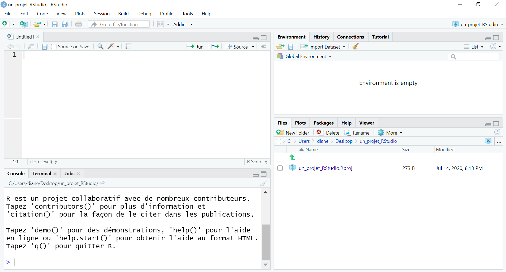
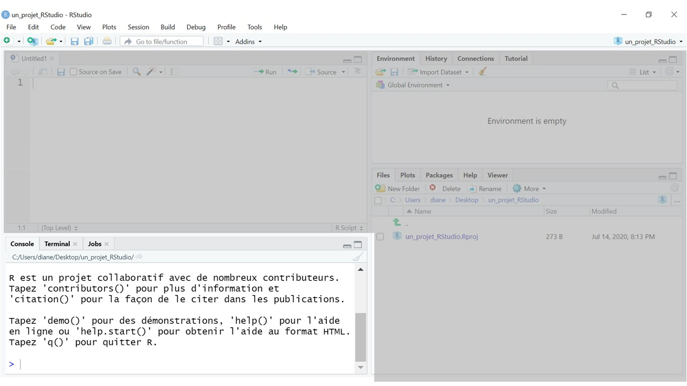
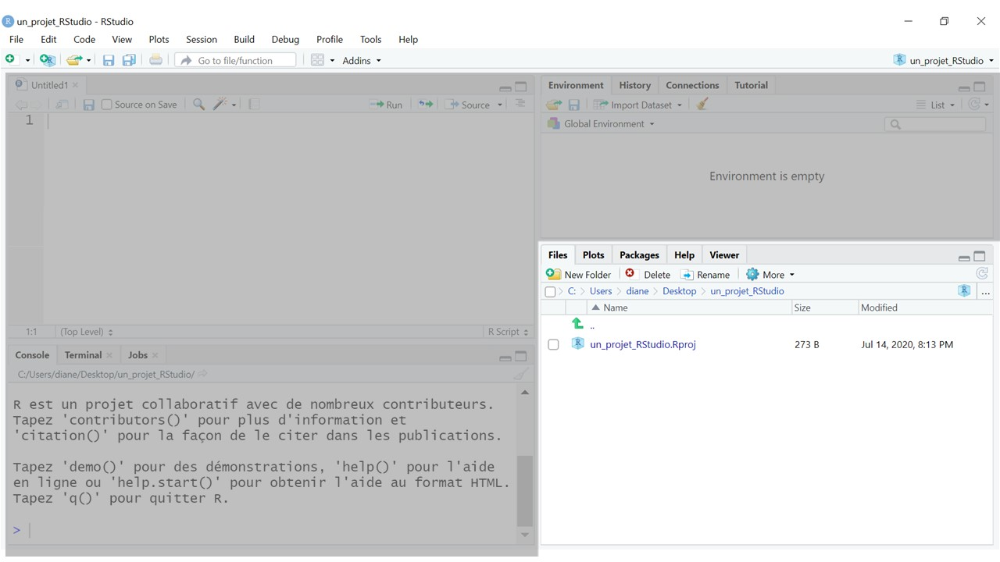
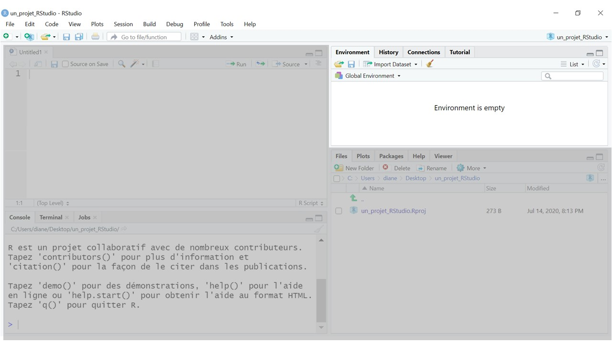
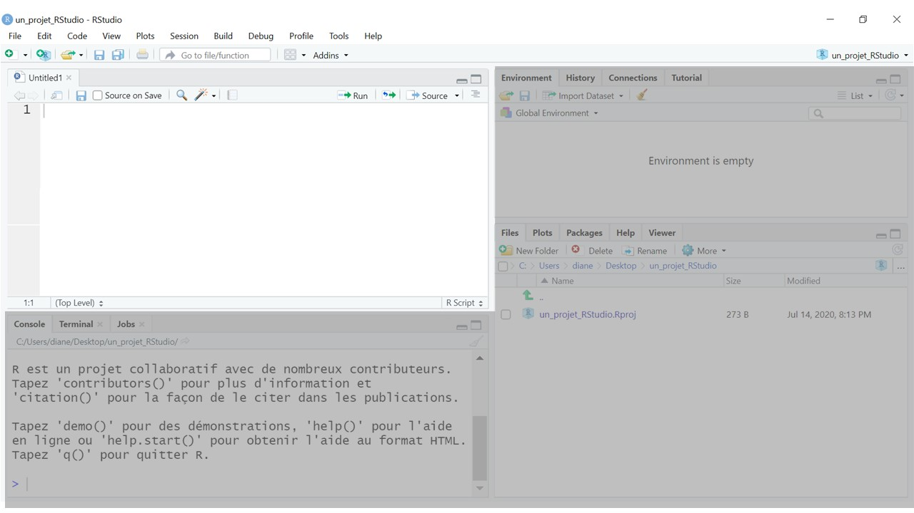
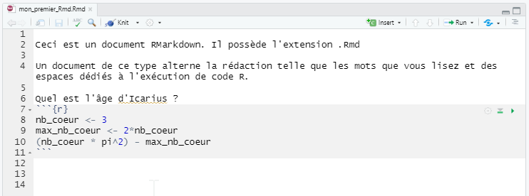
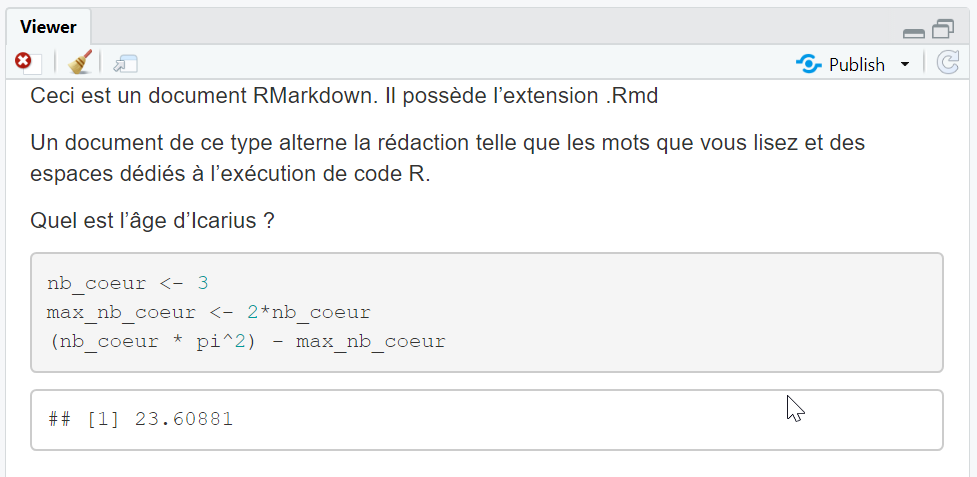

```{r setup, include=FALSE}
library(learnr)
library(knitr)
```


## Mes(-)aventures ? 

Votre aventure touche à sa fin, vous voilà en possession des 6 runes, votre fidèle épée, un bouclier, une fiole d'immonde jus de mandragore, la clé de la cave à ambroisie, une plume du tidyverse, un boomerang, une paire de palme et...ce bon vieux grimoire IgoR. 

Le grimoire ? Mince, le grimoire ! Quelle n'est pas votre surprise quand vous découvrez que votre immersion dans le datalake a ruiné ses pages.
Tous vos précieux apprentissages dilués, presque illisibles !

## Migration vers des outils modernes

Depuis vos mésaventures avec Teoc vous savez maintenant écrire votre propre sortilège et le documenter consciencieusement, et votre mémoire est encore fraîche. Vous décidez de vous équiper non plus d'un livre mais d'une tablette magique, bien plus moderne et surtout, à toute épreuve pour consigner vos savoirs-faire.

Au déverrouillage de l'appareil, vous découvrez que cet outil est plus complexe à utiliser que votre bon vieux grimoire ! Et pour cause, voici ce que vous découvrez : 

```{r echo=FALSE}

```

Quelle est donc cette magie noire ?! Encore un coup de Sassos ? Vous qui vous attendiez à simplement scripter vos sortilèges avec votre plume du tidyverse vous voici bien dépourvu(e)...

Par chance le mode d'emploi est fourni et ce dernier vous apprend qu'il s'agit là du logiciel de traitement de texte des mages, celui-là même qui leur sert à produire les écrits des grimoires tels qu'IgoR.

En poursuivant votre lecture, vous apprenez que plus qu'un traitement de texte vous avez sous les yeux un EDI : **Environnement de Développement Intégré**. C'est à dire un *"ensemble d'outils et de procédés destinés à assister et formaliser le travail de création de logiciels"* selon Statispedia. Il porte le nom de RStudio et comme R, c'est un logiciel open source. 
Vu l'âge avancé des mages, vous n'êtes pas étonné(e) qu'ils doivent être assistés pour la rédaction de leurs sortilèges... Mais voyons plutôt comment. 

## Le tour du propriétaire

Commençons par la console, cet espace vous est familier, c'était le lieu privilégié pour la pratique du langage des Runes dans le grimoire : c'est à cet endroit que nous pouvons mesurer les effets des sortilèges lancés


```{r  echo=FALSE}

```

À la droite de cet encart, on trouve un panneau qui contient un explorateur de fichier et d'autres onglets utiles tels que l'affichage des graphiques, la liste des packages installés, la fenêtre d'aide et même un navigateur web (Viewer). 

```{r  echo=FALSE}

```

Dans la partie supérieure on trouve un onglet environnement (ici vide) qui expose et détaille en temps réel les objets créés et assignés grâce à l'opérateur `<-`

```{r  echo=FALSE}

```

Et enfin, un dernier quart de page est dédié à l'écriture à proprement parler des sortilèges : 
```{r  echo=FALSE}

```


## Intégré et reproductible

La dimension "intégrée" de l'outil prend son sens : tout est à portée de main pour parler le langage des Runes. Notez que cet environnement est personnalisable à l'envi et vous pouvez donc vous saisir des "poignées" pour réajuster la taille des fenêtres comme bon vous semble.

Pour consigner vos apprentissages, vous allez donc écrire dans le panneau dit "Source" le grand récit des aventures passées.

Et comme pour le grimoire IgoR, pour consigner la mémoire des choses, nous allons alterner la prise de note et les lieux où invoquer les sortilèges. Pour ce faire nous écrirons dans le panneau source un document un peu particulier : un Rmarkdown. 

- _R_ parce que nous souhaitons faire s'exécuter du R dans le document

- _Markdown_ pour pouvoir formater le texte comme dans un traitement de texte

Un document RMarkdown est donc un entrelacs de lieux où taper du texte et de lieux où taper du code. Ces derniers sont matérialisés par une zone grisée dans votre tablette RStudio : 

```{r  echo=FALSE}

```

Ces zones grisées d'exécution de R commencent par des symboles ``` (ce sont des accents graves ou backticks en anglais) et se terminent par cette même série de symboles. Il est préférable de ne pas toucher ces lignes au risque de détraquer le document. Les lignes de code sont à taper entre ces deux lignes. 

L'intérêt de mélanger le texte et le code c'est qu'il nous est maintenant possible de produire des documents qui réalisent les calculs et les graphiques... et les mettent à jour si les données changent ! Le rapport produit - on dit "compilé"- est alors est au format html, c'est-à-dire qu'il s'ouvre dans un navigateur web. Dans RStudio, on le trouvera dans l'onglet "Viewer" (visualiseur en anglais) : 

```{r  echo=FALSE}

```

Où se trouve le fichier des résultats ? Le fichier `html` compilé juxtapose le `.Rmd` dans l'onglet File

## Quizz

```{r question, echo=FALSE}
question("A quoi sert l' EDI RStudio ?",
type="single",
allow_retry = TRUE,
incorrect="Retente ta chance",
answer("à protéger les livres de la noyade"),
answer("à assister les utilisateurs de R à scripter", correct = TRUE),
answer("à saisir les résultats d'une enquête téléphonique"),
correct="Félicitations, il s'agit bien de rendre conviviale l'utilisation de R"
)

``` 


```{r question2, echo=FALSE}
question("A quoi sert un Rmd ?",
type="single",
allow_retry = TRUE,
incorrect="Retente ta chance",
answer("à publier des rapports où les calculs et graphiques sont réalisés par R"),
answer("à reproduire des résultats"),
answer("à cesser les copier/coller entre le logiciel qui traite les données et celui qui traite le texte"),
answer("toutes les réponses ci-dessus", correct = TRUE),
correct="Félicitations, c'est tout à fait ça et maintenant...à vous de jouer"
)

``` 

Nous pourrions aussi imaginer produire des documents tels que des `.odt` mais déjà votre mémoire se brouille, il vous faut vite consigner vos mémoires épiques. 


C'est parti !  Vous allez maintenant ouvrir une autre partie de ce chapitre 13, avec le service intitulé "Grimoire - Neverending" dans votre panneau comportant tous les tutoriels du FuncampR. Vous pourrez alors accéder à RStudio, pour éditer votre grimoire. 


**Fin de la première partie du chapitre 13  >>  lancez la partie "Grimoire - Neverending" qui vous permettra d'ouvrir un RStudio et d'éditer votre grimoire (partie 2 du chapitre 13)**

*Version 0.9.2*

