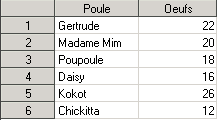
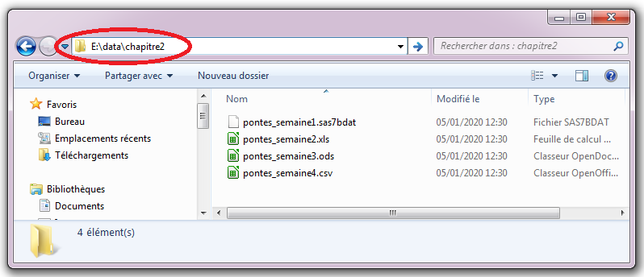
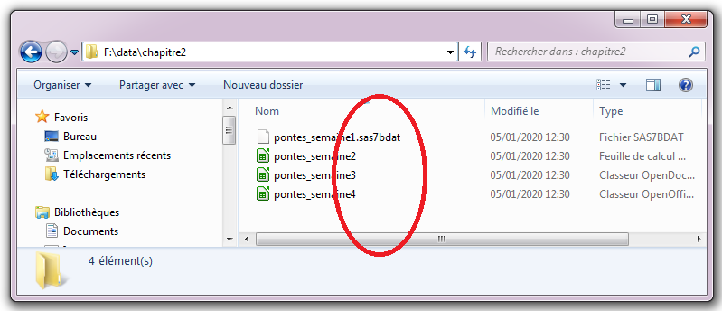
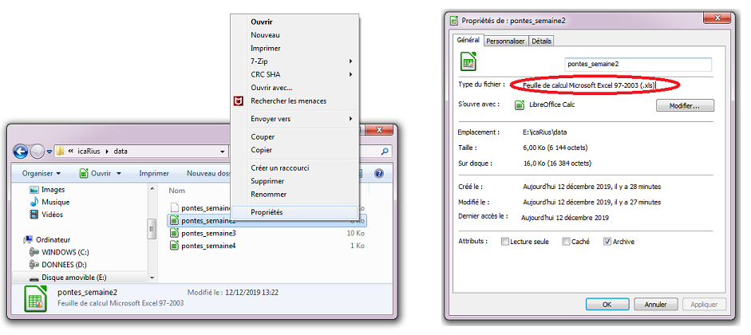
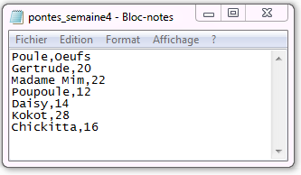

```{r setup, include=FALSE}
library(rio)
library(learnr)
library(knitr)
knitr::opts_chunk$set(echo = TRUE)

dir.create(paste0(tempdir(),"/data"))
dir.create(paste0(tempdir(),"/data/chapitre2"))

file.copy(from = system.file(package = "funcampR","data","chapitre2/pontes_semaine1.sas7bdat"),
          to = paste0(tempdir(),"/data/chapitre2/pontes_semaine1.sas7bdat"))
file.copy(from = system.file(package = "funcampR","data","chapitre2/pontes_semaine2.xls"),
          to = paste0(tempdir(),"/data/chapitre2/pontes_semaine2.xls"))
file.copy(from = system.file(package = "funcampR","data","chapitre2/pontes_semaine3.ods"),
          to = paste0(tempdir(),"/data/chapitre2/pontes_semaine3.ods"))
file.copy(from = system.file(package = "funcampR","data","chapitre2/pontes_semaine4.csv"),
          to = paste0(tempdir(),"/data/chapitre2/pontes_semaine4.csv"))
          
```

Vous venez de rencontrer la fermière du village Kokoro, désespérée d'avoir perdu le livre de compte où, chaque jour, elle note consciencieusement le nombre de pontes. 

Aidons IcaRius à reconstituer le livre de compte. Ce dernier n'est pas tout à fait perdu : il en reste une copie, éclatée dans plusieurs fragments par le redoutable sorcier SaSSoS ! Pour  corser le tout, chaque fragment a été ensorcelé et semble indéchiffrable... Ils sont en effet chacun dans d'étranges formats : SAS, Excel, Calc...

**Aie aie aie.**

## Un Sasseur sait bien sasser... sur R ?

Commençons par le fragment ensorcelé sous le format SAS - qui rappellera peut-être quelques souvenirs aux aventuriers les plus aguerris. Nous allons donc apprendre, en R, à lire un fichier SAS. 

Le contenu de ce fichier - que seul le terrible SaSSoS est normalement capable de lire, est le suivant :



Pour charger un fichier, nous allons utiliser un sortilège prévu à cet effet dans R. Dans le monde des Runes, un sortilège est identifié par **son nom suivi de parenthèses** :`nomsortilege()`. Nous en parlerons davantage dans un prochain chapitre. 

Pour lors, nous allons découvrir un premier sortilège, dénommé `import()`, qui permet, comme son nom l'indique, d'importer (*import*) un fichier dans R. Pour utiliser `import()`, il y a un ingrédient à préciser : l’emplacement du fichier à lire.

```{r, collapse = TRUE, eval=FALSE}
# J'importe le fichier
import("chemin_du_fichier")
```

Pour s'y retrouver, autant tout de suite ranger ce que l'on est en train d'importer dans R. Pour cela, on assigne à un nouvel objet le contenu du fichier importé, en choisissant astucieusementle nom de cet objet. Par exemple, appelons `livre_compte_1` ce qui sera importé dans R en lisant le fichier SAS. 

```{r, collapse = TRUE, eval=FALSE}
# J'importe le fichier et je l'assigne à l'objet livre_compte_1
livre_compte_1 <- import("chemin_du_fichier")
```
De cette façon, en appelant l'objet `livre_compte_1` dans la console R, il est aisé d'en consulter le contenu. En l'occurence :

```{r, echo=FALSE}
livre_compte_1 <- import(paste0(tempdir(),"/data/chapitre2/pontes_semaine1.sas7bdat"))
```

```{r, collapse = FALSE}
# J'affiche le contenu de l'objet livre_compte_1
livre_compte_1
```

Et voilà, c'est fini pour le premier fichier ! Ce dernier donne le nombre de pontes par poule pour une semaine complète. Il comporte deux types d'information : le nom de la poule (colonne `Poule`) et le nombre d'oeufs pondus (colonne `Oeufs`). Il y a 6 enregistrements, un par poule. Par exemple, la poule Kokot a pondu 26 oeufs - c'est d'ailleurs la meilleure pondeuse de la semaine !

Et si vous pratiquiez vous-même ? Pour cela, il faut d'abord trouver l’emplacement du fichier à lire, sur votre poste de travail par exemple. En l'occurrence, le fichier est présent sur la clé USB qui vous a été remise en début de partie. Cherchons donc l'emplacement à partir  de l'explorateur dans windows. 



<p style="border:1px; border-style:solid; border-color:#000000; padding: 1em;">
**Attention :** pour spécifier le chemin d’un fichier, il va falloir jongler avec les signes cabalistiques que sont les `/` et les `\` (ça ne s'appelle pas le langage des Runes pour rien). Contrairement à Windows où le backslash `\` est utilisé pour écrire un chemin, en R il faut écrire avec un slash `/`. Pensez donc à modifier le chemin du répertoire lors d'un copier coller de ce dernier depuis l’explorateur. Enfin, n'oubliez pas d'ajouter à la fin le nom du fichier (`pontes_semaine1`) avec son extension (`.sas7bdat`). 
</p>


Dans l'exemple ci-dessus, la bonne adresse pour notre fichier de ponte c'est donc `E:/data/chapitre2/pontes_semaine1.sas7bdat`. **Attention, dans votre cas, la première lettre peut être différente et dépend de votre poste de travail (lettre D, E, F...)**. En ayant pris soin de vérifier la lettre correspondant à celle assignée pour votre clef USB, chargez vous-mêmes le fichier dans une table nommée `livre_compte_1`

```{r ok-chapitre2-etape1,exercise=TRUE}
# Charger le fichier pontes_semaine1.sas7bdat en indiquant son chemin
# et assigner le résultat à l'objet nommé livre_compte_1


# Afficher le contenu de l'objet livre_compte_1

``` 

<div id="ok-chapitre2-etape1-hint">
**Aide 1:** Utiliser la fonction `import()`. Veillez à indiquer le bon chemin entre parenthèses
</div>

## Tremblez, messieurs les tableurs


Bon, il nous reste à ouvrir les autres fragments. Deux d'entre eux correspondent à des fichiers produits par des tableurs, comme Excel (extension `.xls` ou `xlsx`) et Calc (extension `.ods`). Pour les ouvrir... nous allons utiliser le même sortilège que précédemment. Et oui : le sortilège `import()` permet aussi d'ouvrir les documents des tableurs ! Magiques !

Comme précédemment, il nous faut spécifier le chemin du fichier, et bien veiller à renseigner son extension (ce qui figure après le `.`). Une astuce à ce sujet : dans l'explorateur Windows, l'extension d'un fichier est parfois masquée. Comment dans ce cas découvrir l'extension des fichiers `pontes_semaine2`, `pontes_semaine3` et `pontes_semaine4` dans l'exemple ci-dessous ? 



Dans l'explorateur Windows, vous pouvez faire un clic-droit sur le nom du fichier que vous souhaitez consulter (par exemple `pontes_semaine2`) puis choisir dans la liste déroulante `Propriétés`. Sur l'onglet qui apparaît, une ligne donne le type de fichier et précise l'extension (ici, `.xls`).




Nous avons donc deux fichiers issus de tableurs :

- `pontes_semaine2.xls` (Excel)
- `pontes_semaine3.ods` (Calc)

Importons dans R le fichier Excel `pontes_semaine2.xls`

```{r, echo=FALSE, message = FALSE}
livre_compte_2 <- import(paste0(tempdir(),"/data/chapitre2/pontes_semaine2.xls"))
```

```{r, eval=FALSE}
# Je charge le fichier pontes_semaine2.xls en indiquant son chemin
livre_compte_2 <- import("E:/data/chapitre2/pontes_semaine2.xls")
```

```{r}
# J'affiche le contenu de l'objet livre_compte_2
livre_compte_2
```

Tiens tiens. Chaque semaine, la poule Kokot l'emporte haut les plumes côté pontes... Serait-ce la meilleure pondeuse de la ferme ?

## À vous de pratiquer

Pour ouvrir le fichier calc `pontes_semaine3.ods`, la marche à suivre est identique à celle vue précédemment : il vous faudra utiliser le sortilège `import()`, en indiquant le chemin du fichier à ouvrir. À vous de jouer !


```{r ok-chapitre2-question2,exercise=TRUE}
# Charger le fichier pontes_semaine3.ods en indiquant son chemin
# et assigner le résultat à l'objet nommé livre_compte_3


# Afficher le contenu de l'objet livre_compte_3


# Trouver dans le tableau quelle est la meilleure pondeuse de la semaine.
``` 

```{r ok-chapitre2-question2-solution}
# Charger le fichier pontes_semaine3.ods en indiquant son chemin
# et assigner le résultat à l'objet nommé livre_compte_3
livre_compte_3 <- import("E:/data/chapitre2/pontes_semaine3.ods")

# Afficher le contenu de l'objet livre_compte_3
livre_compte_3

# Trouver dans le tableau quelle est la meilleure pondeuse de la semaine.
```


##  Découvrons le contenu du fichier

```{r, echo=FALSE}
livre_compte_4 <- import(paste0(tempdir(),"/data/chapitre2/pontes_semaine4.csv"))
```

Maintenant que vous savez charger un fichier, apprenons les sortilèges élémentaires pour décrire le contenu d'un fichier : les variables qu'il comporte, le nombre d'observations (de lignes) et l'affichage d'un extrait du fichier (plutôt que sa totalité). 

Nous allons découvrir ces sortilèges sur l'exemple du livre de compte pour la 4ème semaine : ce dernier est déjà chargé, sous le nom `livre_compte_4`.

<span style="color:#18AC3E;font-size:16px">**Affichage du nom des variables**</span> 

La fonction `names()` permet de connaître les différentes variables comprises dans un fichier, ou dit autrement de connaître le nom des colonnes du tableau de données : 

```{r, collapse = TRUE}
# Affichage du nom des variables
names(livre_compte_4) 
```

<span style="color:#18AC3E;font-size:16px">**Affichage du nombre de lignes**</span> 

Reste à savoir combien d'observations - combien de lignes - comprend un fichier. Mot à mot, nous voulons connaître le **n**ombre de lignes (**row** en anglais), d'où la fonction `nrow()`

```{r, collapse = TRUE}
# Affichage du nombre de lignes (nombre d'observations)
nrow(livre_compte_4) 
```

Il y a 6 enregistrements dans le registre (6 lignes dans le tableau de données).

<span style="color:#18AC3E;font-size:16px">**Affichage des premières lignes du fichier**</span> 

Pour afficher les premières lignes du fichier, nous allons utiliser la fonction `head()` (head = tête, début), en lui indiquant deux paramètres : le nom du fichier concerné, et le nombre de lignes à présenter. Par exemple, pour `livre_compte_4` et le choix des 3 premières lignes :

```{r, collapse = TRUE}
# Affichage des premières lignes contenues dans le fichier
head(livre_compte_4,3) 
```

Vous noterez qu'ici, le sortilège head() a été utilisé avec deux paramètres, séparés par une virgule.

On peut changer le nombre de lignes à afficher, et choisir de consulter les 6 premières lignes (ici, c'est donc la totalité du fichier).

```{r, collapse = TRUE}
# Affichage des premières lignes contenues dans le fichier
head(livre_compte_4,6) 
```

## Revenons à nos oeufs...

Nous avons maintenant le pouvoir de charger dans R des fichiers de différents formats, et d'en connaître les variables. Les quelques exemples ici sont loin d'être exhaustifs : avec `import()`, vous pourriez aussi charger des fichiers au format SPSS, Stata, Matlab... et bien sûr, des fichiers de données R. Nous découvrirons plus loin dans le grimoire comment R permet de sauvegarder les objets que vous avez créés. Mais pour lors, revenons au livre de compte.

><details><summary><font size="3"><b>Pour les plus téméraires : partie optionnelle sur les fichiers CSV - cliquez ici</b></font></summary>
><p><font size="2">
>
>Le livre des pontes pour la 4ème semaine vient d'un fragment qui se termine par l'extension `.csv`. Qu'est-ce donc qu'un fichier CSV ?
>
>CSV, c'est un format de fichier où chaque enregistrement apparaît sur sa propre ligne et dont les champs sont séparés par un caractère unique appelé “séparateur”. En l'occurrence, le séparateur est une virgule ou un point-virgule : c'est d'ailleurs le sens de l'acronyme CSV, pour Comma Separated Value (comma = virgule en anglais). 
>
>Un fichier CSV peut être produit de multiples manières, et a l'avantage d'être "interopérable", c'est à dire qu'il peut être lu et modifié aussi bien avec un tableur comme Excel ou Calc qu'avec des logiciels statistiques comme R. Vous pouvez même créer un fichier CSV "à la main", juste avec le Notepad dans Windows par exemple.
>
>
>
>Dans ce qui a précédé, ce fragment était déjà "chargé" dans le chapitre avec le nom `livre_compte_4`. Mais vous pouvez vous-mêmes réaliser cette opération. D'après-vous, comment allons-nous charger ce fichier csv dans R ? Eh oui: toujours avec le même sortilège `import()` ! Vous savez désormais comment procéder : à vous de charger le fichier `pontes_semaine4.csv` dans la console R, en la sauvegardant dans l'objet nommé `livre_compte_4` 
>
>```{r module2-question3,exercise=TRUE}
# Chargez le fichier pontes_semaine4.csv en indiquant son chemin


# Affichez le contenu de l'objet livre_compte_4


# C'est fini !
``` 
>
></font></p></details>


Nous avons ouverts différents fragments, ce qui répond aux attentes de la fermière. Il ne reste plus qu'à trouver quelle est la meilleure poule pondeuse. Celle qui, chaque semaine, sort en tête des résultats de ponte. Si vous avez bien suivi ce tutoriel, un nom de poule doit vous venir à l'esprit...


```{r ok-chapitre2-quiz1,echo=FALSE}
question("Alors, quelle est la meilleure poule pondeuse ? Ne reste plus qu'à cocher la bonne réponse...pour poursuivre l'aventure!",
type="single",
allow_retry = TRUE,
incorrect="Retente ta chance",
answer("Daisy"),
answer("Poupoule"),
answer("Kokot",correct=TRUE),
correct="Félicitations, vous avez reconstitué le livre de compte et trouvé la meilleure poule pondeuse. Renseignez la réponse Kokot (avec un K majuscule) dans le jeu pour continuer l'aventure !"
)

```   

Vous avez trouvé ? **Reportez le nom de la meilleure poule pondeuse dans le jeu Icarius** pour reprendre la partie...

**Fin du chapitre 2 >> reprenez la partie d'Icarius !!!**

*(version du chapitre : 0.9.3.1)*
