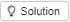

```{r setup, include=FALSE}
library(learnr)
library(knitr)
knitr::opts_chunk$set(echo = TRUE)
```

```{r prepare-data-df_statis}
df_statis <- data.frame(
    nom = factor(c("IcaRius", "Mage Zilap", "Mage RegoR")),
    coeurs = c(2, 12, 10),
    lieu = factor(c("Maison d’IcaRius", "Maison d’IcaRius", "Village de Kokoro"))
)
```

## Premières conversations runiques


Bienvenu(e) dans ce premier chapitre du grimoire IGoR. Au cours de ce chapitre, nous allons progressivement : 

- entamer de premiers dialogues avec R via une fenêtre de saisie, la console
- nous familiariser avec une nouvelle série de tics de langages de R

En cas de besoin, n'hésitez pas à solliciter un animateur circulant dans la salle.

Mais rappellons... le commencement ! R est un langage utilisé pour le traitement de données statistiques.

## Des Quiz tu triompheras

Dans l'aventure d'icaRius, vous serez parfois amené(e) à répondre à des quiz pour aider le personnage à poursuivre sa quête. En voici un tout premier, histoire de se familiariser avec le format de l'exercice. À vous donc de répondre directement en cochant votre choix puis en appuyant sur le bouton qui s'intitule `Submit answer` (*envoyer la réponse*).

À ce sujet, vous croiserez de temps à autre quelques mots étranges issus de la langue de Shakespeare. Le langage runique emprunte en effet quelques termes à nos voisins *grands brittons*... Mais le grimoire vous proposera toujours la traduction dans la langue - infiniment plus mélodieuse - de Molière...

En cas de besoin sur le mode de fonctionnement, n'hésitez pas à solliciter un animateur circulant dans la salle.

```{r ok-chapitre1-quiz1,echo=FALSE}
question("Quiz - Qu'est-ce que R ne fait PAS ?",
type="single",
allow_retry = TRUE,
incorrect="Retente ta chance",
answer("de très beaux graphiques,"),
answer("des calculs statistiques,"),
answer("de très belles cartes géographiques,"),
answer("le café,",correct=TRUE),
answer("des applications web"),
correct="Félicitations, c'est la bonne réponse pour ce quiz."
)
```

## Premiers pas dans la console

Vous pourriez penser que nous allons vous proposer une "console" de jeux vidéo. Malheureusement, ce n'est pas tout à fait le cas. Nous parlerons dans le grimoire de console pour désigner une partie de l'écran où vous pourrez vous-même vous exercer à pratiquer le langage des Runes - autrement dit, à écrire vous-mêmes du R et à en voir le résultat. C'est donc une **console R** !

Sous ces lignes se trouve une console R et, à la manière d'une calculatrice, il est possible de lui demander de réaliser des calculs  : tapez ci-dessous, dans la console, un calcul tel que `2 + 2` (c'est tout de même plus dur que `1 + 1`). Appuyez ensuite sur le bouton   en haut à droite de la console pour faire executer le code (*run code* signifie *exécuter le code*). La réponse de votre calcul s'affichera alors en dessous de la console.

```{r ok-chapitre1-etape1,exercise=TRUE}         


```

R  répond `4` et heureusement ! À l'avenir nous allons lui faire faire des choses beaucoup plus compliquées...

<BR>

## Souvenirs, souvenirs

<BR>

Icarius dispose de son précieux grimoire, qu'il a pu alimenter au fur et à mesure de ses rencontres avec des mages dans les villages précédents.
Etant au début d'une nouvelle aventure, il en feuillette quelque pages.

<BR>

#### Rappel : le sortilège, un outil précieux au service d'Icarius

<BR>

Le grimoire renferme une multitude de sortilèges - appelés **fonctions** dans le langage des Runes - permettant chacun d'accomplir une tâche bien spécifique.

Dans le monde des Runes, un sortilège est identifié par **son nom suivi de parenthèses** :`nomsortilege()`. A l'intérieur des parenthèses, sont précisés les ingrédients utiles à la confection du sortilège.

Si plusieurs ingrédients sont nécessaires, ces derniers sont séparés par une virgule:

```{r, collapse = TRUE, eval=FALSE}
# Application d'un sortilège   
nomsortilege(ingredient1, ingredient2,...,ingredientN)

```

<BR>

#### Rappel : les vecteurs

<BR>

Un vecteur est un objet du langage des Runes regroupant un ensemble de valeurs, comme une colonne dans un tableau.

Exemples de manipulation d'un vecteur :

```{r, messages=FALSE, warning=FALSE}
# Je crée un vecteur "nom" qui contient des chaînes de caractère, avec le sortilege "c()"
nom = c("IcaRius", "Mage Zilap", "Mage RegoR")
# Je crée un vecteur "coeurs" qui contient des nombres
coeurs = c(2, 12, 10)
# Pour sélectionner un élément d'un vecteur, je peux utiliser le nom du vecteur, 
# les "crochets", et la position de l'élément dans le vecteur
coeurs[2]
```

<BR>

## De belles tables

```{r, messages=FALSE, warning=FALSE, echo=FALSE, eval=FALSE}
Tables de pokeR
```

<BR>

Dans cette partie, nous allons nous appesantir sur les tables de données que l'on trouve dans le langage des Runes.

<BR>

Dans R, les tables de données standard courantes, que l'on manipule, s'appellent des "data.frame".  
Ce sont des tableaux rectangulaires, dont les colonnes sont des variables et les lignes des observations.  

<BR>

#### Création d'un data.frame

<BR>

Les data.frame peuvent être créés :

- par importation dans R d'un fichier de données,

- ou avec le sortilège `data.frame()` :

`data_frame_1 <- data.frame(vecteur_de_nombres, vecteur_de_chaines_de_caractères, ...)`  

<BR>

Voici une console un peu plus grande qui contient des instructions pré-remplies, exécutez-les toujours avec le bouton pour voir comment R structure sa réponse à votre sollicitation :
```{r ok-chapitre1-etape2, exercise=TRUE, exercices.lines = 14}
# Je crée un data.frame "df_statis",
# contenant des informations sur IcaRius ainsi que sur les mages Zilap et RegoR,
# avec le sortilège data.frame()
df_statis <- data.frame(
	nom = c("IcaRius", "Mage Zilap", "Mage RegoR"),
	coeurs = c(2, 12, 10),
	lieu = c("Maison d’IcaRius", "Maison d’IcaRius", "Village de Kokoro")
)

# J'affiche l'objet data.frame "df_statis".
# Pour cela, je peux entrer le nom de l'objet.
# Mais je peux aussi utiliser le sortilège print() :
print(df_statis)
```

<BR>

La console est un lieu de dialogue, vous commandez et R s'exécute ! 

<BR>

Quiz
```{r ok-chapitre1-quiz2,echo=FALSE}
question("Quiz - Dans R, que sont les \"data.frame\" ?",
type="single",
allow_retry = TRUE,
incorrect="Retente ta chance",
answer("ce sont des tables, peu courantes,"),
answer("ce sont des tables, avec des observations en colonne et des variables en lignes,"),
answer("ce sont les tables de données rectangulaires de R les plus courantes, avec des observations en ligne et des variables en colonnes,",correct=TRUE),
answer("autre réponse"),
correct="Félicitations, c'est la bonne réponse pour ce quiz."
)
```

<BR>

<span style="color:#18AC3E;font-size:16px">**A vous de pratiquer**</span>

Nous vous proposons de recréer ci-dessous le data.frame `df_statis` avec le sortilège `data.frame()`, 
puis de l'afficher avec `print()`. Au fait, une astuce : dans la console R, vous pouvez également afficher la solution pour avoir une aide avec le bouton :
```{r, echo=FALSE, fig.cap="", out.width = '70px'}

```

```{r ok-chapitre1-etape3,exercise=TRUE}
# Créer le data.frame "df_statis" contenant 3 variables "nom", "coeurs", "lieu", avec le sortilège "data.frame()"


# Afficher le data.frame "df_statis" avec le sortilège "print()"


# Fin de l'exercice
``` 

```{r ok-chapitre1-etape3-solution}
# Créer le data.frame "df_statis" contenant 3 variables "nom", "coeurs", "lieu", avec le sortilège "data.frame()"
df_statis <- data.frame(
	nom = c("IcaRius", "Mage Zilap", "Mage RegoR"),
	coeurs = c(2, 10, 8),
	lieu = c("Maison d’IcaRius", "Maison d’IcaRius", "Village de Kokoro")
)

# Afficher le data.frame "df_statis" avec le sortilège "print()"
print(df_statis)

# Fin de l'exercice
```

<BR>

#### Accéder aux éléments d'un data.frame

<BR>

```{r, message=FALSE, warning=FALSE, echo=FALSE, eval=TRUE}
library(dplyr)
df_statis <- data.frame(
	nom = factor(c("IcaRius", "Mage Zilap", "Mage RegoR")),
	coeurs = c(2, 10, 8),
	lieu = factor(c("Maison d’IcaRius", "Maison d’IcaRius", "Village de Kokoro"))
)
```

##### Obtenir telle colonne, avec le signe $

<BR>

```{r, messages=FALSE, warning=FALSE}
# J'accède à la colonne "coeurs" du data.frame "df_statis", avec le signe $
df_statis$coeurs
```

<BR>

##### Disposer des éléments d'un data.frame avec les crochets [...]

<BR>

```{r, messages=FALSE, warning=FALSE}
# data.frame "df_statis", j'accède à l'élément situé 1ère ligne, 2ème colonne
df_statis[1, 2]

# la 3ème ligne
df_statis[3, ]

# la 2ème colonne
df_statis[ , 2] 

# L'ensemble constitué des deux premières lignes, et des colonnes 1 et 3 : 
df_statis[c(1, 2), c(1, 3)]


# L'élément situé à la 1ère ligne, colonne "coeurs"
df_statis[1, "coeurs"] 

# La colonne "coeurs"
df_statis[ , "coeurs"] 
```

<BR>

##### Le signe $ combiné avec les crochets

<BR>

On peut utiliser ensemble le signe $ et les crochets.

Exemple.
```{r, messages=FALSE, warning=FALSE}
# data.frame "df_statis", colonne coeurs, 2ème élément de la colonne
df_statis$coeurs[2]
```

<BR>

<span style="color:#18AC3E;font-size:16px">**A vous de pratiquer**</span>

Pour la table "df_statis", nous vous proposons d'afficher :  
- l'élément situé 1ère ligne, 2ème colonne,  
- puis la 3ème ligne  


```{r ok-chapitre1-etape4,exercise=TRUE, exercise.setup = "prepare-data-df_statis"}
# Accéder à l'élément situé 1ère ligne, 2ème colonne


# Afficher la 3ème ligne


# Fin de l'exercice
``` 

```{r ok-chapitre1-etape4-solution}
# Accéder à l'élément situé 1ère ligne, 2ème colonne
df_statis[1, 2]

# Afficher la 3ème ligne
df_statis[3, ]

# Fin de l'exercice
```

<BR>

## Et les colonnes ?

<BR>

#### Le "type" des colonnes

<BR>

Les colonnes peuvent être :  

- de type caractère (elles ne contiennent que des chaînes de caractère)  
- de type numérique (elles ne comprennent que des nombres)  

<BR>

Mais il existe aussi un type particulier : le type "factor".  

<BR>

#### Les "factor"

<BR>

Le type "factor" (ou "facteur") est réservé aux colonnes qualitatives.

<BR>

#### Obtenir le type d'une colonne

<BR>

On peut utiliser le sortilege `class`, pour disposer du type d'une colonne d'un data.frame.

```{r, message=FALSE, warning=FALSE, echo=FALSE, eval=TRUE}
df_statis <- mutate(df_statis, nom = factor(nom)) 
``` 

```{r, message=FALSE, warning=FALSE}
# data.frame "df_statis", type de la colonne "nom" :
class( df_statis[, "nom"] )
``` 

<BR>

Le type de la colonne "nom" est "factor".  

(C'est R, qui a automatiquement affecté ce type "factor" à la colonne "nom", au moment de la création du data.frame `df_statis`.)

<BR>

#### Modifier le type d’une colonne

<BR>

Pré-requis : le sortilège `mutate()`, qui permet de créer ou de modifier une colonne.

<BR>

Il est parfois nécessaire de modifier le type d'une colonne.  

Ici nous souhaitons transformer le type de la colonne "nom" en "character".

On utilise le sortilège `as.character()`.

```{r, message=FALSE, warning=FALSE}
# La colonne "nom" de la table df_statis est de type "factor".
# Je modifie son type en "character" :
df_statis <- mutate(df_statis, nom = as.character(nom)) 
  
# nouveau type de la colonne "nom"
class( df_statis[, "nom"] )
``` 

<BR>

De même, on peut utiliser les sortilèges :  

`as.numeric()` : pour transformer le type d'une colonne en "numeric",  
`factor()`, ou `as.factor()` : pour transformer le type d'une colonne en "factor".  

<BR>

Quiz
```{r ok-chapitre1-quiz3,echo=FALSE}
question("Quiz - Dans R, quel doit être le type des colonnes qualitatives ?",
type="single",
allow_retry = TRUE,
incorrect="Retente ta chance",
answer("caractère,"),
answer("numérique,"),
answer("factor (facteur),",correct=TRUE),
answer("autre"),
correct="Félicitations, c'est la bonne réponse pour ce quiz."
)
```

<BR>

<span style="color:#18AC3E;font-size:16px">**A vous de pratiquer**</span>

Dans le data.frame "df_statis" (qui entretemps a été réinitialisé), nous vous proposons de re-modifier le type de la colonne "nom" en "character"

```{r ok-chapitre1-etape5,exercise=TRUE, exercise.setup = "prepare-data-df_statis"}
# Afficher le type de la colonne "nom"


# Modifier le type de la colonne "nom" en "character"


# Obtenir le nouveau type de la colonne "nom"


# Fin de l'exercice
``` 

```{r ok-chapitre1-etape5-solution}
# Afficher le type de la colonne "nom"
class( df_statis[, "nom"] )

# Modifier le type de la colonne "nom" en "character"
df_statis <- mutate(df_statis, nom = as.character(nom)) 

# Obtenir le nouveau type de la colonne "nom"
class( df_statis[, "nom"] )

# Fin de l'exercice
```

<BR>

## Si mais uniquement si

<BR>

#### Le sortilège `ifelse()`

<BR>

Le sortilège `ifelse()` peur être utile quand on crée ou modifie une colonne.

Il permet de tester quelque chose. Si oui, la colonne vaudra tant. Si non, elle sera égale à tant.


```{r, message=FALSE, warning=FALSE}
# Je recrée le data.frame "df_statis"
df_statis <- data.frame(
	nom = c("IcaRius", "Mage Zilap", "Mage RegoR"),
	coeurs = c(2, 12, 10),
	lieu = c("Maison d’IcaRius", "Maison d’IcaRius", "Village de Kokoro")
)

# Dans le data.frame "df_statis", le nombre de coeurs n'a pas été bien renseigné :
# pour IcaRius ce nombre a été sous-estimé d'une unité.

# Je modifie la colonne "coeurs" du data.frame pour qu'elle contienne les vraies valeurs.
df_statis <- mutate(
  df_statis,
  # pour chaque ligne du data.frame, je teste si nom = IcaRius
  # si oui, je modifie coeurs en coeurs + 1
  # si non, le laisse la valeur de coeurs
  coeurs = ifelse(nom == "IcaRius", coeurs + 1, coeurs)
)

# J'affiche le data.frame modifié :
print(df_statis)
``` 

<BR>

#### Les tests logiques dans R

<BR>

Dans le code ci-dessus `mutate(... ifelse(...) )`, on a utilisé l'expression == pour tester si le nom est IcaRius.  
(Dans le langage runique, le test d'égalité ne se fait pas avec le signe =, mais avec le double signe ==.)

<BR>

Pour tester, on peut utiliser aussi :    

< &nbsp;&nbsp;> &nbsp;&nbsp;<= &nbsp;&nbsp;>=  
&nbsp;&nbsp;&nbsp;&nbsp;&nbsp;&nbsp;Ex. `ifelse(coeurs <= 2, ...)` 

!= &nbsp;&nbsp;&nbsp;&nbsp;&nbsp;&nbsp;(est différent de)  
&nbsp;&nbsp;&nbsp;&nbsp;&nbsp;&nbsp;Ex. `ifelse(nom != "IcaRius", ...)`  

! &nbsp;&nbsp;&nbsp;&nbsp;&nbsp;&nbsp;(pour tester l'inverse)  
&nbsp;&nbsp;&nbsp;&nbsp;&nbsp;&nbsp;Ex. `ifelse( !(nom == "IcaRius"), ...)`  

& &nbsp;&nbsp;&nbsp;&nbsp;&nbsp;&nbsp;(et)  
&nbsp;&nbsp;&nbsp;&nbsp;&nbsp;&nbsp;Ex. `ifelse(nom != "IcaRius" & nom != "Statia"), ...)`  

| |  &nbsp;&nbsp;&nbsp;&nbsp;&nbsp;&nbsp;(ou)  
&nbsp;&nbsp;&nbsp;&nbsp;&nbsp;&nbsp;Ex. `ifelse(nom == "IcaRius" | nom == "Statia"), ...)`  

%in% &nbsp;&nbsp;&nbsp;&nbsp;&nbsp;&nbsp;(appartient aux valeurs d'un vecteur)  
&nbsp;&nbsp;&nbsp;&nbsp;&nbsp;&nbsp;Ex. `ifelse(nom %in% c("Statia", "IcaRius"), ...)`  

<BR>

## L'âge des statisiens


<p style="border:1px; border-style:solid; border-color:#000000; padding: 1em;">
```{r image1, echo=FALSE, fig.cap=""}
knitr::include_graphics("images/icarius_hero.png")
```
<span style="color:#18AC3E">**Mais au fait, il nous reste à répondre à la question du mage RegoR... quel âge a icaRius ? **</span>
</p>


Dans le monde de Statis, l'âge suit une logique un peu étrange. Les statisiens ont pour âge leur nombre de coeurs multiplié par 8.

Ecrivons la formule de calcul pour l'âge d'IcaRius. Allons-y pas-à-pas.

```{r, results='hide'}
# On trouve le nombre de coeurs d'IcaRius,
# dans la table "df_statis", 1ère ligne, colonne "coeurs" :
df_statis[1, "coeurs"]

# L'âge d'IcaRius est égal à son nombre de coeurs multiplié par 8
df_statis[1, "coeurs"] * 8

# Et c'est déja fini !
```

Pas sorcier finalement. Comme quoi, cette histoire de "mage" dans icaRius, c'est très surfait.

<BR>

## À vous de jouer !

Et si vous écriviez vous-mêmes la solution pour trouver l'âge d'IcaRius ? Ecrivez ci-dessous la manipulation du data.frame "df_statis", 
exécutez votre code pour trouver l'âge... Rappel : l'exécution des lignes se fait en appuyant sur le bouton :
```{r image2, echo=FALSE, fig.cap="", out.width = '80px'}
knitr::include_graphics("images/run_code.png")
```

```{r ok-chapitre1-etape6,exercise=TRUE, exercise.setup = "prepare-data-df_statis"}
# Dans le data.frame "df_statis" (qui a entretemps été réinitialisé),
# le nombre de coeurs d'IcaRius a été sous-estimé d'une unité. 
# Modifier la colonne "coeurs" du data.frame pour qu'elle contienne les vraies valeurs, 
# avec les sortilèges "mutate" et "ifelse"


# afficher le data.frame modifié


# Obtenir le nombre de coeurs d'IcaRius, en sélectionnant avec les crochets le bon élément du data.frame "df_statis"


# Calculer l'âge d'IcaRius, égal à son nombre de coeurs multiplié par 8


# Fin de l'exercice
``` 

```{r ok-chapitre1-etape6-solution}
# Dans le data.frame "df_statis" (qui a entretemps été réinitialisé),
# le nombre de coeurs d'IcaRius a été sous-estimé d'une unité. 
# Modifier la colonne "coeurs" du data.frame pour qu'elle contienne les vraies valeurs, 
# avec les sortilèges "mutate" et "ifelse"
df_statis <- mutate(
  df_statis,
  coeurs = ifelse(nom == "IcaRius", coeurs + 1, coeurs)
)

# afficher le data.frame modifié
print(df_statis)

# Obtenir le nombre de coeurs d'IcaRius, en sélectionnant avec les crochets le bon élément du data.frame "df_statis"
df_statis[1, "coeurs"]

# Calculer l'âge d'IcaRius, égal à son nombre de coeurs multiplié par 8
df_statis[1, "coeurs"] * 8

# Fin de l'exercice
```

```{r ok-chapitre1-quiz4,echo=FALSE}
question("Quiz - Alors, quel âge a IcaRius? Ne reste plus qu'à cocher la bonne réponse...pour poursuivre l'aventure!",
type="single",
allow_retry = TRUE,
incorrect="Retente ta chance",
answer("18 ans,"),
answer("27 ans,"),
answer("36 ans,"),
answer("24 ans,",correct=TRUE),
answer("La bonne réponse n'est pas dans les propositions."),
correct="Félicitations, c'est la bonne réponse pour ce quiz."
)
```
 

**Fin du chapitre 1  >>  reprenez la partie d'IcaRius**

*(version du chapitre : 0.0.1)*