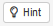

```{r, echo=FALSE, eval=FALSE}
# curly quotes -> staight quotes
# smart = false
md_extensions:  -smart
```


```{css, echo=FALSE}
.background-white {
  background-color: white;
}
```

```{r setup, include=FALSE}
library(learnr)
library(parsons)
library(knitr)
library(ggformula)
library(skimr)
library(rio)
library(tidyverse)
library(fst)
knitr::opts_chunk$set(echo = TRUE)

#création des répertoires temporaires
dir.create(paste0(tempdir(),"/sauvegarde"))

#creation du graphe contenant la séquence secrète:
coord=data.frame(x1=c(1,2,3,4,6,7),x2=c(1,2,3,4,5,8),y1=c(0,0,1,1,0.5,0.5),y2=c(1,1,0,0,0.5,0.5))
directions_fleches=ggplot(coord, aes(x = x1, y = y1, xend = x2, yend = y2)) +
  geom_segment(
    size = 2, arrow = arrow(length = unit(0.3, "inches"))
  ) + theme(plot.margin = margin(6,.2,6,.2, "cm"),
      plot.background = element_rect(fill = "darkgrey"), 
      axis.title=element_blank(),axis.text=element_blank(),axis.ticks = element_blank())

# Import des tables des chapitres 6 et 9 pour l'exercice d'export
file.copy(from = system.file(package = "funcampR","data","chapitre10_replay/naissances.csv"),
          to = paste0(tempdir(),"/naissances.csv"))
file.copy(from = system.file(package = "funcampR","data","chapitre10_replay/data_soldiers.csv"),
          to = paste0(tempdir(),"/data_soldiers.csv"))
		
# loading data for in-tutorial calculations
naissances<-import(paste0(tempdir(),"/naissances.csv"))
naissances_1213 <-  filter(naissances, An == 1213)
naissances_mana <- naissances %>% 
                    filter(Genre=="F") %>%
                    mutate(Mana = Force + Spirit) %>%
                    arrange(desc(Mana))

# Création d'un fichier nb_pontes pour la sauvegarde externe (log)
nb_pontes <- data.frame(poulette=c("Cocotte1","Cocotte2","Cocotte3","Cocotte4"),nb_oeufs=c(10,9,20,18))

# Création d'un fichier donnees_secretes pour la sauvegarde externe (graphique graphique_chapitre6)
donnees_secretes <- import(paste0(tempdir(),"/data_soldiers.csv"))
donnees_secretes <- donnees_secretes %>%
  select('royaume','nb_guerriers','nb_habitants','nb_chevaux','nb_canicule','dist_royaume','situation')
donnees_secretes_df <- as.data.frame(donnees_secretes)
graphique_chapitre6 <- donnees_secretes %>% 
                gf_point(nb_canicule ~ dist_royaume,
                         size = ~ nb_guerriers,
                         shape = 5) %>% 
                gf_text(label = ~ royaume,
                        size = 2.5,
                        check_overlap = TRUE) %>%
                gf_refine(scale_x_continuous(limits = c(0, 50)))

# chemin_naissances_1213
chemin_naissances_1213 <- paste0(
  tempdir(),
  "/naissances_1213.rds"
)
chemin_naissances_1213 <- str_replace_all(chemin_naissances_1213, "\\\\", "/")
repertoire_naissances_1213 <- tempdir()
repertoire_naissances_1213 <- str_replace_all(repertoire_naissances_1213, "\\\\", "/")

# chemin_naissances_mana
chemin_naissances_mana <- paste0(
  tempdir(),
  "/naissances_mana.rds"
)
chemin_naissances_mana <- str_replace_all(chemin_naissances_mana, "\\\\", "/")
repertoire_naissances_mana <- tempdir()
repertoire_naissances_mana <- str_replace_all(repertoire_naissances_mana, "\\\\", "/")

# chemin_livre_ambroisie
chemin_livre_ambroisie <- paste0(
  tempdir(),
  "/livre_ambroisie.fst"
)
chemin_livre_ambroisie  <- str_replace_all(chemin_livre_ambroisie, "\\\\", "/")

# repertoire_livre_ambroisie
repertoire_livre_ambroisie <- tempdir()
repertoire_livre_ambroisie <- str_replace_all(repertoire_livre_ambroisie, "\\\\", "/")

## chargement du data.frame df_livre_ambroisie
file.copy(
  from = system.file(
    package = "funcampR",
	"data",
	"chapitre10_replay/livre_ambroisie.fst"
  ),
  to = paste0(
    tempdir(),
	"/livre_ambroisie.fst"
  )
)
		  
df_livre_ambroisie <- read_fst(chemin_livre_ambroisie)

tryCatch(
  {
    if (file.exists(chemin_livre_ambroisie)) {
      unlink(chemin_livre_ambroisie)
    }
  },
  error=function(cond) {
    return("")
  }
)


```

```{r prepare-data}
# relative path to data from "local random repo" of learnr exercise
naissances<-import(paste0(tempdir(),"/naissances.csv"))

naissances_1213 <- naissances %>% filter(An == 1213)
naissances_mana <- naissances %>% 
                    filter(Genre=="F") %>%
                    mutate(Mana = Force + Spirit) %>%
                    arrange(desc(Mana))

# Création d'un fichier nb_pontes pour la sauvegarde externe
nb_pontes <- data.frame(poulette=c("Cocotte1","Cocotte2","Cocotte3","Cocotte4"),nb_oeufs=c(10,9,20,18))

# Création d'un fichier donnees_secretes pour la sauvegarde externe (graphique graphique_chapitre6)
donnees_secretes <- import(paste0(tempdir(),"/data_soldiers.csv"))
donnees_secretes <- donnees_secretes %>%
  select('royaume','nb_guerriers','nb_habitants','nb_chevaux','nb_canicule','dist_royaume','situation')
donnees_secretes_df <- as.data.frame(donnees_secretes)
graphique_chapitre6 <- donnees_secretes %>% 
                gf_point(nb_canicule ~ dist_royaume,
                         size = ~ nb_guerriers,
                         shape = 5) %>% 
                gf_text(label = ~ royaume,
                        size = 2.5,
                        check_overlap = TRUE) %>%
                gf_refine(scale_x_continuous(limits = c(0, 50)))
```

```{r prepare-data_2}
tryCatch(
  {
    if (file.exists(paste0(tempdir(),"/naissances_mana.rds"))) {
      unlink(paste0(tempdir(),"/naissances_mana.rds"))
    }
  },
  error=function(cond) {
    return("")
  }
)

df_2 <- NA
```

```{r prepare-data_3}
tryCatch(
  {
    if (file.exists(paste0(tempdir(),"/livre_ambroisie.fst"))) {
      unlink(paste0(tempdir(),"/livre_ambroisie.fst"))
    }
  },
  error=function(cond) {
    return("")
  }
)

filename <- NA
```

```{r prepare-data_4}
filename <- paste0(
  tempdir(),
  "/livre_ambroisie.fst"
)

tryCatch(
  {
    if ( !file.exists(paste0(tempdir(), "/livre_ambroisie.fst")) ) {
      write_fst(
		df_livre_ambroisie, 
		paste0(
		  tempdir(), 
		  "/livre_ambroisie.fst")
	  )
    }
  },
  error=function(cond) {
    return("")
  }
)

ref_livre_ambroisie <- NA
df_4 <- NA
```

## Les sortilèges de mémoire éternelle à notre rescousse 

Jamais à court d’idées pour empêcher Icarius de poursuivre sa quête, le terrible Sassos a encore frappé en lui jetant un sort totalement déboussolant… Pris au piège dans la lugubre salle de l'impossible, Icarius a totalement perdu le nord et ne sait absolument plus quel chemin emprunter pour en sortir. C’est simple, dès qu’Icarius prend une sortie, il arrive dans une nouvelle pièce … exactement identique à la précédente… Ahhhh, de quoi le rendre totalement fou !

Mais comment s’échapper de ce piège?  Icarius a beau avoir une bonne mémoire, impossible pour lui de retenir la combinaison de toutes les directions prises pour sortir des différentes pièces.  Icarius ne voit plus qu’un moyen de s’en sortir… mobiliser les sortilèges de mémoire éternelle, qui lui permettront de garder la mémoire de ce qu’il a fait, des directions qu’il vient de prendre… Sans cela, Icarius est condamné à rester prisonnier des murs de ce donjon…

Plus que jamais, il a besoin de votre aide pour retrouver ses repères et sauvegarder ce qu’il a déjà trouvé ! Mais avant cela, prenons le temps de nous familiariser avec les différents sortilèges de sauvegarde.

## Des formats de fichier du langage des Runes

<BR>

#### Le format ".RData" pour enregistrer des objets de R

<BR>

Dans le monde des Runes, le sortilège `save` va permettre la sauvegarde d'objets R, par exemple des tables de données, dans un format propre au langage runique: le fichier "RData".

*Souvenez-vous* : un objet c'est comme une boite sur laquelle on peut apposer une étiquette (un nom) et dans laquelle on range un contenu (le résultat d'un calcul par exemple). L'objet est l'élément de base du langage runique. Les objets R peuvent être de type différents: data frame, vecteur, liste, graphique...

<BR>

<span style="color:#18AC3E;font-size:16px">Tous les objets de l'espace de travail</span> 

<BR>

Les objets sont stockés dans notre environnement de travail. Dans sa version la plus large, le sortilège save peut être utilisé comme suit pour sauvegarder tous les objets présents dans l'environnement de travail :
```{r, collapse = TRUE, eval=FALSE}
save.image("nom complet du chemin répertoire et du fichier")
```

<BR>

<span style="color:#18AC3E;font-size:16px">Un objet</span> 

<BR>

Si on veut se limiter à la sauvegarde d'un objet, c'est possible. Le sortilège save le plus basique nécessite alors au minimum 2 ingrédients :
- le nom de l'objet que l'on souhaite sauvegarder
- l'emplacement et le nom du fichier RData dans lequel va être stocké l'objet.
```{r, collapse = TRUE, eval=FALSE}
save(nom_objet_à_sauvegarder,file="chemin_du_fichier/nom_du_fichier.RData")
```

<BR>

<span style="color:#18AC3E;font-size:16px">Plusieurs objets</span> 

<BR>

**Pour aller plus loin et plus vite...:**
Il est possible de stocker dans un même fichier "RData", plusieurs objets R pouvant être de type différent. Pour cela, rien de plus simple, il suffit dans la liste des ingrédients de séparer nos différents objets à sauvegarder par des virgules.
Si par exemple, nous souhaitons sauvegarder dans un même fichier « RData », 3 objets dont 2 tables de données et 1 vecteur, cela s’écrira alors :
```{r, collapse = TRUE, eval=FALSE}
save(table1_à_sauvegarder,vecteur_à_sauvegarder,table2_à_sauvegarder,file="chemin_du_fichier/nom_du_fichier.RData")
```

**Prêt pour l'échauffement ?** Pour parfaire votre apprentissage du sortilège `save`, exercez-vous en sauvegardant dans un même "RData" nommé "chapitre9_tables", les 2 tables suivantes: "naissances_1213" et "naissances_mana", correspondant aux calculs que vous avez pu conduire dans le chapitre 9 "Do you dplyr?" pour sélectionner les naissances de l'année 1213 d'une part, et trier selon le mana d'autre part.

**Vous travaillez sur une version locale des tutoriels, sur votre poste de travail ?** A vous de choisir le chemin où vous sauvegarderez ce fichier sur votre poste (ou sur une clef USB si vous en utilisez une). *Il faudra penser à renseigner la lettre du lecteur sur votre poste (si besoin, demander à l'animateur du Funcamp de vous aider)*

**Vous travaillez sur une version Internet des tutoriels avec le SSPCloud ?** Dans ce cas, il vous faut sauvegarder dans un endroit que nous avons créé exprès dans les nuages, en l'occurrence, à l'adresse "../sauvegarde"*

```{r ok-chapitre10-etape1,exercise=TRUE, exercise.setup = "prepare-data_2"}
# Sauvegarder les tables "naissances_1213" et "naissances_mana"

# Fin de l'exercice
``` 

<!-- eval=FALSE -->
```{r ok-chapitre10-etape1-solution, eval=FALSE}
#  Sauvegarder les tables "naissances_1213" et "naissances_mana"
save(naissances_1213,naissances_mana,file="../sauvegarde/tables_chapitre9.RData")
# Fin de l'exercice
``` 

<BR>

<span style="color:#18AC3E;font-size:16px">Lecture d'un fichier "RData"</span> 

<BR>

Un fichier RData pourra ensuite être ouvert et lu à tout moment grâce au sortilège `load(chemin_du_fichier)`, vu dans le chapitre 2.

A la suite de `load(chemin_du_fichier)`, tous les objets sauvegardés dans le fichier seront chargés dans R.

<BR>

#### Le format ".rds" pour sauvegarder un objet de R

<BR>

".rds" est un autre format, propre à R, de sauvegarde dans un fichier.

De même que le format ".RData", le format ".rds" permet d'enregistrer tout type d'objet R (data.frame, vecteur, graphique, etc.).

<BR>

Une différence entre les formats ".rds" et ".RData" est que le format ".rds" ne peut sauvegarder qu'un seul objet par fichier.

<BR>

Pour enregistrer un objet de R au format ".rds", il faut utiliser le sortilège `saveRDS()`

Exemple.
```{r, echo=FALSE, eval=TRUE, comment=NA}
str_1 <- 
  paste0(
    "# Je sauvegarde le data.frame \"naissances_1213\" dans un fichier \".rds\",\n",
	"# dans le répertoire \"",
	repertoire_naissances_1213,
	"\"\n",
	"# (j'ai vérifié que le répertoire existe)\n",
    "saveRDS(\n",
	"  naissances_1213,\n",
	"  file = \"",
    chemin_naissances_1213,
    "\"\n",
	")"
  )
cat(str_1) 
```

<BR>

Pour importer dans R un fichier ".rds", on peut utiliser le sortilège `readRDS()` .

```{r, echo=FALSE, eval=TRUE, comment=NA}
str_2 <- 
  paste0(
    "# Je charge en mémoire le package \"dplyr\"\n",
    "library(dplyr)\n",
	"\n",
    "# J'importe dans R le fichier \"naissances_1213.rds\".\n",
	"# J'assigne son contenu à l'objet \"df_1\".\n",
    "df_1 <- readRDS(\"",
	chemin_naissances_1213,
    "\"\n",
	"\n",
	"# J'affiche \"df_1\"\n",
	"df_1 %>%\n",
	"  head(5) # les 5 premières lignes"
  )
cat(str_2) 
```
```{r, echo=FALSE, eval=TRUE}
naissances_1213 %>% 
  head(5)
```

<BR>

<span style="color:#18AC3E;font-size:16px">**A vous de pratiquer**</span>

<BR>

Nous vous proposons d'enregistrer la table "naissances_mana" dans un fichier "naissances_mana.rds", dans le répertoire &nbsp;&nbsp; `r repertoire_naissances_mana` .  
(le système a vérifié que le répertoire existe).  

<BR>

Au fait, une astuce : dans la console R ci-dessous, vous pouvez également afficher la solution pour avoir une aide avec le bouton :
```{r, echo=FALSE, fig.cap="", out.width = '60px', out.height = '26px'}

```
```{r ok-chapitre10-etape2,exercise=TRUE, exercise.setup = "prepare-data_2", message=FALSE, warning=FALSE}
# Avec le sortilège "saveRDS", enregistrer la table "naissances_mana" 
# dans le fichier "naissances_mana.rds"


# Importer le fichier "naissances_mana.rds" dans R, avec le sortilège "readRDS".
# Assigner le contenu du fichier à "df_2".


# Afficher les 5 premières lignes de "df_2"


# Fin de l'exercice
```

```{r, include=FALSE, comment=NA}
str_2 <- 
  paste0(
    "# Avec le sortilège \"saveRDS\", enregistrer la table \"naissances_mana\" \n",
	"# dans le fichier \"naissances_mana.rds\" \n",
	"saveRDS(\n",
	"  naissances_mana,\n",
	"  file = \"",
    chemin_naissances_mana,
    "\"\n",
	")", 
	"\n",
	"\n",
	"# Importer le fichier \"naissances_mana.rds\" dans R, avec le sortilège \"readRDS\".\n",
    "# Assigner le contenu du fichier à \"df_2\".\n",
	"df_2 <- readRDS(\"",
	chemin_naissances_mana,
    "\")\n",
	"\n",
	"# Afficher les 5 premières lignes de \"df_2\"\n",
	"df_2 %>%\n",
	"  head(5)",
	"\n",
	"\n",
	"# Fin de l'exercice"
  )
```

<div id="ok-chapitre10-etape2-hint">
```{r ok-chapitre10-etape2-hint1, echo=FALSE, eval=TRUE, comment=NA}
cat(str_2) 
```
</div>

<BR>

#### Le format ".fst" pour sauvegarder un très gros data.frame

<BR>

Le format ".fst" permet d'enregistrer un data.frame dans un fichier.

Ce format est intéressant pour la sauvegarde d'un très gros data.frame (de typiquement 1 Go, ou plus).

<BR>

Le format ".fst" présente deux avantages :  

- la lecture/écriture dans le format ".fst" est très rapide, si on la compare avec la lecture/écriture dans d'autres formats,

- à la lecture, il est possible de lire seulement une partie d'un fichier ".fst", si on le souhaite.

(alors qu'avec un fichier "RData", "rds", "csv", "sas7bdat" (SAS), "xlsx", "ods" (Libre Office), etc, 
la seule possibilité de lecture dans R est d'importer tout le fichier).

<BR>

Exemples.

Un data.frame "df_livre_ambroisie" a été chargé en mémoire.  

Il contient des données sur 100 liqueurs d'Ambroisie produites dans le royaume de Statis.  

```{r, echo=TRUE, eval=TRUE}
# J'affiche les 5 premières lignes du data.frame
df_livre_ambroisie %>%  
  head(5)  
```
Le data.frame `df_livre_ambroisie` comprend pour chaque observation (chaque liqueur consommée) les informations suivantes :  
- le prix de la bouteille d’ambroisie,  
- la puissance de la liqueur, comparable au nombre de degré d’une boisson alcoolisée,  
- la puissance_arrondie de la liqueur (l'arrondi est au plus proche entier),  
- l’ age de la liqueur,  
- la saveur,  
- l’ ivresse,  
- la production, en nombre de bouteilles de la liqueur.  

(Ces données ont déjà été utilisées au chapitre 5).   

<BR>

--------------------------------------------------------

&#35;&#35;&#35;&#35; Je souhaite enregistrer le data.frame "df_livre_ambroisie" dans un fichier "livre_ambroisie.fst",  
&#35;&#35;&#35;&#35; dans le répertoire `r repertoire_livre_ambroisie`  
&#35;&#35;&#35;&#35; (je me suis assuré que le répertoire existe)  
&nbsp;  
&#35; Je charge en mémoire les packages "fst" et "dplyr"  
library(fst)  
library(dplyr)  

&#35; J'assigne le chemin du fichier à une variable "filename"  
filename <- "`r chemin_livre_ambroisie`"  

&#35; Je vérifie que le fichier n'existe pas  
file.exists(filename)   

--------------------------------------------------------

```{r, echo=FALSE, eval=TRUE}
library(fst)  
library(dplyr)  

filename <- chemin_livre_ambroisie

file.exists(filename)
```

--------------------------------------------------------

&#35; J'écris le contenu du data.frame "df_livre_ambroisie" dans le fichier  
write_fst(df_livre_ambroisie, filename)  

&#35; Je vérifie que le fichier existe  
file.exists(filename)  

--------------------------------------------------------

```{r, echo=FALSE, eval=TRUE}
write_fst(df_livre_ambroisie, filename)

file.exists(filename)  

rm(df_livre_ambroisie)
``` 

--------------------------------------------------------

&#35;&#35;&#35;&#35; Je souhaite ensuite :  
&#35;&#35;&#35;&#35; - importer dans un data.frame une partie du fichier "livre_ambroisie.fst" :  
&#35;&#35;&#35;&#35; &nbsp;&nbsp; exclusivement les liqueurs dont la saveur est "Delicieux",  
&#35;&#35;&#35;&#35; &nbsp;&nbsp; et uniquement les colonnes "prix", "puissance_arrondie", "saveur",  
&#35;&#35;&#35;&#35; - puis travailler avec le data.frame obtenu  
&nbsp;  
&#35; J'affiche les meta-données du fichier, si je le souhaite  
metadata_fst(filename)  

--------------------------------------------------------

```{r, echo=FALSE, eval=TRUE}
metadata_fst(filename) # Affichage des meta-données du fichier  
``` 

--------------------------------------------------------

&#35; Je crée une référence "ref_livre_ambroisie" au fichier avec le sortilège `fst()`  
ref_livre_ambroisie <- fst(filename)  
 
&#35; A partir du fichier "livre_ambroisie.fst", j'importe dans un data.frame  
&#35; les liqueurs dont la saveur est "Delicieux",  
&#35; et les colonnes "prix", "puissance_arrondie", "saveur".    
df_3 <- ref_livre_ambroisie[ ref_livre_ambroisie$saveur == "Delicieux", c("prix", "puissance_arrondie", "saveur")]  
&nbsp;&nbsp;&nbsp;&nbsp;&nbsp;&nbsp;&nbsp;&nbsp; &#35; (j'emploie la référence "ref_livre_ambroisie" comme si elle était un data.frame)  

&#35; Pour vérification, j'affiche les 5 premières lignes du data.frame  
df_3 %>%  
&nbsp;&nbsp;&nbsp;&nbsp;head(5)

--------------------------------------------------------

```{r, echo=FALSE, eval=TRUE}
ref_livre_ambroisie <- fst(filename)

df_3 <- ref_livre_ambroisie[ ref_livre_ambroisie$saveur == "Delicieux", c("prix", "puissance_arrondie", "saveur")]   
  
df_3 %>%
  head(5) 
``` 

--------------------------------------------------------

&#35; Je travaille avec le data.frame obtenu  
etc.  

-------------------------------------------------------- 

```{r, echo=TRUE, eval=FALSE, class.source="background-white"}
etc.
```

<BR>

<span style="color:#18AC3E;font-size:16px">**A vous de prendre la plume**</span>

<BR>

Nous vous proposons de demander à R d'enregistrer le data.frame "df_livre_ambroisie" dans un
fichier "livre_ambroisie.rds", dans le repertoire `r repertoire_livre_ambroisie` .  
(le système a vérifié que le répertoire existe).

```{r ok-chapitre10-etape3,exercise=TRUE, exercise.setup = "prepare-data_3", message=FALSE, warning=FALSE}
# Assigner le chemin du fichier à une variable "filename"

 
# Vérifier que le fichier n'existe pas avec le sortilège "file.exists()"

 
# Sauvegarder le data.frame "df_livre_ambroisie" dans le fichier


# Vérifier que le fichier existe


# Fin de l'exercice
``` 

```{r, include=FALSE, comment=NA}
str_6 <-
  paste0(
    "# Assigner le chemin du fichier à une variable \"filename\"\n",
    "filename <- \n",
	"\"",
	chemin_livre_ambroisie,
	"\"\n",
	" \n",
	"# Vérifier que le fichier n'existe pas avec le sortilège \"file.exists()\"\n",
    "file.exists(filename)\n",  
    " \n",
    "# Sauvegarder le data.frame \"df_livre_ambroisie\" dans le fichier\n",
	"write_fst(df_livre_ambroisie, filename)\n",
	"\n",
	"# Vérifier que le fichier existe\n",
    "file.exists(filename)\n",
	" \n",
	"# Fin de l'exercice"
  )
```

<div id="ok-chapitre10-etape3-hint">
```{r ok-chapitre10-etape3-hint2, echo=FALSE, eval=TRUE, comment=NA}
cat(str_6) 
```
</div>

<BR>

Nous vous proposons ensuite de charger dans un data.frame une partie du fichier "livre_ambroisie.fst" :  
seulement les liqueurs dont la saveur est "Delicieux",  
et uniquement les colonnes "prix", "puissance_arrondie", "saveur".  

<BR>

```{r ok-chapitre10-etape4,exercise=TRUE, exercise.setup = "prepare-data_4", message=FALSE, warning=FALSE}
# Créer une référence au fichier avec le sortilège "fst()" 


# A partir de cette référence, importer une partie du fichier (les liqueurs dont la saveur est "Delicieux", et 
# les colonnes "prix", "puissance_arrondie", "saveur"), dans un data.frame. 


# Afficher les 5 premières lignes du data.frame


# Fin de l'exercice
``` 

```{r, include=FALSE, comment=NA}
str_6 <-
  paste0(
    "# Créer une référence au fichier avec le sortilège \"fst()\" \n",
    "ref_livre_ambroisie <- fst(filename)\n",
    "\n",
    "# A partir de cette référence, importer une partie du \n",
	"# fichier (les liqueurs dont la saveur est \"Delicieux\", et \n",
    "# les colonnes \"prix\", \"puissance_arrondie\", \"saveur\"), dans un data.frame. \n",
    "df_4 <- ref_livre_ambroisie[ ref_livre_ambroisie$saveur == \"Delicieux\", c(\"prix\", \"puissance_arrondie\", \"saveur\")] \n",
    "\n",
    "# Afficher les 5 premières lignes du data.frame \n",
    "df_4 %>% \n",  
    "  head(5) \n",  
	" \n",
	"# Fin de l'exercice"
  )
```

<div id="ok-chapitre10-etape4-hint">
```{r ok-chapitre10-etape4-hint2, echo=FALSE, eval=TRUE, comment=NA}
cat(str_6) 
```
</div>

<BR>

## Oui mais si je veux sauvegarder des informations en dehors de l'environnement R ?

Il est parfois nécessaire de sauvegarder des informations statistiques "en dehors de R" dans des formats qui sont compatibles avec d'autres logiciels, que ce soit le contenu de la console, des tableaux de résultats ou des graphiques. On parle alors d'exporter des objets. Par exemple, sauvegarder le contenu de la console dans un fichier txt, sauvegarder un graphique en format jpeg ou en format pdf, sauvegarder une table de données dans un fichier csv. Pour chaque objet, il existe des sortilèges d'export différents.

Pour sauvegarder **le contenu de la console**, le sortilège `sink` est très efficace. Les ingrédients nécessaires à ce sortilèges sont le chemin complet vers le fichier texte dans lequel on va stocker le résultat. Exemple :
```{r, collapse = TRUE, eval=FALSE}
# J'amorce le "journal de bord" qui gardera trace des calculs
sink(file="../sauvegarde/mon_journal.txt")
# la table nb_pontes est déjà chargée. Calculons quelques statistiques descriptives
skim(nb_pontes)
# Enregistrons les résultats dans le journal de bord et refermons-le.
sink()
```

Pour les **graphiques**, on peut utiliser le sortilège `ggsave`en précisant le nom du graphique:
```{r, collapse = TRUE, eval=FALSE}
# L'objet graphique "graphique_chapitre6" est déjà chargé.
# Pour le sauvegarder en format pdf :
ggsave(graphique_chapitre6,path ="../sauvegarde/",filename="graphique_chapitre6.pdf",device = "pdf" )
#exemple pour le format jpeg :
ggsave(graphique_chapitre6,path ="../sauvegarde/",filename="graphique_chapitre6.jpg",device = "jpeg" )
```

Pour exporter un **tableau de données**, utilisez le sortilège `export`  :
```{r, collapse = TRUE, eval=FALSE}
# la table nb_pontes est déjà chargée. Exportons-la.
export(nb_pontes, "nb_pontes.csv")
```
## Entrainez-vous !

À vous de jouer : vous devez désormais exporter la table naissance_1213 au format csv dans un fichier nommé naissances_1213.csv. **Vous travaillez avec une version locale des tutoriels ?** Enregistrez le fichier dans le répertoire de votre choix (sur votre poste de travail ou sur votre clef USB le cas échéant). **Vous travaillez avec une version en ligne sur le SSPCloud ?** Enregistrez le fichier dans le répertoire "../sauvegarde/", directement dans les nuages :-)

```{r ok-chapitre10-etape5,exercise=TRUE, exercise.setup = "prepare-data"}
# Sauvegarder la table "naissances_1213" au format csv

# Fin de l'exercice
``` 

<!-- eval=FALSE -->
```{r ok-chapitre10-etape5-solution, eval=FALSE}
# Sauvegarder la table "naissances_1213" au format csv
export(naissances_1213,"../sauvegarde/naissances_1213.csv")
# Fin de l'exercice
``` 

<BR>

## Aidez Icarius à retrouver le nord!

L'horrible Sassos a téléporté Icarius dans la salle de l'impossible. Prisonnier de cette pièce magique, Icarius a plus que jamais besoin de votre aide! Vous aurez pour mission de lui indiquer le chemin à suivre pour enfin pouvoir s'échapper de ce piège infernal.

Mais comment ? Il se trouve que la séquence de directions qu'il doit suivre pour s'échapper est cachée dans un objet R, que vous allez devoir sauvegarder. 

Indication: l'objet R est un *graphique* dénommé "directions_fleches" que vous stockerez au format jpg dans un fichier denommé enigme_chapitre10.jpg**

```{r ok-chapitre10-etape6,exercise=TRUE, exercise.setup = "prepare-data"}
#Sauvegarder l'objet directions_fleches comme une image,
# avec pour nom enigme_chapitre10.jpg

# Fin de l'exercice
```

<!-- eval=FALSE -->
```{r ok-chapitre10-etape6-solution, eval=FALSE}
#Sauvegarder l'objet directions_fleches comme une image,
# avec pour nom enigme_chapitre10.jpg
ggsave(directions_fleches, filename="../sauvegarde/enigme_chapitre10.jpg",device = "jpeg")
# Fin de l'exercice

```
 
Vous avez réalisé l'exercice pratique ? Vous pouvez désormais consulter le fichier créé en le téléchargeant sur votre poste de travail, et souffler les bonnes directions à Icarius. 

```{r, echo=FALSE}
downloadLink("downloadPlot", "Téléchargez l'image pour avoir la solution de l'énigme")
```

```{r, context="server"}

  plotInput = function() {
	  coord=data.frame(x1=c(1,2,3,4,6,7),x2=c(1,2,3,4,5,8),y1=c(0,0,1,1,0.5,0.5),y2=c(1,1,0,0,0.5,0.5))
	  ggplot(coord, aes(x = x1, y = y1, xend = x2, yend = y2)) +
 		  geom_segment(size = 2, arrow = arrow(length = unit(0.3, "inches"))) + theme(plot.margin = margin(6,.2,6,.2, "cm"),
      plot.background = element_rect(fill = "darkgrey"), 
      axis.title=element_blank(),axis.text=element_blank(),axis.ticks = element_blank())
  }

  output$downloadPlot <- downloadHandler(
   	filename = function() { paste('enigme_chapitre10', '.jpg', sep='') },
   	content = function(file) {
    ggsave(file, plot = plotInput(), device = "jpeg")
  }) 
```

A partir de l'image téléchargée, reportez la séquence des directions à suivre dans le jeu **icaRius** et reprenez votre partie !

**Fin du chapitre   >>  reprenez la partie d'Icarius**

*Version 0.9.4*

 

