```{css, echo=FALSE}
.background-white {
  background-color: white;
}
```

```{r setup, include=FALSE}
library(learnr)
library(knitr)

# répertoire du fichier chapitre13.Rmd en cours d'exécution
REPERTOIRE_du_fichier_chapitre13_Rmd <- getwd()

# répertoire du package funcampR, sous répertoire data/chapitre13_replay
REPERTOIRE_package_funcampR_data_chapitre13_replay <- system.file(
    package = "funcampR",
	"data/chapitre13_replay"
)

# copie hello.html
file.copy(
  from = 
    paste0(
	  REPERTOIRE_package_funcampR_data_chapitre13_replay, 
	  "/hello.html"
	),
  to = paste0(
	  REPERTOIRE_du_fichier_chapitre13_Rmd, 
	  "/hello.html"
	)
)
# copie R.css
file.copy(
  from = 
    paste0(
	  REPERTOIRE_package_funcampR_data_chapitre13_replay, 
	  "/R.css"
	),
  to = paste0(
	  REPERTOIRE_du_fichier_chapitre13_Rmd, 
	  "/R.css"
	)
)
```

## Mes(-)aventures ? 

Votre aventure touche à sa fin, vous voilà en possession des 6 runes, votre fidèle épée, un bouclier, une fiole d'immonde jus de mandragore, 
la clé de la cave à ambroisie, une plume du tidyverse, un boomerang, une paire de palme et...ce bon vieux grimoire IgoR. 

Le grimoire ? Mince, le grimoire ! Quelle n'est pas votre surprise quand vous découvrez que votre immersion dans le datalake a ruiné ses pages.
Tous vos précieux apprentissages dilués, presque illisibles !

A la suite de cela, vous décidez d'utiliser un "projet RStudio" pour organiser vos sortilèges.  

<BR>

## Rappel : le logiciel RStudio qui facilite l'écriture de code R

<BR>

Depuis vos mésaventures avec Teoc vous savez maintenant écrire votre propre sortilège et le documenter consciencieusement, et votre mémoire est 
encore fraîche. Vous décidez de vous équiper non plus d'un livre mais d'une tablette magique "RStudio", moderne et surtout, à toute épreuve pour 
consigner vos savoirs-faire.

Au déverrouillage de RStudio, vous vous rappelez que l'outil est plus complexe à utiliser que votre bon vieux grimoire ! Et pour cause, 
voici RStudio une fois lancé : 

```{r echo=FALSE}
include_graphics("images/rstudio_4_panes.png")
```

Vous vous rappelez la première impression que vous aviez eue avec l'outil. "Quelle est donc cette magie noire ?! Encore un coup de Sassos ? Vous qui vous 
étiez attendiu à simplement scripter vos sortilèges avec votre plume du 
tidyverse vous étiez bien dépourvu(e)..."

Par chance le mode d'emploi est fourni et ce dernier vous rappelle qu'il s'agit là du logiciel de traitement de texte des mages, celui-là même qui 
leur sert à produire les écrits des grimoires tels qu'IgoR.

En poursuivant la lecture, vous vous rappelez que plus qu'un traitement de texte vous avez sous les yeux un EDI : **Environnement de Développement Intégré**. 
C'est à dire un *"ensemble d'outils et de procédés destinés à assister et formaliser le travail de création de logiciels"* selon Statispedia. 
RStudio comme R, est un logiciel open source. 
Vu l'âge avancé des mages, vous n'êtes pas étonné(e) qu'ils doivent être assistés pour la rédaction de leurs sortilèges... Mais rappelons plutôt comment. 

#### Le tour du propriétaire

Tout d'abord la console de RStudio. Cet espace est familier, il ressemble aux lieux privilégiés pour la pratique du langage des Runes dans le grimoire : 
c'est à cet endroit 
que nous pouvons mesurer les effets des sortilèges lancés


```{r  echo=FALSE}
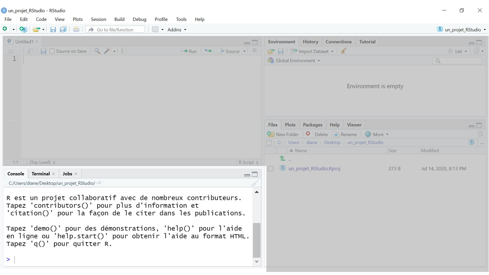
```

À la droite de cet encart, se trouve un panneau qui contient un explorateur de fichier et d'autres onglets utiles tels que l'affichage des graphiques,
la liste des packages installés, la fenêtre d'aide et même un navigateur web (Viewer). 

```{r  echo=FALSE}
include_graphics("images/files.JPG")
```

Dans la partie supérieure on trouve un onglet environnement (ici vide) qui expose et détaille en temps réel les objets créés et assignés grâce à l'opérateur `<-`

```{r  echo=FALSE}
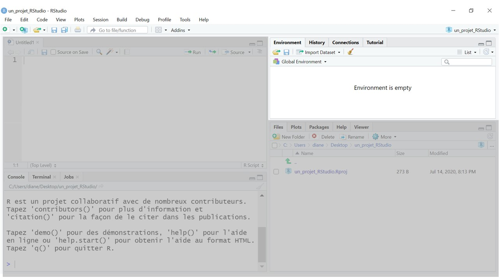
```

Et enfin, un dernier quart de page est dédié à l'écriture à proprement parler des sortilèges : 
```{r  echo=FALSE}
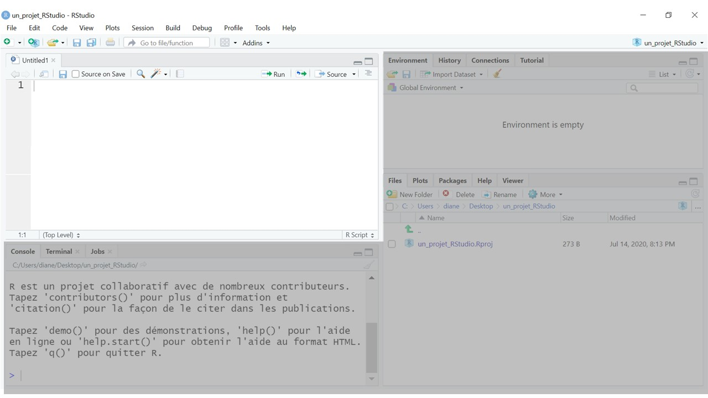
```

<BR>

<BR>

## Pourquoi créer un "projet RStudio" ?

<BR>

<BR>

Quand on utilise des programmes R dans le cadre d'un projet statistique, il est conseillé de créer un projet RStudio.  

Un projet RStudio permet de :  

- rassembler les scripts R utilisés,  

- faciliter l'utilisation des programmes par tout utilisateur (reproductibilité),  

- simplifier le travail en équipe : plusieurs personnes pourront 
contribuer en même temps sur les scripts du projet sans risque d'écraser par mégarde le travail d'un collègue.  

<BR>

<BR>

## Création d'un projet RStudio

<BR>

<BR>

#### Je crée un projet RStudio

<BR>

Ci-dessous, l'une des façons de créer un projet RStudio.

<BR>

Lancer RStudio.

<BR>

Dans RStudio, tout en haut à droite, cliquer sur "Project: (None)".  
Une liste déroulante apparaît.  

Choisir "New Project..."  
Une fenêtre pop-up "Create Project" s'affiche  

&nbsp;&nbsp;&nbsp;&nbsp;Sélectionner "New Directory" .  

&nbsp;&nbsp;&nbsp;&nbsp;Dans la page "Project Type" de la pop-up,  
&nbsp;&nbsp;&nbsp;&nbsp;cliquer sur "New Project".  

&nbsp;&nbsp;&nbsp;&nbsp;Dans la page suivante,  
&nbsp;&nbsp;&nbsp;&nbsp;&nbsp;&nbsp;&nbsp;&nbsp;&nbsp;&nbsp;champs "Directory Name:" renseigner le nom du projet, par exemple projet1 ,  
&nbsp;&nbsp;&nbsp;&nbsp;&nbsp;&nbsp;&nbsp;&nbsp;&nbsp;&nbsp;champs "Create project as subdirectory of:" choisir le répertoire parent du projet,  
&nbsp;&nbsp;&nbsp;&nbsp;&nbsp;&nbsp;&nbsp;&nbsp;&nbsp;&nbsp;(par exemple C/user/R/mesProjets/ ),  
&nbsp;&nbsp;&nbsp;&nbsp;&nbsp;&nbsp;&nbsp;&nbsp;&nbsp;&nbsp;puis cliquer sur "Create Project"  

<BR>

Le projet est maintenant utilisable.

Dans le répertoire parent du projet un dossier "projet1" a été créé.

<BR>

#### Visualisation du projet dans l'explorateur de fichier

<BR>

Avec l'explorateur de fichier je consulte le contenu du répertoire "projet1" :

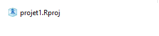{width=40%} 

*Le dossier "projet1" contient un seul fichier "projet1.Rproj" .*

<BR>

#### Le répertoire "R" du projet

<BR>

Je crée un sous-dossier "R" dans le répertoire "projet1" avec l'explorateur de fichier.

<BR>

Le contenu du dossier "projet1" devient :

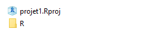{width=40%} 

<BR>

Ce sous-dossier "R" sert à stocker les scripts R.

<BR>

Le projet "projet1" est maintenant prêt.  
Il reste à le compléter avec des scripts écrits dans le langage des Runes.  

<BR>

<BR>

## Création d'un "projet de package"

<BR>

<BR>

Un projet de package est un projet RStudio plus élaboré que les simples projets créés ci-dessus.  

Un projet de package permet notamment :

- de créer un package,

- de fabriquer une documentation des scripts R particulièrement bien assemblée,

- etc.

<BR>

<BR>

#### Je crée un projet de package

<BR>

Ci-dessous, l'une des façons d'obtenir un projet de package.

<BR>

<BR>

On peut créer un projet de package de la même façon qu'on a construit un simple projet ci-dessus :  
dans RStudio, en haut à droite, cliquer sur "Project: (None)" etc.

Deux différences avec la création d'un simple projet :  
dans la page "Project Type" , cliquer sur "R package",  
dans la page suivante renseigner le nom du projet, par exemple projet2, dans le champs "Package Name:" .

<BR>

Après création du projet de package "projet2", un répertoire "projet2" apparaît.

<BR>

#### Visualisation du projet dans l'explorateur de fichier

<BR>

##### Aperçu

<BR>

Le répertoire "projet2" a alors le contenu suivant :  

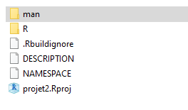{width=30%} 

<BR>

<BR>

##### Les sous-répertoires du projet

<BR>

Le dossier "projet2" inclut un sous-répertoire "R" :  

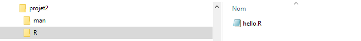{width=100%}  

Ce sous-répertoire "R" contient un script R exemple "hello.R".  

<BR>

"hello.R" comprend le code suivant :
```{r, message=FALSE, warning=FALSE}
# Hello, world!
#
# This is an example function named 'hello' 
# which prints 'Hello, world!'.
#
# You can learn more about package authoring with RStudio at:
#
#   http://r-pkgs.had.co.nz/
#
# Some useful keyboard shortcuts for package authoring:
#
#   Install Package:           'Ctrl + Shift + B'
#   Check Package:             'Ctrl + Shift + E'
#   Test Package:              'Ctrl + Shift + T'

hello <- function() {
  print("Hello, world!")
}
```

<BR>

Le dossier "projet2" inclut aussi un sous-répertoire "man" :  

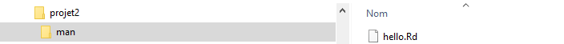{width=100%} 

Ce répertoire "man" contient des fichiers ".Rd" (de documentation).  
Ces fichiers ".Rd" sont typiquement créés avec le package **roxygen2** (vu dans le chapitre précédent).  

<BR>

##### Utilisation du projet

<BR>

J'emploie le sortilège "hello()" :
```{r, message=FALSE, warning=FALSE, eval=FALSE}
# J'installe le package "devtools" si je ne l'ai pas déjà installé dans une session antérieure
install.packages("devtools")

# Dans un projet de package, je peux charger en mémoire 
# les sortilèges du projet avec "load_all()" du package "devtools"
library(devtools)
load_all()

# J'exécute le sortilege "hello()"
hello()
```

```{r, message=FALSE, warning=FALSE, echo=TRUE, eval=FALSE, class.source="background-white"}
[1] "Hello, world!"
```

<BR>

```{r, message=FALSE, warning=FALSE, eval=FALSE}
## J'affiche la documentation du sortilège "hello()"
# Je peux utiliser le point d'interrogation suivi de "hello"
# (ce qui est synonyme de "help(hello)" )
?hello
```

_______________________________________________


```{r message = FALSE, warning = FALSE, echo=FALSE}
htmltools::includeHTML( paste0(REPERTOIRE_du_fichier_chapitre13_Rmd, "/hello.html") )
```

_______________________________________________

<BR>

<BR>

Le projet "projet2" est prêt.  
Il reste à le compléter avec des scripts dans le langage des Runes.  

<BR>

<BR>

<BR>

Remarque : en plus des "projets RStudio" et des projets de package, 
nous pourrions aussi imaginer de créer d'autres types de projet,

<BR>

<BR>

## Rappel : les fichiers "RMarkdown"

<BR>

<BR>

#### Motivation

<BR>

Les fichiers RMarkdown permettent de produire des documents, rapports, présentations, tableaux de bord :   
- avec une belle présentation,  
- et qui peuvent contenir :  
&nbsp;&nbsp;&nbsp;&nbsp;&nbsp;&nbsp;du texte,  
&nbsp;&nbsp;&nbsp;&nbsp;&nbsp;&nbsp;du code R,  
&nbsp;&nbsp;&nbsp;&nbsp;&nbsp;&nbsp;ainsi que les résultats de l'éxécution du code R (les chiffres produits, les graphiques réalisés, etc.).  

<BR>

<BR>

#### Le contenu des fichiers RMarkdown

<BR>

<BR>

Les fichiers RMarkdown ont une extension `.Rmd` .  

<BR>

A l'intérieur des fichiers RMarkdown on alterne du texte et du code R.  

Les lieux où entrer du code 
sont matérialisés par des zones grisées dans RStudio.  

<BR>

Exemple, un fichier `"age_Icarius.Rmd"` : 

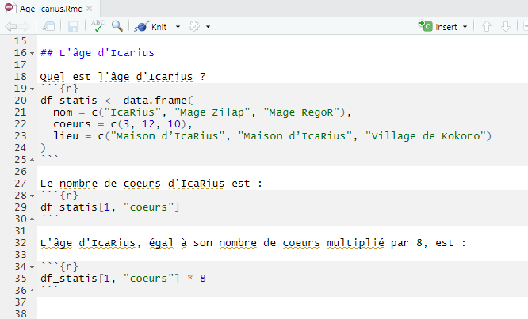{width=70%} 

<BR>

Ces zones grisées commencent par des symboles ``` (accents graves ou "backticks" en anglais) et se terminent par cette même 
série de symboles.

<BR>

<BR>

#### Exécution d'un fichier RMarkdown

<BR>

Après exécution du fichier `.Rmd` , on obtient un document html qui comprend 
le texte, le code R, et le résultat de l'exécution du code R.  

<BR>

Ci-dessous le document obtenu après exécution de `age_Icarius.Rmd` :

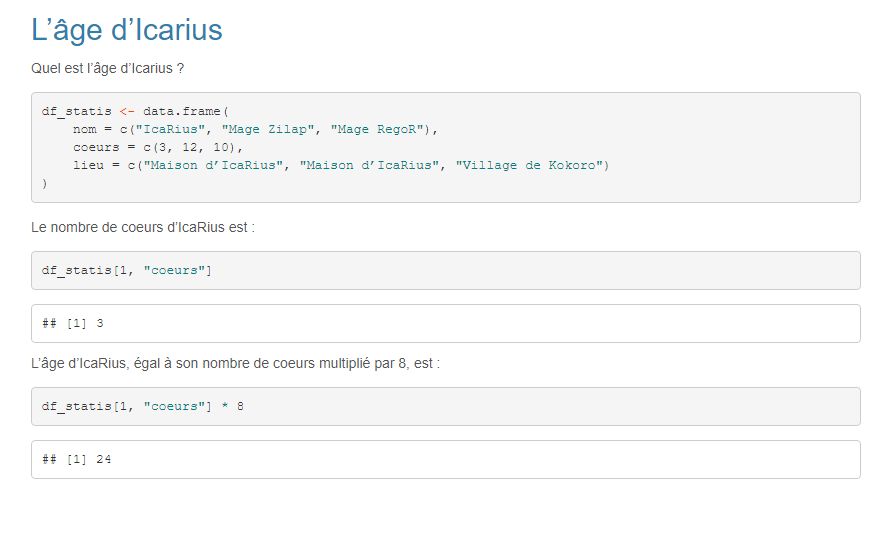{width=100%} 

<BR>

Le document produit apparaît dans le même répertoire que le fichier `.Rmd` .  

<BR>

Quand le fichier `.Rmd` est modifié ou quand les données utilisées changent, 
on peut mettre à jour le document réalisé, en exécutant à nouveau le fichier RMarkdown.

<BR>

<BR>

## Quizz

```{r question, echo=FALSE}
question("Qu'est-ce qu'un projet RStudio ?",
type="single",
allow_retry = TRUE,
incorrect="Retente ta chance",
answer("un ensemble de scripts, qui ne contient qu'une partie des programmes R d'un projet statistique"),
answer("un ensemble de scripts qui ne permet qu'un seul utilisateur "),
answer("une organisation des scripts R d'un utilisateur ou d'une équipe, dans le cadre d'un projet statistique", correct = TRUE),
correct="Félicitations, il s'agit bien d'organiser les scripts"
)

``` 


```{r question2, echo=FALSE}
question("Qu'est-ce qu'un projet de package ?",
type="single",
allow_retry = TRUE,
incorrect="Retente ta chance",
answer("un simple projet RStudio"),
answer("un projet qui ne permet pas de créer un package"),
answer("un projet qui n'apporte pas de plus-value en matière d'édition de la documentation des scripts"),
answer("un projet RStudio, plus élaboré, qui permet notamment de créer un  package, d'éditer une documentation particulièrement bien assemblée, etc.", correct = TRUE),
correct="Félicitations, bonne réponse"
)

``` 

```{r question3, echo=FALSE}
question("Quel est le type de fichiers, qui permet de créer des rapports, présentations, etc. qui contiennent du texte, du code R, et les résultats de l'exécution du code R, avec une belle présentation ?",
type="single",
allow_retry = TRUE,
incorrect="Retente ta chance",
answer("Le type \".R\","),
answer("Le type \".Rmd\" (RMarkdown)", correct = TRUE),
answer("Le type \".txt\""),
correct="Félicitations, ce sont bien les fichiers de type \".Rmd\", qui à l'exécution peuvent produire de tels rapports. Et maintenant...à vous de jouer"
)

``` 

<BR>

<BR>


Nous pourrions continuer avec les fichiers RMardown, mais déjà votre mémoire se brouille, il vous faut vite consigner vos mémoires épiques. 


C'est parti !  Vous allez maintenant ouvrir une autre partie de ce chapitre 13, avec le service intitulé "Grimoire - Neverending" 
dans votre panneau comportant tous les tutoriels du FuncampR.  

<BR>

Ce service va ouvrir RStudio.

À la page de lancement de Rstudio, il vous faudra indiquer :  

- comme nom d'utilisateur (username) : icarius
- comme mot de passe (password) : statia

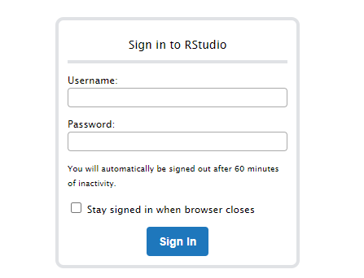{width=50%} 

<BR>

Vous pourrez alors :  
1. éditer votre grimoire,  
2. créer un projet RStudio.  

<BR>

**Fin de la première partie du chapitre 13  >>  lancez la partie "Grimoire - Neverending" qui vous permettra d'éditer 
votre grimoire et de créer un projet RStudio (partie 2 du chapitre 13)**

*Version 0.9.3*

