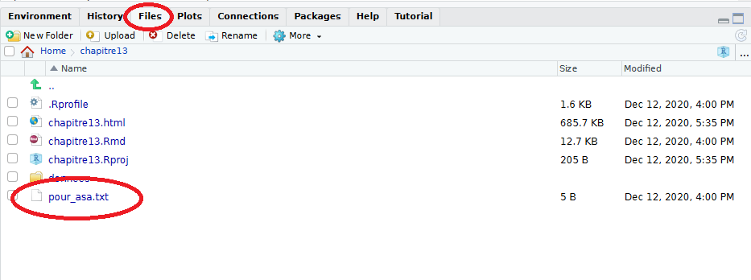

```{r setup, include=FALSE}
library(learnr)
library(knitr)
```

Soyez les bienvenus : vous voici dans l'environnement de développement RStudio. Prenez le temps de trouver vos marques. L'environnement a été préparé pour vous : à gauche le panneau source, à droite le viewer. Sentez-vous libre de manipuler les fenêtres comme bon vous semble. 

Pour faciliter la mise en forme des mémoires d'Icarius au Royaume de Statis, nous allons utiliser le dièse pour faire en sorte que le texte apparaisse comme un titre dans le rapport des aventures. Voyez plutôt : en positionnant un dièse sur la ligne 6, on observe une mise en page sous forme de grand titre du rendu sur votre droite. Et en encadrant _des mots_ avec des _ de part et d'autre, on constate leur mise en forme italique. Nous utiliserons ces balises tout au long du texte. Notez comment RStudio les colore en bleu pour nous assister. 

# Chapitre 1 

Icarius se réveille, Statia lui murmure dans un demi-sommeil que son royaume est en danger : elle a besoin de lui. Sitôt levé, vous avez rencontré le mage Zilap, qui vous a invité à prendre possession du grimoire IgoR.

Pour quitter la maison d'Icarius, vous avez répondu à la question du mage RegoR : 

> Quel est l'âge d'Icarius ? 

À cet effet, nous avons exécuté l'instruction suivante : 

```{r}
nb_coeur <- 3
max_nb_coeur <- 2*nb_coeur
(nb_coeur * pi^2) - max_nb_coeur
```

Une fois dehors, vous avez parcouru les plaines de Statis et rencontré Statia. Ou plutôt un spectre d'elle qui nous offre une épée. 


# Chapitre 2

Parfaitement équipé, nous nous sommes rendu au village Kokoro en hachant menu les buissons.  
Au village, le mage Tourep nous confie la lourde responsabilité d'aider la fermière avec le registre des pontes. 

> En reconstituant le livre de comptes à partir des 4 fichiers aux formats différents quelle poule est la plus performante ? 

```{r message = FALSE}
library(rio)
livre_compte_1 <- import("donnees/pontes_semaine1.sas7bdat")
livre_compte_2 <- import("donnees/pontes_semaine2.xls")
livre_compte_3 <- import("donnees/pontes_semaine3.ods")
livre_compte_4 <- import("donnees/pontes_semaine4.csv")

```

Dans le livre 1, la meilleure poule est : 

```{r}
livre_compte_1
```

Dans le livre 2, la meilleure poule est : 

```{r}
livre_compte_2
```

Dans le livre 3, la meilleure poule est : 

```{r}
livre_compte_3
```

Dans le livre 4, la meilleure poule est : 

```{r}
livre_compte_4
```

Le mage Tourep nous remercie d'un bouclier qui nous rend apte à traverser les dangers des plaines de Statis. 
Ainsi équipé, nous accédons à la première rune en abattant un monstrueux papillon.


# Chapitre 3

Au delà des plaines de Statis, le mage Xeilhac qui siège dans le village GrissGrass nous bassine avec sa soupe et... la mandragore. Il nous charge de mener l'enquête. 

> Qui possède l'exploitation la plus productive ? 

```{r message=FALSE}
fichier_tellus <- import("donnees/recensement_agricole_statia_Tellus.ods")
fichier_galia <- import("donnees/recensement_agricole_statia_Galia.ods")

library(skimr)
skim(fichier_galia)
skim(fichier_tellus)
```

Le modeste Galia est bien le meilleur producteur de Mandragore - tant pis pour ce prétentieux Tellus !


# Chapitre 4 

Mais ce n'est pas suffisant, le mage Xeilhac vous pose une autre colle : 

> quel est donc le secret d'une telle performance ? 

La productivité de la meilleure exploitation est explicable par l'efficacité à conjuguer et chaîner les opérations sur la culture avec l'opérateur %>%. L'itinéraire technique optimal de la culture de la Mandragore est la suivante : 

```{r, eval = FALSE}
champ %>% 
  labourer() %>% 
  ajouter(coccinelles) %>%
  semer() %>% 
  arroser() %>% 
  recolter()

```

En récompense à vos nouvelles compétences en vocabulaire, le fermier Galia et le chef du village de Griss Grass vous offrent un filtre de mandragore : vos pouvoirs sont augmentés. 

En allant au-delà du cimetière de GrissGrass, nous voilà face au monstrueux et souterrain Tartaros qui emprisonne les esprits égoïstes qui ne partagent pas leur code. 

Gonflé au philtre de Mandragore, Icarius n'en fait qu'une bouchée et prend du galon : il acquiert sa seconde rune. 

# Chapitre 5 

Arrivé au château de Statis la situation est dramatique : des forces occultes sont à l'oeuvre. Le ministre des armées Parlyus occupe le château avec des soldats.  
Il réclame la guerre ! Quelle drôle d'idée ! Pour obtenir la clé de la cachette d'Essespéus et se faire aider, il faut gagner la confiance de Batreb qui noie son chagrin dans l'ambroisi... Pour cela, vous devez résoudre l'énigme proposée en traçant le graphique qui permet de répondre à la question suivante : 

> A partir de quelle puissance d'ambroisie Batreb franchit le seuil des 100 hoquets par heure ?

```{r, eval = FALSE}

livre_ambroisie %>% 
  gf_line(ivresse ~ puissance, title = "Attention à l'abus d'ambroisie...")
```

Vous obtenez la clé qui permet de libérer Essespéus de la cave (ou ce qu'il en reste, hips !). 

# Chapitre 6

Une fois libéré de son cachot, Essespéus vous propose de tromper Parlyus en lui communiquant une _fake news_. Il s'agit de le tromper et de diriger les forces obscures le plus loin possible auprès du peuple le plus armé. 
Le temps presse, car il s'agit de vaincre Sassos avant que le chef des armées ne rejoigne ce territoire. Statis est un royaume pacifique et vous devez veiller à ce qu'il le reste. 

> Quel royaume est le plus éloigné, tout en comptant le plus de guerriers et le plus grand nombre de jours de canicule ? 

```{r include=FALSE}
library(dplyr)
donnees_secretes <- import("donnees/data_soldiers.csv")
donnees_secretes <- donnees_secretes %>%
  select('royaume','nb_guerriers','nb_habitants','nb_chevaux','nb_canicule','dist_royaume','situation')
donnees_secretes_df <- as.data.frame(donnees_secretes)
```

```{r message=FALSE}
library(ggformula)

donnees_secretes %>% 
  gf_point(nb_canicule ~ dist_royaume,
           size = ~ nb_guerriers,
           shape = 5) %>% 
  gf_text(label = ~ royaume,
          size = 2.5,
          check_overlap = TRUE) %>%
  gf_refine(scale_x_continuous(limits = c(0, 50)))
```

C'est le territoire des Hauts qu'il faut attaquer !

Et c'est là la rencontre avec Sassos ! Ou plutôt un ectoplasme de lui. Il n'empêche que sa terrible PROC FIREBALL vous a salement amoché et il a disparu d'un coup de PROC EXPAND ! Heureusement, vous avez pu vous défendre en réfléchissant ses tirs grâce à l'épée. 


# Chapitre 7 

Le mage Delagarde à l'entrée du labyrinthe vous propose de manipuler quelques vecteurs pour vous guider dans le dédale. Bien que...il est possible de s'en sortir sans aide à dire vrai. 

Qu'à cela ne tienne ! Il énonce une étrange vérité : 

> quelle que soit la direction que tu regardes, la sortie se trouve au delà de Pi. 

```{r include=FALSE}
vecteur_choix <- c("Droite","Gauche","Gauche","Droite","Droite",
"Gauche","Droite","Gauche","Gauche","Droite",
"Droite","Gauche","Droite","Gauche","Gauche",
"Droite","Droite","Gauche","Gauche","Droite")
vecteur_seuil <- rep(pi,20)
vecteur_ajust <- rep(-1,20)
vecteur_ajust[c(6,10,12,19)]<-1
vecteur_seuil <- vecteur_seuil + runif(20)*vecteur_ajust
```

```{r}
# Chercher les éléments de  vecteur_seuil dont la valeur est supérieure à pi
# et sauvegarder cet ensemble de position dans un vecteur appelé vecteur_position
vecteur_position <- which(vecteur_seuil>pi)
# Extraire de vecteur_choix les éléments qui sont dans les emplacements 
# de vecteur_position et afficher cet ensemble de directions
vecteur_choix[vecteur_position]
```

# Chapitre 8 

Une fois extrait du labyrinthe, vous retrouvez le mage Zilap dans le désert. Ce vieux ronchon doit bien reconnaître que vous avez progressé dans le maniement du langage des Runes ! Il vous explique comment ajouter des pages au grimoire, chaque package étant un nouveau chapitre. 

```{r eval=FALSE}
# J'installe les packages du tidyverse en une ligne
install.packages("tidyverse")
# Je charge les packages en une ligne
library(tidyverse)
```

Vous voilà plus léger, ou plutôt les objets qui vous entourent le sont. Et vous rejoignez le village de Sandia. 

# Chapitre 9 

Le temps presse, vous débarquez dans le village de Sandia. Mam’Grouxi radote et vous conte les innombrables naissances qu’elle a vu au fil des ans (des siècles?). Elle vous demande d'identifier, dans le registre des naissances, le nom d’une jeune fille dont le Mana (la force vitale et magique) est le plus élevé.

```{r eval=FALSE}
naissances %>% 
  filter(Genre == "F") %>%
  mutate(Mana = Force + Spirit) %>%
  arrange(desc(Mana))
```

C'est Statia ! et elle est née dans le village d'Hylia. Mam’Grouxi vous fait cadeau des bombes qui permettent de percer la montagne et entrer dans le temple de la Roche. Et c'est au coeur des souterrains, en déjouant monstres et boules de feu que le pouvoir de l'épée se trouve renforcé. Et heureusement, car c'est Monolith qu'il faut affronter en déjouant ces satanées boules de feu. 

Vous voilà en possession de la quatrième rune. 

En quittant le temple de la roche, l'éboulement condamne tout retour en arrière : l'affrontement final de SassoS est inélectuable. 


# Chapitre 10 


En poursuivant vos pérégrinations et après avoir abattu quelques drôles de sphinx, icaRius se trouve pris au piège dans la salle de l'impossible. Quelle que soit la direction prise, Icarius atterrit toujours au même endroit. Il doit apprendre à garder les choses en mémoire et les sauvegarder. 

```{r eval=FALSE}
save(naissances_1213,naissances_mana,file="../sauvegarde/tables_chapitre9.RData")
sink()
ggsave()
export()
```

En retenant la suite d'instructions directionnelles qui s'avère être la célèbre suite de Konami, Icarius prend possession du bouclier éponyme. 

# Chapitre 11

Au sortir de la salle de l'impossible, Icarius ne peut poursuivre son chemin face aux tourbillons de l'éternel recommencement : il se retrouve systématiquement éjecté. C'est le robot TeoC, envoyé par le mage Essespéus, qui nous vient en aide en vous intronisant aux voies du reproductible. Ses manières ne sont pas des plus délicates : il catapulte Icarius au tout début de l'histoire ! 

Vous voilà à écrire votre première fonction, celle qui calcule l'âge d'Icarius. 

```{r}
calcul_age_arrondi <- function(nb_coeur) { 
  round(nb_coeur * pi^2 - 2 * nb_coeur)
}
```

C'est ainsi vous obtenez le boomerang magique qui permet de désamorcer les tourbillons de l'éternel recommencement : Icarius peut ainsi pénétrer dans le temple de l'ombre. 

Muni de la petite clef et de la carte du donjon, les longues errances dans le labyrinthe de l'ombre conduisent à Zigûr, l'infâme oeil de Sassos. Grâce au boomerang pour agir à distance car le sol est pavé de trous béants et à votre épée, vous prenez possession de la cinquième rune. 

# Chapitre 12 

Sorti enfin à l'air libre, vous longez le datalake jusqu'à rencontrer le drôle d'oiseau Febeler. S'il veut bien vous donnez les moyens de traverser à la nage le lac avec le sortilège palmes(), il vous faut toutefois documenter son fonctionnement et donc en lire la documentation car pour le paraphraser : 

> Sans sortilège, point de magie ! Et sans documentation, point de sortilège ! 

Vous voilà donc à soigneusement documenter votre précieuse fonction calcul_age_arrondi() grâce aux balises _roxygen2_ et c'est là la réponse à l'énigme posée par l'oiseau. 

```{r}
#' @title calcul_age_arrondi
#' @description calculer l'âge arrondi d'un statisien selon son nombre de coeurs
#' @param nb_coeur Un nombre
#' @import tidyverse
#' @examples
#' calcul_age_arrondi(3)
#' calcul_age_arrondi(4)
calcul_age_arrondi <- function(nb_coeur){
  calcul_age(nb_coeur)%>%
    round()}

```

Febeler s'acquitte de sa promesse et vous fournit les palmes nécessaires à une traversée qui n'est pas sans encombres.

Arrivé au temple de la glace, les longs couloirs parsemés d'objets qui vous rapprochent de votre quête sont légion : une carte, une boussole, une petite clé, la clé du boss... La fin de ce chapitre approche ! Vous rencontrez Confusius, maître en ces lieux. Et remportez la sixième rune ! Une fois dehors, vous ne pouvez plus faire marche arrière. Qu'à cela ne tienne, la quête reprend.

Febeler, lui encore, vous aiguille vers l'Est dans une forêt brumeuse peuplée de squelettes. La progression à travers les grumes creuses est difficile... 

## Dernier chapitre

Vous rencontrez enfin Asa la gueRnouille qui vous propose d'écrire votre destin et vos mémoires, simultanément.

Votre quête de la maîtrise du langage des runes s'achève ici. Prenez quelques instants pour observer le chemin accompli : vous avez importé des fichiers, manipulé des données, synthétisé leur contenu en des tableaux résumés, exporté ces mêmes données pour les sauvegarder, créé et documenté des fonctions pour les réutiliser et les transmettre. Toutes les traces de votre connaissance (et bravoure !) sont présentées dans le présent (et précieux) document. 

Vous pouvez, si vous le souhaitez, en guise d'aide-mémoire pour vos prochaines aventures avec R, enregistrer le fichier html qui résulte de ce RMarkdown en vous rendant dans l'onglet Files, qui se trouve sur votre droite, dans un cadran de la partie inférieure de l'écran.

Cliquez sur la case qui jouxte le nom de fichier et l'engrenage dans le menu de l'onglet vous laissera l'opportunité d'exporter votre prose.

Toujours dans cet onglet Files, vous trouverez juste à côté de votre RMarkdown (.Rmd) et html (fichier lisible dans un navigateur web) 
un fichier intitulé _pour_asa.txt_ : il contient la réponse à fournir à Asa pour finaliser votre aventure au royaume de Statis. 
Pour ouvrir ce fichier _pour_asa.txt_, il vous suffira de cliquer dessus...
Notez bien ce code magique, pour que vous puissiez reprendre le jeu vidéo icaRius et donner la réponse à Asa la gueRnouille.

{width=100%} 

<BR>

<BR>

Juste avant de finaliser l'aventure, nous vous proposons de créer un "projet de package" comme vu dans la première partie du chapitre 13.

1. Enregistrez la succession d'étapes ci-dessous, par exemple sur un fichier personnel, car au cours de la création d'un projet de package
vous risquez de quitter cette page et de ne plus avoir accès à son contenu.  
2. Tentez la création d'un projet de package.  
3. puis vous pourrez reprendre le jeu vidéo icaRius et donner la réponse (le code magique ci-dessus) à Asa la gueRnouille.  

<BR>

!###############################################  
Création d'un projet de package, succession d'étapes :  
!###############################################  
Dans RStudio, en haut à droite, cliquez sur "chapitre 13".  
Une liste déroulante apparaît. Choisir "Close project".  
En haut à droite cliquer sur "Project: (None)".   
Choisir "New Project..."  
Une fenêtre pop-up "Create Project" s'affiche  
&nbsp;&nbsp;&nbsp;&nbsp;Sélectionner "New Directory" .  
&nbsp;&nbsp;&nbsp;&nbsp;Dans la page "Project Type" de la pop-up, cliquer sur "R package",  
&nbsp;&nbsp;&nbsp;&nbsp;Dans la page suivante,  
&nbsp;&nbsp;&nbsp;&nbsp;&nbsp;&nbsp;&nbsp;&nbsp;&nbsp;&nbsp;champs "Package Name:" renseigner le nom du projet, par exemple projet1 ,  
&nbsp;&nbsp;&nbsp;&nbsp;&nbsp;&nbsp;&nbsp;&nbsp;&nbsp;&nbsp;champs "Create project as subdirectory of:" choisir le répertoire parent du projet,  
&nbsp;&nbsp;&nbsp;&nbsp;&nbsp;&nbsp;&nbsp;&nbsp;&nbsp;&nbsp;puis cliquer sur "Create Project"  
# Le projet est créé. Il contient déjà un sortilège "hello()" ainsi qu'une documentation de ce sortilège.  
# Dans RStudio ouvrir une fenêtre de script, puis exécuter le code suivant :  
library(devtools)  
load_all()  
hello() # exécution
?hello # affichage de la documentation
!###############################################  

<BR>

(Fin de cette épreuve. Version 0.9.4)