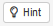

```{r, echo=FALSE, eval=FALSE}
# curly quotes -> staight quotes
# smart = false
md_extensions:  -smart
```

```{r setup, include=FALSE, echo = TRUE}
library(rio)
library(dplyr)
library(learnr)
library(parsons)
library(knitr)
library(rsdmx)
library(stringr)
knitr::opts_chunk$set(echo = TRUE)

file.copy(from = system.file(package = "funcampR","data","chapitre2_replay/livre_compte_3.RData"),
          to = paste0(tempdir(),"/livre_compte_3.RData"))
file.copy(from = system.file(package = "funcampR","data","chapitre2_replay/livre_compte_4.RData"),
          to = paste0(tempdir(),"/livre_compte_4.RData"))

chemin_livre_compte_3 <- paste0(tempdir(),
  "/livre_compte_3.RData"
)
chemin_livre_compte_3 <- str_replace_all(chemin_livre_compte_3, "\\\\", "/")

chemin_livre_compte_4 <- paste0(tempdir(),
  "/livre_compte_4.RData"
)
chemin_livre_compte_4 <- str_replace_all(chemin_livre_compte_4, "\\\\", "/")

chemin_comparateur_cc_33292 <- paste0(tempdir(),
  "/comparateur_cc_33292.xls"
)
chemin_comparateur_cc_33292 <- str_replace_all(chemin_comparateur_cc_33292, "\\\\", "/")
```

```{r prepare-data}
rm(livre_compte_3)

rm(livre_compte_4)

Sys.unsetenv("https_proxy")
Sys.unsetenv("http_proxy")

rm(naissances_93)

rm(df_naissances_93)

tryCatch(
  {
    if (file.exists(chemin_comparateur_cc_33292)) {
      unlink(chemin_comparateur_cc_33292)
    }
  },
  error=function(cond) {
    return("")
  }
)

df_statis <- data.frame(
    nom = factor(c("IcaRius", "Mage Zilap", "Mage RegoR")),
    coeurs = c(2, 12, 10),
    lieu = factor(c("Maison d’IcaRius", "Maison d’IcaRius", "Village de Kokoro"))
)
```

<BR>

Vous venez de rencontrer la fermière du village Kokoro, désespérée d'avoir perdu le livre de compte où, chaque jour, elle note consciencieusement le nombre de pontes. 

Aidons IcaRius à retrouver le livre de compte. Ce dernier n'est pas tout à fait perdu : il en reste une copie. Mais pour corser le tout, la copie a été ensorcelée et semble indéchiffrable... Elle est en effet dans un format ".RData".

**Aie aie aie.**

<BR>

## Au Royaume de Statis, lecture de données enregistrées

<BR>

#### Rappel : charger un fichier dans R avec le sortilège `import`

<BR>

Le sortilège `import()` permet d'importer dans R des fichiers qui ont une extension ".sas7bdat" (SAS), ".xls", ".xlsx", ".ods" (Libre office Calc), ".csv", 
ou un format SPSS, Stata, Matlab, etc.

L'écriture est la suivante :
```{r, echo=TRUE, eval=FALSE}
import("chemin_du_fichier")
```

<BR>

D'autres fichiers, avec des extensions particulières, nécessitent des sortilèges différents de `import()`.

<BR>

## Un fichier du langage des Runes

<BR>

#### Charger le contenu d'un fichier ".RData" dans R

<BR>

Rappel : un fichier ".RData", est une sauvegarde sur disque (ou clé USB, etc.) d'un ou de plusieurs objets de R.  

<BR>

Pour importer le contenu d'un fichier ".RData" dans R, on peut utiliser le sortilège `load`.

<BR>

Exemple.

Un fichier "livre_compte_3.RData" a été préalablement créé.  

(Ce fichier est la sauvegarde d'un data.frame nommé "livre_compte_3".)  

L'adresse de ce fichier est &nbsp;&nbsp;&nbsp;&nbsp; `r chemin_livre_compte_3`  
(attention, dans R, il faut toujours dans les chemins de fichier utiliser des "slash" / et non des "back slash" \)  

<BR>

```{r, echo=FALSE, eval=TRUE, comment=NA}
str_1 <- 
  paste0(
    "# Je charge le fichier \"livre_compte_3.RData\"\n",
    "load(\n  \"",
    chemin_livre_compte_3,
    "\" # le chemin du fichier\n)"
  )
cat(str_1) 
```

<BR>

```{r, echo=FALSE, eval=TRUE}
load(chemin_livre_compte_3)
```

Après chargement du fichier, je peux constater qu'un data.frame "livre_compte_3" existe maintenant dans R.
```{r, echo=TRUE, eval=TRUE}
# J'affiche le contenu du data.frame "livre_compte_3"
livre_compte_3
```

<BR>

<span style="color:#18AC3E;font-size:16px">**A vous de pratiquer**</span>

<BR>

Nous vous proposons de charger un autre fichier, `livre_compte_4.RData`.  

(Ce fichier est une sauvegarde d'un data.frame `livre_compte_4`.)  

Le chemin de ce fichier est : &nbsp;&nbsp; `r chemin_livre_compte_4`

<BR>

Au fait, une astuce : dans la console R ci-dessous, vous pouvez également afficher la solution pour avoir une aide avec le bouton :
```{r, echo=FALSE, fig.cap="", out.width = '60px', out.height = '26px'}

```
```{r ok-chapitre2-etape1,exercise=TRUE, exercise.setup = "prepare-data", message=FALSE, warning=FALSE}
# Avec le sortilège "load", importer dans R le fichier "livre_compte_4.RData"


# Après importation du fichier, le data.frame "livre_compte_4" est chargé dans R.
# Afficher le contenu du data.frame "livre_compte_4"


# Fin de l'exercice
```

```{r, include=FALSE, comment=NA}
str_2 <- 
  paste0(
    "# Avec le sortilège \"load\", importer dans R le fichier \"livre_compte_4.RData\"\n",
    "load(\n  \"",
    chemin_livre_compte_4,
    "\"\n)",
	"\n",
	"\n",
	"# Après importation du fichier, le data.frame \"livre_compte_4\" est chargé dans R.\n",
	"# Afficher le contenu du data.frame \"livre_compte_4\"\n",
	"livre_compte_4\n",
	"\n",
	"# Fin de l'exercice"
  )
```

<div id="ok-chapitre2-etape1-hint">
```{r ok-chapitre2-etape1-hint1, echo=FALSE, eval=TRUE, comment=NA}
cat(str_2) 
```
</div>


<BR>

<BR>

## Les données sdmx

<BR>

#### Importer dans R des données sdmx

<BR>

Les données au format ".sdmx" sont très souvent employées par les statisiens.

Le sortilège `readSDMX` permet de charger des données ".sdmx" dans R. 

<BR>

Exemple.

```{r, echo=TRUE, eval=FALSE}
# Site Insee.
# L'adresse "https://bdm.insee.fr/series/sdmx/data/SERIES_BDM/000868205" permet 
# d'accéder aux chiffres des naissances, région Provence-Alpes-Côte d'Azur
# (BDM, Banque de Données Macro-économiques),
# au format sdmx.
# Je souhaite charger ces chiffres dans R.

# Je charge les données, avec le sortilège "readSDMX",
# dans un objet R "naissances_93"
naissances_93 <- readSDMX("https://bdm.insee.fr/series/sdmx/data/SERIES_BDM/000868205")

# Pour faciliter l'utilisation, je transforme "naissances_93" en un "data.frame"
df_naissances_93 <- as.data.frame(naissances_93)

# J'affiche, si je le souhaite, les 5 premières lignes du data.frame
head(df_naissances_93, 5)
```
| *Selon la gestion de la sécurité de votre administration ou entreprise, il peut être nécessaire, avant*  
| *d'employer le sortilège `readSDMX`, d'effectuer dans RStudio un paramétrage particulier.*  
|            *Sur un poste Insee, si vous suivez ce tutoriel à partir d’une clef USB ou si vous avez installé*  
|            *le grimoire de tutoriels sur votre poste de travail, le paramétrage nécessaire est le suivant :*  
|            *Sys.setenv(https_proxy="http://proxy-rie.http.insee.fr:8080")*  
|            *Sys.setenv(http_proxy="http://proxy-rie.http.insee.fr:8080")*  

<BR>

<span style="color:#18AC3E;font-size:16px">**À vous de prendre la plume !**</span> 

Nous vous proposons de re-charger les données "https://bdm.insee.fr/series/sdmx/data/SERIES_BDM/000868205" dans R.

```{r ok-chapitre2-etape2,exercise=TRUE, exercise.setup = "prepare-data", message=FALSE, warning=FALSE}
# Charger les données, avec le sortilège "readSDMX",
# dans un objet R "naissances_93"


# Pour faciliter l'utilisation, transformer l'objet R "naissances_93" en un "data.frame", 
# avec le sortilège "as.data.frame"


# Afficher les 5 premières lignes du data.frame


# Fin de l'exercice
``` 

```{r ok-chapitre2-etape2-solution}
# Charger les données, avec le sortilège "readSDMX",
# dans un objet R "naissances_93"
naissances_93 <- readSDMX("https://bdm.insee.fr/series/sdmx/data/SERIES_BDM/000868205")

# Pour faciliter l'utilisation, transformer l'objet R "naissances_93" en un "data.frame", 
# avec le sortilège "as.data.frame"
df_naissances_93 <- as.data.frame(naissances_93)

# Afficher les 5 premières lignes du data.frame
head(df_naissances_93, 5)

# Fin de l'exercice
```

<BR>

<BR>

><details><summary><font size="3"><b>
>S'il y a une difficulté d'encodage dans les lignes ci-dessus (par ex. des lignes "Naissances domiciliées par région" apparaissant),
>ci-dessous pour les plus téméraires une partie optionnelle - cliquez ici
</b></font></summary>
><p><font size="2">
>
><BR>
>
>Dans cette sous-partie, on demande à R de lire et d'afficher, avec l'encodage "UTF-8", la série téléchargée.  
>Pour cela, on ajoute un paragraphe au code précédent.  
>
>```{r message=FALSE, warning=FALSE, echo=TRUE, eval=FALSE}
naissances_93 <- readSDMX("https://bdm.insee.fr/series/sdmx/data/SERIES_BDM/000868205")

df_naissances_93 <- as.data.frame(naissances_93)

####
# data.frame "df_naissances_93", je transforme les colonnes de type "facteur" en colonnes de type caractère
df_naissances_93 <- df_naissances_93 %>%
    mutate_if(is.factor, as.character) # utilisation de nouveaux sortilèges "mutate_if" et "is.factor"
# je déclare que l'encoding de chaque colonne du data.frame "df_naissances_93" est "UTF-8"
for (name in colnames(df_naissances_93)){ # emploi de "for" pour énumérer, et du sortilège "colnames" pour obtenir les colonnes d'un data.frame
    Encoding( df_naissances_93[,name] ) <- "UTF-8" # utilisation du sortilège "Encoding"
}
####

head(df_naissances_93, 5)
>```
>
>
><span style="color:#18AC3E;font-size:16px">**À vous de jouer !**</span> 
>
>Nous vous proposons de re-charger les données "https://bdm.insee.fr/series/sdmx/data/SERIES_BDM/000868205" dans R,
> et de demander à R de les lire et afficher avec l'encodage UTF-8.
>
>```{r ok-chapitre2-etape3,exercise=TRUE, exercise.setup = "prepare-data", message=FALSE, warning=FALSE}
# Charger les données dans un objet R "naissances_93"


# Pour faciliter l'utilisation, transformer l'objet R "naissances_93" en un "data.frame"


####
# data.frame "df_naissances_93", transformer les colonnes de type "facteur" en colonnes de type caractère


# déclarer que l'encoding de chaque colonne du data.frame "df_naissances_93" est "UTF-8"


####

# Afficher les 5 premières lignes du data.frame


# Fin de l'exercice
>```
>
>```{r ok-chapitre2-etape3-solution}
# Charger les données dans un objet R "naissances_93"
naissances_93 <- readSDMX("https://bdm.insee.fr/series/sdmx/data/SERIES_BDM/000868205")

# Pour faciliter l'utilisation, transformer l'objet R "naissances_93" en un "data.frame"
df_naissances_93 <- as.data.frame(naissances_93)

####
# data.frame "df_naissances_93", transformer les colonnes de type "facteur" en colonnes de type caractère
df_naissances_93 <- df_naissances_93 %>%
    mutate_if(is.factor, as.character) # utilisation de nouveaux sortilèges "mutate_if", "is.factor", "as.character"
# déclarer que l'encoding de chaque colonne du data.frame "df_naissances_93" est "UTF-8"
for (name in colnames(df_naissances_93)){
    Encoding(df_naissances_93[,name]) <- "UTF-8" # emploi du sortilège "Encoding()"
}
####

# Afficher les 5 premières lignes du data.frame
head(df_naissances_93, 5)

# Fin de l'exercice
>```
>
><BR>
>
>
></font></p></details>

<BR>

## L'internet des Runes

<BR>

#### Demander à R de télécharger un fichier sur internet

<BR>

Avec le sortilège `download.file`, on peut demander à R de télécharger un fichier disponible sur internet.

<BR>

Exemple.

Nous allons demander à R :  

- de télécharger le fichier ".xls" https://www.insee.fr/fr/statistiques/tableaux/1405599/comparateur_cc_.xls?geo=COM-33292 ,  

("Comparateur de territoire", commune de Montignac (33292), insee.fr,
https://www.insee.fr/fr/statistiques/1405599?geo=COM-33292 )

- et d' enregistrer le fichier téléchargé sous  &nbsp;&nbsp; `r chemin_comparateur_cc_33292` .  

<BR>

```{r, echo=FALSE, eval=TRUE, comment=NA}
str_3 <- 
  paste0(
    "# Avec le sortilège \"download.file\",\n",
	"# je télécharge le fichier ci-dessus,\n",
    "# et je l'enregistre.\n",
    "download.file(\n",
    "  url = \"https://www.insee.fr/fr/statistiques/tableaux/1405599/comparateur_cc_.xls?geo=COM-33292\",\n",
    "  destfile = \"",
    chemin_comparateur_cc_33292,
    "\"\n)"
  )
cat(str_3)
```

```{r, echo=FALSE, eval=TRUE}
download.file(
    url = "https://www.insee.fr/fr/statistiques/tableaux/1405599/comparateur_cc_.xls?geo=COM-33292",
    destfile = chemin_comparateur_cc_33292
)
```

<BR>

Après téléchargement, on peut vérifier que ce fichier &nbsp;&nbsp; `r chemin_comparateur_cc_33292` &nbsp;&nbsp; existe bien,
avec le sortilège `file.exists()` .

```{r, echo=FALSE, eval=TRUE, comment=NA}
str_4 <- 
  paste0(
    "# Je vérifie que le fichier existe\n",
    "file.exists(\"",
    chemin_comparateur_cc_33292,
    "\")"
  )
cat(str_4)
```

```{r, echo=FALSE, eval=TRUE}
file.exists(chemin_comparateur_cc_33292)
```

<BR>

<span style="color:#18AC3E;font-size:16px">**A vous de pratiquer**</span>

Nous vous proposons de redemander à R :  
- de télécharger le fichier `https://www.insee.fr/fr/statistiques/tableaux/1405599/comparateur_cc_.xls?geo=COM-33292`,  
- et d'enregistrer le fichier téléchargé sous &nbsp;&nbsp; `r chemin_comparateur_cc_33292` .  

```{r ok-chapitre2-etape4,exercise=TRUE, exercise.setup = "prepare-data", message=FALSE, warning=FALSE}
# Avec le sortilège "download.file", télécharger le fichier


# Vérifier que le fichier a bien été créé, avec le sortilège "file.exists(...)"


# Fin de l'exercice
``` 

```{r, include=FALSE, comment=NA}
str_6 <- 
  paste0(
    "# Avec le sortilège \"download.file\", télécharger le fichier\n",
    "download.file(\n",
    "  url = \"https://www.insee.fr/fr/statistiques/tableaux/1405599/comparateur_cc_.xls?geo=COM-33292\",\n",
    "  destfile = \"",
    chemin_comparateur_cc_33292,
    "\"\n)\n",
	"\n",
	"# Vérifier que le fichier a bien été créé, avec le sortilège \"file.exists(...)\"\n",
	"file.exists(\"",
	chemin_comparateur_cc_33292,
	"\")\n",
	"\n",
	"# Fin de l'exercice"
  )
```

<div id="ok-chapitre2-etape4-hint">
```{r ok-chapitre2-etape4-hint2, echo=FALSE, eval=TRUE, comment=NA}
cat(str_6) 
```
</div>

<BR>

## Décompression

<BR>

#### Indiquer à R de dézipper un fichier

<BR>

Soit un fichier compressé, qui est sur disque dur ou sur clé USB.

On peut demander à R de dézipper le fichier, avec le sortilège "unzip".  

<BR>

```{r, echo=TRUE, eval=FALSE}
# Avec du code R, je souhaite dé-zipper un fichier compressé "monFichierZip", que j'ai sur disque dur ou clé USB.
# Je souhaite que le résultat du dé-zippage soit dans un dossier "monRepertoire".
# J'utilise le sortilège "unzip" :
unzip(
  zipfile = "monFichierZip", # indiquer le chemin complet du fichier, entre guillemets (utiliser des / et non des \)
                             # exemple : "C:/user/fichier_1.zip"
  exdir = "monRepertoire" # précider le chemin complet du dossier, entre guillemets, par exemple "C:/user"
)
```

<BR>

## Rappel : conjuguer les sortilèges

<BR>
Avant de passer à la suite, un petit rappel, si vous le souhaitez.

Le **pipe** `%>%` est une instruction du langage des Runes qui permet de conjuguer les sortilèges.  

Le "pipe" va être très utilisé dans la suite du Grimoire.  

Souhaitez vous réviser le "pipe" (comment le "pipe" s'emploie, comment il permet d'assembler les sortilèges) ?

Si vous ne souhaitez pas revoir cette instruction du langage R, passez directement à la partie "Revenons à nos oeufs...", en vue de
répondre à l'énigme du chapitre 2, et de continuer le jeu Icarius.

><details><summary><font size="3"><b>Si vous souhaitez réviser le **pipe** `%>%`, avant de résoudre l'énigme et de continuer le jeu, cliquer ici.</b></font></summary>
><p><font size="2">
>
><BR>
>
><span style="color:blue;font-size:20px">Comment conjuguer les sortilèges</span>
>
><BR>
>
>```{r, echo=TRUE, eval=FALSE}
# Créons une table de données "df.statis",
# contenant des informations sur IcaRius ainsi que sur les mages Zilap et RegoR,
# avec le sortilège data.frame()
df_statis <- data.frame(
    nom = c("IcaRius", "Mage Zilap", "Mage RegoR"),
    coeurs = c(2, 12, 10),
    lieu = c("Maison d’IcaRius", "Maison d’IcaRius", "Village de Kokoro")
)
>```
>```{r, echo=FALSE, eval=TRUE}
# Créons une table de données "df.statis",
# contenant des informations sur IcaRius ainsi que sur les mages Zilap et RegoR,
# avec le sortilège data.frame()
df_statis <- data.frame(
    nom = factor(c("IcaRius", "Mage Zilap", "Mage RegoR")),
    coeurs = c(2, 12, 10),
    lieu = factor(c("Maison d’IcaRius", "Maison d’IcaRius", "Village de Kokoro"))
)
>```
>
>Un bon mage est appelé à évoquer de multiples sortilèges, qu'il va combiner pour accroître son pouvoir. 
>De même, dans la langue des Runes, les sortilèges peuvent se conjuguer les uns les autres, 
>c'est-à-dire être associés dans un ordre qui vous permettra d'obtenir l'effet escompté. 
>La conjugaison des sortilèges se fonde sur un étonnant symbole : le **pipe** (prononcez "paille-peu"), 
>représenté par les lettres **%>%**. On l'invoque en juxtaposant %, > et % côte-à-côte. 
>
>```{r image1, echo=FALSE, fig.cap="", out.width = '8%', fig.align='center'}
knitr::include_graphics("images/symbole_pipe.png")
>```
>
><BR>
>
><span style="color:blue;font-size:16px">L'utilisation du **pipe**, avec un sortilège</span>
>
><BR>
>
>Le **pipe** est un opérateur qui facilite l'enchaînement de sortilèges sur une table de données. Le signe **%>%** peut être lu comme **"ensuite".**  Ainsi, si on utilise cet opérateur :
>```{r, echo=TRUE, eval=FALSE}
# Je souhaite afficher le data.frame "df_statis"

print(df_statis)
# EST EQUIVALENT A :
df_statis %>% print()
>```
>
>```{r, echo=FALSE, eval=TRUE}
df_statis %>% print()
>```
>Le sortilège se trouvant immédiatement à la droite du **%>%** utilise comme objet en entrée l'élement se trouvant à la gauche du **%>%**.  
>
>Dans ce cas particulier, en langue vernaculaire, cela donne: **"Je prends ma table de données et ensuite je l'imprime."**
>
><BR>
>
>Autre exemple :
>```{r, echo=TRUE, eval=FALSE}
class(df_statis)
# EST EQUIVALENT A :
df_statis %>% class()
>```
>
>```{r, echo=FALSE, eval=TRUE}
df_statis %>% class()
>```
>
>Si on traduit, cela donne: **"Je considère ma table de données, et ensuite je retrouve son type."**
>
><BR>
>
>On peut également choisir de ne s'intéresser qu'à une seule des variables de la table comme nous l'avions fait au chapitre 1 :
>
>```{r, echo=TRUE, eval=FALSE}
print(df_statis$coeurs)
# EST EQUIVALENT A :
df_statis$coeurs %>% print()
>```
>
>```{r, echo=FALSE, eval=TRUE}
df_statis$coeurs %>% print()
>```
>
>En traduisant, cela donne: **"Je prends ma table de données, je sélectionne une variable de la table, et ensuite j'affiche cette variable"**
>
><BR>
>
><span style="color:#18AC3E;font-size:16px">**À vous de prendre la plume !**</span> 
>
>Nous vous proposons de réafficher la table "df_statis", et de réobtenir son type, en utilisant le pipe.
>
>```{r ok-chapitre2-etape5,exercise=TRUE, exercise.setup = "prepare-data", message=FALSE, warning=FALSE}
# En utilisant le "pipe" %>% et le sortilège print(), 
# afficher le data.frame "df_statis"


# Avec le "pipe" %>% et le sortilège class(), 
# retrouver le type de la table "df_statis"


# Fin de l'exercice
>```
>
>```{r ok-chapitre2-etape5-solution}
# En utilisant le "pipe" %>% et le sortilège print(), 
# afficher le data.frame "df_statis"
df_statis %>% print()

# Avec le "pipe" %>% et le sortilège class(), 
# retrouver le type de la table "df_statis"
df_statis %>% class()

# Fin de l'exercice
>```
>
><BR>
>
><span style="color:blue;font-size:16px">L'utilisation du **pipe**, dans le cas de plusieurs sortilèges qu'on enchaîne</span>
>
><BR>
>
> Pré-requis : le sortilège "mutate".
>
><BR>
>
>```{r, echo=TRUE, eval=TRUE}
# La table "df_statis" contient une colonne "coeurs".
# Cette colonne "coeurs" est de type numérique
class(df_statis$coeurs)
>```
>
><BR>
>
>On enchaîne ci-dessous deux sortilèges.
>```{r, echo=TRUE, eval=TRUE}
# Je commence par modifier la colonne "coeurs" en la faisant passer de numérique à caractère.
# Ensuite j'affiche la table
print( mutate( df_statis, coeurs = as.character(coeurs) ) ) 
>```
>
><BR>
>
>```{r, echo=TRUE, eval=FALSE}
# Le code
print( mutate( df_statis, coeurs = as.character(coeurs) ) )
# EST EQUIVALENT A :
df_statis %>% 
  mutate( coeurs = as.character(coeurs) ) %>%
  print()
>```
>
>```{r, echo=FALSE, eval=TRUE}
df_statis %>% 
  mutate( coeurs = as.character(coeurs) ) %>%
  print()
>```
>
>Si on traduit en langage des Runes, cela donne :  
>**“Je condidère ma table de données, puis je modifie le type de la colonne 'coeur',
> et après j'affiche la table.”**
>
><BR>
>
><span style="color:blue;font-size:20px">Un peu de pratique...</span>
>
><BR>
>
>Nous vous proposons ci-dessous d'utiliser le **pipe** **%>%** avec plusieurs sortilèges.
>
>```{r ok-chapitre2-etape6,exercise=TRUE, exercise.setup = "prepare-data", message=FALSE, warning=FALSE}
# En utilisant le "pipe" %>% ainsi que les sortilèges "mutate()", et "print()",
# modifier la colonne "coeurs" en la faisant passer de numérique à caractère,
# puis afficher la table


# fin de l'exercice
>```
>
>```{r ok-chapitre2-etape6-solution}
# En utilisant le "pipe" %>% ainsi que les sortilèges "mutate()", et "print()",
# modifier la colonne "coeurs" en la faisant passer de numérique à caractère,
# puis afficher la table
df_statis %>% 
  mutate( coeurs = as.character(coeurs) ) %>%
  print()

# fin de l'exercice
>```
>
><BR> 
> 
><span style="color:blue;font-size:20px">Les étapes d'une recette</span>
>
><BR> 
>
>Dans le monde de Statia, le pipe permet de produire des enchainements de sortilèges... comme de composer toutes les étapes d'une recette. Mais attention : pour qu'une recette soit un succès, encore faut-il suivre les étapes dans le bon ordre. Il en va de même pour un bon sortilège...
>
>Imaginez Sylvain, un cuisinier du dimanche qui veut faire du pain, voilà la recette telle qu'il la trouvera sur maRmiton, la célèbre bibliothèque de cuisine : *prends la farine, ensuite ajoute le sel, ensuite ajoute la levure, ensuite ajoute l'eau, ensuite mélange le tout, ensuite laisse reposer la pate réalisée, enfin met au four pendant 13 minutes à 240°C.*
>
>En langage des Runes, la même recette s'écrira de la façon suivante :
>
>```{r,eval = F, echo=TRUE}
farine %>% 
  ajouter(sel) %>% 
  ajouter(levure) %>% 
  ajouter(eau) %>% 
  melanger() %>% 
  laisser_reposer() %>% 
  mettre_au_four(température = 240°C,temps = 13minutes)
>```
>
>Le sortilège invoqué dans le langage des Runes est comme une transcription littérale de la recette moyennant l'utilisation du **%>%** .
>
><BR>
>
><span style="color:blue;font-size:20px">De l'art de bien cultiver la terre des plaines de Statis...</span>
>
><BR>
>
>
>
>Vous avez revu la magie du pipe ? A vous de jouer !
>
>Le mage Zilap a bien fourni quelques secrets pour travailler la terre des plaines de Statis, mais dans le désordre. Recomposons les étapes comme il convient. Voici quelques indices :
>
>- Une conjugaison de sortilèges doit d'abord commencer par l'objet sur lequel débute l'enchainement de sortilèges. Ici, l'objet par où tout commence, c'est le champ des plaines de Statis...
>
>- N'oubliez pas : dans les plaines de Statis les fermiers n'utilisent pas de magie noire.
>
>- Ne vous laissez pas embrouiller par le terrible SaSSoS et sa langue serpentine - pas de "set" ou de "run" dans la langue des Runes.
>
>- Le meilleur moment pour arroser une terre, c'est quand elle vient d'être labourée puis semée.
>
>- Les coccinelles sont les amies des plaines de Statis, c'est bien connu !
>
>- Les coccinelles aiment que la terre soit humide...
>
>- A la toute fin, il n'y a plus qu'à récolter...
>
>Saurez-vous remettre les étapes dans l'ordre ?
>
>
>```{r ok-chapitre4-quiz, echo = FALSE}
question_parsons(
  initial = c(
    "champ %>%",
    "data champ;set champ;run;",
    "semer() %>%",
    "arroser() %>%",
    "ajouter(coccinelles) %>%",
    "labourer() %>%",
    "ajouter(magie_noire) %>%",
    "recolter()"
  ),
  pass_if(
    c(
    "champ %>%",
    "labourer() %>%",
    "semer() %>%",
    "arroser() %>%",
    "ajouter(coccinelles) %>%",
    "recolter()"
    ),
    message = "Bravo vous êtes des champions de la culture dans les plaines de Statis!"
  ),
    pass_if(
    c(
    "champ %>%",
    "labourer() %>%",
    "semer() %>%",
    "ajouter(coccinelles) %>%",
    "arroser() %>%",
    "recolter()"
    ),
    message = "Bravo vous êtes des champions de la culture dans les plaines de Statis!"
  ),
    pass_if(
    c(
    "champ %>%",
    "labourer() %>%",
    "ajouter(coccinelles) %>%",
    "semer() %>%",
    "arroser() %>%",
    "recolter()"
    ),
    message = "Bravo vous êtes des champions de la culture dans les plaines de Statis!"
  ),
  fail_if(
    ~length(.) < 2,
    message = "Inclure au moins deux verbes"
  ),
  fail_if(
    ~{.[1] != "champ %>%"},
    message = "Votre solution doit commencer par 'champ %>%'"
  )
)
>```
>
>
>
>
></font></p></details>


<BR>

## Revenons à nos oeufs...

<BR>

Il ne reste plus qu'à trouver quelle est la meilleure poule pondeuse. Celle qui sort en tête des résultats de ponte. 

Nous avons affiché ci-dessus le data.frame "livre_compte_3".
Ce data.frame donne le nombre d'oeufs pour chaque poule pondeuse, et permet d’obtenir la réponse  

D'après les données de ce data.frame "livre_compte_3", quel est le résultat ?  

```{r ok-chapitre2-quiz1,echo=FALSE}
question("Alors, quelle est la meilleure poule pondeuse ? Ne reste plus qu'à cocher la bonne réponse...pour poursuivre l'aventure!",
type="single",
allow_retry = TRUE,
incorrect="Retente ta chance",
answer("Daisy"),
answer("Poupoule"),
answer("Kokot",correct=TRUE),
correct="Félicitations, vous avez reconstitué le livre de compte et trouvé la meilleure poule pondeuse. Renseignez la réponse Kokot (avec un K majuscule) dans le jeu pour continuer l'aventure !"
)

```   

Vous avez trouvé ? **Reportez le nom de la meilleure poule pondeuse dans le jeu Icarius** pour reprendre la partie...

**Fin du chapitre 2 >> reprenez la partie d'Icarius !!!**

*(version du chapitre : 0.0.1)*
