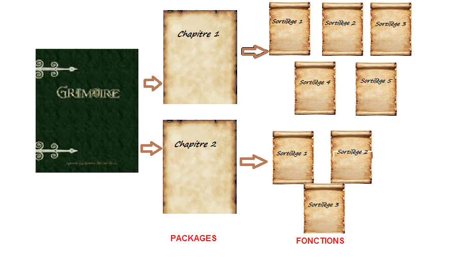
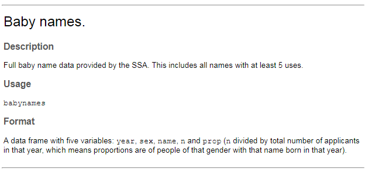
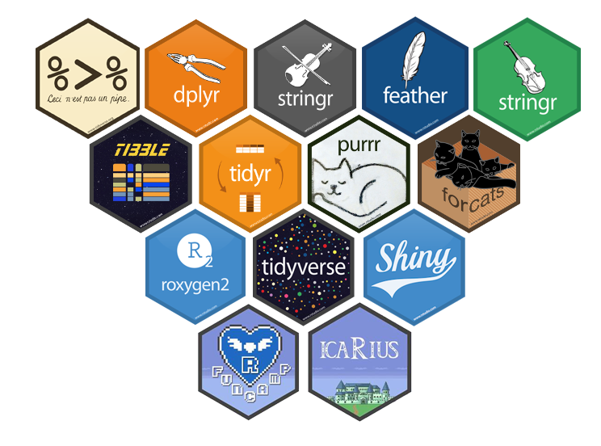

```{r setup, include=FALSE}
library(learnr)
library(knitr)
library(dplyr)
knitr::opts_chunk$set(echo = TRUE)
options(width = 700) # size de la sortie, ~comme la size de la console

options(repos=structure(c(CRAN="https://cran.r-project.org")))
```

```{css, echo=FALSE}

/* console : largeur */
pre code, pre, code {
  white-space: pre !important;
  /* width: 500% !important; */ /* si l'on souhaite que la console de résultats soit plus grande */
}

```


```{r prepare-data}
if (!require(babynames)) {
  install.packages("babynames")
}
unloadNamespace("babynames")
```

```{r prepare-data_2}
if (!require(babynames)) {
  install.packages("babynames")
}
```

<BR>

## Rappels : les packages

<BR>

#### Ecrire de nouvelles pages pour IGoR

<BR>

Le grimoire IGoR comprend les principaux sortilèges du langage des Runes. Mais il peut s'enrichir de nombreux pouvoirs, pour aider IcaRius dans sa quête. De la même façon, le logiciel R contient, dans son installation initiale, le cœur du programme ainsi qu’un ensemble de fonctions de base, mais il peut lui-aussi s'enrichir.

R étant un logiciel libre, il bénéficie d’une forte communauté d’utilisateurs qui peuvent librement contribuer au développement du logiciel en lui ajoutant des fonctionnalités supplémentaires. Ces contributions prennent la forme d’extensions, que l'on appelle `packages` en anglais.

Ajouter une extension à R, c'est comme ajouter un nouveau chapitre dans votre grimoire IGoR. Et ce chapitre comprend plusieurs sortilèges, c'est-à-dire des `fonctions` complémentaires, qui vous simplifieront la vie dans votre quête statistique.


```{r image1, echo=FALSE, fig.cap="", out.width = '90%'}

```


><details><summary><font size="3">Pour les plus téméraires : cliquez ici</font></summary>
><p><font size="2">
>
>Il existe un très grand nombre d’extensions (plus de 10 000 à ce jour), qui sont diffusées par un réseau baptisé CRAN (Comprehensive R Archive Network). La liste de toutes les extensions disponibles sur CRAN est disponible ici : http://cran.r-project.org/web/packages/.
>
>Pour faciliter un peu le repérage des extensions, il existe un ensemble de regroupements thématiques (économétrie, finance, génétique, données spatiales…) baptisés Task views : http://cran.r-project.org/web/views/. On y trouve notamment une Task view dédiée aux sciences sociales, listant de nombreuses extensions potentiellement utiles pour les analyses statistiques dans ce champ disciplinaire : http://cran.r-project.org/web/views/SocialSciences.html.
>
>On peut aussi citer le site Awesome R (https://github.com/qinwf/awesome-R) qui fournit une liste d’extensions choisies et triées par thématique.
>
></font></p></details>


<BR>

#### Installons notre premier package

<BR>

Un package apporte donc de nouvelles fonctionnalités dans R. Le plus souvent, il s'agit de nouvelles capacités de traitement, c'est-à-dire des fonctions pour faire des calculs, des graphiques, etc. Les packages peuvent aussi comprendre des jeux de données. Nous allons par exemple installer le package `babynames` qui permet de charger directement dans R les données sur les prénoms des enfants nés aux Etats-Unis depuis... 1900 ! 

L’installation d’une extension se fait par la fonction `install.packages()`, à qui on fournit le nom du package. L'opération `install.packages()` se fait une seule fois pour un package donné : ensuite, il reste installé de façon pérenne sur votre poste de travail. Pour installer un package, il faut donc connaître son "nom" - ici, c'est `babynames`. Attention à bien retranscrire ce nom en respectant la casse (si le nom comporte une majuscule). 

```{r, echo=TRUE, eval=FALSE}
install.packages("babynames")
```
```{r, echo=FALSE, eval=TRUE}
install.packages("babynames")
```


Dans le fonctionnement de R, tous les packages téléchargés sont rangés en réserve. Le moment venu, il faut ensuite indiquer à R que vous souhaitez effectivement utiliser ce package : comme d'ouvrir un grimoire à une page précise pour lancer un sort. Il suffit de préciser l'instruction `library()` avec le nom du package, donc ici `library(babynames)`. Habituellement, cette indication est donnée en début de programme R, mais il est possible de l'indiquer à l'endroit de votre choix, du moment que le chargement du package précéde les lignes de code qui en utilisent les fonctionnalités.

C'est parti, chargeons `babynames` :

```{r, collapse = TRUE, eval=FALSE}
# Charger le package et les fonctions qu'il contient en mémoire 
# à faire à chaque fois, lors de l'ouverture d'une nouvelle session R
library(babynames)
```

Une astuce : pour installer un package, il faut entourer le nom du package par des guillemets, alors qu'il faut les enlever pour l'activer dans un programme

```{r, collapse = TRUE, eval=FALSE}
install.packages("babynames")
library(babynames)
```

La fonction `help()`avec le nom du package permet d'accéder à la documentation.

```{r, collapse = TRUE, eval=FALSE}
help(babynames)
```

Vous accédérez à une page de renseignement, du type :
<br>

<br>
Bon, les packages sont documentés en anglais - mais la communauté francophone est très présente, et vous trouverez aisément de l'aide sur internet, en complément de l'appui proposé au sein de l'Insee et des Services statistiques ministériels : nous en parlerons à la fin de l'aventure d'icaRius. Le package babynames regroupe donc, dans un fichier également nommé `babynames`, les données des prénoms données par la *Social Security Administration (SSA)* - l'équivalent de la sécurité sociale aux Etats-Unis. Il y a cinq variables, `year` (année), `sex` (genre), `name` (prénom), `n` (nombre de naissances) et `prop` (proportion dans la population née cette année). D'ailleurs, vous pouvez le vérifier avec vos connaissances en R :

```{r, collapse = TRUE}
library(babynames)
head(babynames,5)
```

Laissons de côté les prénoms américains : ce n'est pas l'objet de ce chapitre que d'explorer les prénoms, et si le sujet vous intéresse vraiment, regarder plutôt du côté du [fichier des prénoms](https://www.insee.fr/fr/statistiques/2540004 "fichier des prénoms") en France diffusé par l'Insee :-)


><details><summary><font size="3">Pour les plus téméraires : cliquez ici</font></summary>
><p><font size="2">
>
>Les données du fichier des prénoms produits par l'Insee sont également diffusées dans un package R (une initiative de quelques esprits mutins...). Mais son installation nécessite de s'aventurer dans un autre environnement que le CRAN...
>
>Certains packages en cours de développement sont en effet disponibles sur d'autres plateformes que le CRAN, comme par exemple la plateforme GitHub. Cette dernière est ce que l'on appelle une *forge logicielle* : une sorte de fabrique pour créer des applications. L'installation des packages proposés sur Github se fait en trois temps : (i) il faut d'abord installer une extension pensée pour les développeurs (pour le coup proposée depuis le CRAN) avec `install.packages("devtools")` (ii) il faut identifier sur Github quel est le répertoire correspondant au package que vous souhaitez installer. Justement, pour le fichier des prénoms, c'est `"ThinkR-open/prenoms"` (iii) enfin, l'installation se fait avec la fonction `install_github()` suivie du nom du répertoire.
>
>```{r, collapse = TRUE, eval=FALSE}
># J'installe d'abord la boite à outil devtools
>install.packages("devtools")
># J'active cette extension
>library(devtools)
># J'utilise la fonction install_github()
>install_github("ThinkR-open/prenoms")
>```
></font></p></details>


<BR>

#### Le "tidyverse"

<BR>

Parmi les nombreux chapitres de sortilèges que vous pourriez ajouter au grimoire IGoR, attardons-nous sur certains d'entre eux... Dans le langage des runes, il existe un ensemble de sortilèges un peu particuliers qui constituent le `tidyverse`. Il s'agit de plusieurs packages conçus pour bien fonctionner ensemble et apportant des pouvoirs drôlement efficaces pour le héros statisticien. Le terme tidyverse est une contraction de *tidy* (qu’on pourrait traduire par “bien rangé”) et de *universe* (un univers cohérent). Le tidyverse couvre un grand nombre d’opérations courantes dans R :

- visualisation
- manipulation des tableaux de données
- import/export de données
- manipulation de variables
- (...)

Pour certaines tâches, il peut exister plusieurs solutions différentes pour les réaliser. Dans la mesure où il n’est pas possible d’être exhaustif, nous avons fait le choix dans l'aventure d'icaRius de retenir en priorité les sortilèges du tidyverse. 

**D'ailleurs, vous avez déjà utilisé des sortilèges du tidyverse, sans le savoir !**. Ainsi, le pipe %>% vient du tidyverse. De même, les sortilèges `ggformula` pour la réalisation de graphiques sont une composante du tidyverse !

Plutôt que d'installer un à un tous les packages de la constellation tidyverse, une extension éponyme permet en une ligne d'ajouter dans votre grimoire IGoR tous ces nouveaux sortilèges. Prenez votre plume :

```{r, collapse = TRUE, eval=FALSE}
# J'installe les packages du tidyverse en une ligne
install.packages("tidyverse")
# Je charge les packages en une ligne
library(tidyverse)
```

Vous voilà désormais en capacité d'invoquer les extensions du tidyverse, ou d'autres packages R encore ! Voici une illustration d'une sélection de ressources que vous pourriez d'ailleurs croiser dans votre apprentissage R, au cours du Funcamp ou plus tard (avec quelques intrus - saurez-vous les retrouver ?).
<br>


<br>


De quoi acquérir une force statistique herculéenne ! Nous verrons d'ailleurs comment icaRius soulève les obstacles rencontrés, maintenant qu'ils deviennent légers comme une plume...

<BR>

Mais auparavant, regardons comment avec du code R on peut obtenir des informations sur les packages en mémoire ou sur les extensions installées.

<BR>

## Gérer les packages qui sont en mémoire

<BR>

Avec du code R, on peut manier les extensions chargées en mémoire.

<BR>

#### Afficher la liste des packages chargés

<BR>

Il est possible d'avoir la liste des extensions en mémoire, avec le sortilège `.packages()` .

<BR>
```{r, echo = TRUE, eval=TRUE}
# J'affiche la liste des packages qui sont chargés en mémoire
(.packages()) # une écriture particulière
```

<BR>

#### Supprimer un package de la mémoire

<BR>

Si une extension a été chargée, il est possible de la supprimer de la mémoire avec le sortilège `unloadNamespace()`.

<BR>

```{r, echo = TRUE, eval=TRUE}
# Le package "babynames" a été chargé.
# Je le supprime de la mémoire.
unloadNamespace("babynames")
```

<BR>

#### Trouver dans quel package chargé se trouve tel sortilège

<BR>

Il est possible de trouver dans quelle extension en mémoire se trouve tel sortilège, avec la fonction `find()`.

<BR>

```{r, echo = TRUE, eval=TRUE}
# Je souhaite savoir dans quel package chargé se trouve le sortilège "select"
find("select")
```

<BR>

<span style="color:#18AC3E;font-size:16px">**A vous de pratiquer**</span>

<BR>

```{r ok-chapitre8-etape1,exercise=TRUE, exercise.setup = "prepare-data", echo=TRUE, message=FALSE, warning=FALSE} 
# Afficher la liste des packages chargés en mémoire
# avec "(.packages())"


# Charger en mémoire l'extension "babynames",
# puis ré-obtenir la liste des packages chargés


# Supprimer l'extension "babynames" de la mémoire,
# et ré-afficher la liste


# Trouver dans quel package chargé se trouve le sortilège "mutate",
# avec la fonction "find()"


# Fin de l'exercice
``` 

```{r ok-chapitre8-etape1-solution}
# Afficher la liste des packages chargés en mémoire
# avec "(.packages())"
(.packages())

# Charger en mémoire l'extension "babynames",
# puis ré-obtenir la liste des packages chargés
library(babynames)
(.packages())

# Supprimer l'extension "babynames" de la mémoire,
# et ré-afficher la liste des packages
unloadNamespace("babynames")
(.packages())

# Trouver dans quel package chargé se trouve le sortilège "mutate",
# avec la fonction "find()"
find("mutate")

# Fin de l'exercice
``` 

<BR>

## Manier les packages qui sont installés

<BR>

Avec du code R, on peut manipuler les extensions qui sont installées.

<BR>

#### Tester si une extension est installée

<BR>

Il est possible de tester si un package est installé, avec le sortilège `require()` .

<BR>
```{r, echo = TRUE, eval=TRUE, message=FALSE, warning=FALSE}
# Je teste si l'extension "babynames" est installée.
# J'utilise le sortilège "require()".
require(babynames) %>%
  print() # "print()" est nécessaire pour afficher la valeur de "require()"
```

<BR>

#### Récupérer la version d'un package installé

<BR>

Il est possible d'obtenir la version d'une extension installée, avec le sortilège `packageVersion()` .

<BR>
```{r, echo = TRUE, eval=TRUE}
# J'accède à la version du package "babynames"
packageVersion("babynames")
```
La version installée de l'extension "babynames" est `r packageVersion("babynames")` .

<BR>

#### Disposer de la liste des extensions installées

<BR>

On peut accéder à la liste des packages installés, avec le sortilège `library()` .

<BR>

```{r, echo = TRUE, eval=FALSE}
# J'accède à la liste des extensions installées, avec le sortilège "library()".
library() # (Il faut ici utiliser la fonction "library()" sans ingrédient)
```

```{r, echo = FALSE, eval=TRUE, attr.output='style="max-height: 200px;"'}
liste_packages_installes <- library()
liste_packages_installes[[2]]
```

<BR>

Si l'on souhaite une liste avec plus d'informations, on peut utiliser le sortilège `installed.packages()` . 

<BR>

```{r, echo = TRUE, eval=TRUE}
# Je souhaite obtenir une liste des packages installés 
# avec plus d'informations que la liste obtenue avec "library()".
# J'utilise la fonction "installed.packages()"
installed.packages() %>%
  head(10) # je souhaite n'afficher que les 10 premiers packages
```

<BR>

#### Désinstaller un package

<BR>

On peut désinstaller une extension, avec le sortilège `remove.packages()` .

<BR>
```{r, echo = TRUE, eval=FALSE}
# Je souhaite désinstaller le package "babynames".

# Je commence par le supprimer de la mémoire (s'il est chargé)
unloadNamespace("babynames")

# Puis je le désinstalle
remove.packages("babynames")
```

<BR>

<span style="color:#18AC3E;font-size:16px">**A vous de prendre la plume**</span>

<BR>

Nous vous proposons ci-dessous de manier les packages installés.

<BR>

```{r ok-chapitre8-etape2,exercise=TRUE, exercise.setup = "prepare-data_2", exercise.timelimit=100, echo=TRUE, message=FALSE, warning=FALSE}
# Tester si l'extension "babynames" est installée, avec le sortilège "require()"


# Désinstaller la package "babynames" :
# employer le sortilège "unloadNamespace()" pour le supprimer de la mémoire (s'il est chargé),
# puis la fonction "remove.packages()" pour le désinstaller.
# Tester que l'extension n'est plus installée.


# Ré-installer le package "babynames" avec le sortilège "install.packages()",
# et tester que l'extension est bien installée


# Afficher la liste des packages installés.
# Utiliser le sortilège "installed.packages()", pour obtenir une liste
# d'informations assez complète.
# Limiter à 10 le nombre de résultats avec le sortilège "head()".


# Fin de l'exercice
``` 

```{r ok-chapitre8-etape2-solution}
# Tester si l'extension "babynames" est installée, avec le sortilège "require()"
require(babynames) %>%
  print()

# Désinstaller la package "babynames" :
# employer le sortilège "unloadNamespace()" pour le supprimer de la mémoire (s'il est chargé),
# puis la fonction "remove.packages()" pour le désinstaller.
# Tester que l'extension n'est plus installée.
unloadNamespace("babynames")
remove.packages("babynames")
require(babynames) %>%
  print()

# Ré-installer le package "babynames" avec le sortilège "install.packages()",
# et tester que l'extension est bien installée
install.packages("babynames")
require(babynames) %>%
  print()

# Afficher la liste des packages installés.
# Utiliser le sortilège "installed.packages()", pour obtenir une liste
# d'informations assez complète.
# Limiter à 10 le nombre de résultats avec le sortilège "head()".
installed.packages() %>%
  head(10)

# Fin de l'exercice
``` 

<BR>

<BR>


**Fin du chapitre >> reprenez la partie d'Icarius !!!** 

*Version 0.9.3*
