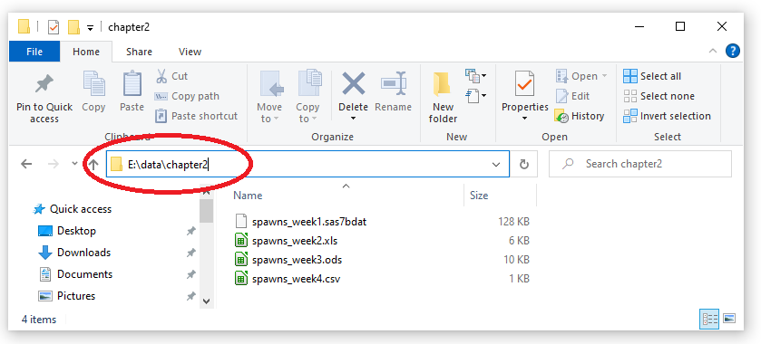
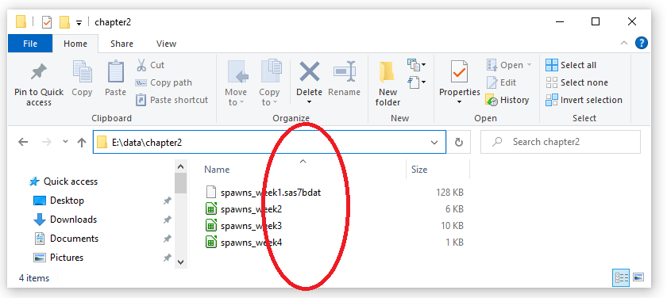
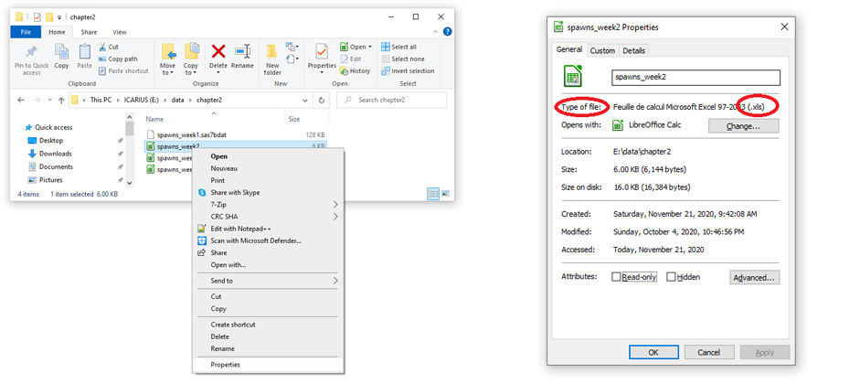
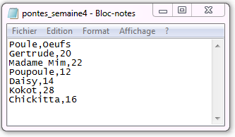

```{r setup, include=FALSE}
library(rio)
library(learnr)
library(knitr)
knitr::opts_chunk$set(echo = TRUE)

file.copy(from = system.file(package = "funcampR","data","chapitre2/pontes_semaine1.sas7bdat"),
          to = "pontes_semaine1.sas7bdat")
file.copy(from = system.file(package = "funcampR","data","chapitre2/pontes_semaine2.xls"),
          to = "pontes_semaine2.xls")
file.copy(from = system.file(package = "funcampR","data","chapitre2/pontes_semaine3.ods"),
          to = "pontes_semaine3.ods")
file.copy(from = system.file(package = "funcampR","data","chapitre2/pontes_semaine4.csv"),
          to = "pontes_semaine4.csv")
          
```


You have just met the farmer in Kokoro village : she is desperate to have lost the egg-laying book in which, every day, she conscientiously notes the number of eggs.

Let's help IcaRius rebuild the egg-laying book. The latter is not entirely lost: a copy has been broken up into several fragments by the dreaded wizard SaSSoS! Furthermore, each fragment has been bewitched and seems indecipherable ... They are indeed each in strange formats: SAS, Excel, Calc...

**Ouch !!!**

## A SAS user knows how to SAS... on R?

Let's start with the bewitched fragment in SAS format - which may bring back some memories to the oldest (and wisest?) statisticians of us. We are therefore going to learn how to read a SAS file... in R!

Content of this file - which can only be understood by the baleful SaSSoS - is as follows:


To load a file, we use a spell provided for this purpose in R. In the Runes' language, a spell is identified by **its name followed by parentheses**: `spellname()`. We will explain more about this in next chapters.

For then, let's discover a first spell, called `import()`, which allows, as its name suggests, to *import* a file into R. To use `import()`, an ingredient has to be specified: the location of the file to read.

```{r, collapse = TRUE, eval = FALSE}
# I import the file
import("file_path")
```

Let's tidy up what you are importing in R. For that, assign the content of the imported file to a new object in R, by choosing cleverly the name of this object. For example, let's call `egglaying_book_1` the new object that will hold information in R, from the SAS file.

```{r, collapse = TRUE, eval = FALSE}
# I import the file and assign it to the egglaying_book_1 object
egglaying_book_1 <- import ("file_path")
```
In this way, by calling the `egglaying_book_1` object in R console, it is easy to explore its content. In our case:

```{r, echo = FALSE}
egglaying_book_1 <- import("spawns_week1.sas7bdat")
```

```{r, collapse = FALSE}
# I display the content of the egglaying_book_1 object
egglaying_book_1
```

Here it is : it's already over for the first file! The latter gives the number of eggs per hen for a full week. It contains two types of information: the name of the hen (`Hen` column) and the number of eggs laid (`Eggs` column). There are 6 observations, one per hen. For example, Tarty hen laid 26 eggs - by the way, she is the best layer of the week!

Let's pratice now ! First, you must find the location of the file to be read. If you have launched this tutorial from local content on your workstation, files can be found in local directory you create when downloading the FuncampR ressources. It is the case for instance if you use a FuncampR USB Key. So let's find the location from the explorer in Windows environment (note that it will be different if you are reading tutorials online, see below).



<p style = "border: 1px; border-style: solid; border-color: # 000000; padding: 1em;">
**Warning:** to specify the file path, you will have to juggle with the cabalistic sign `/` and `\` (this is not called the Runes language for nothing). Unlike Windows where the backslash `\` is used to specify a path, in R you must write it with a slash `/`. Remember to change directory path when copying and pasting it from the explorer. Finally, don't forget to add the name of the file (`egglaying_book_1`) with its extension (`.sas7bdat`) at the end.
</p>


In the example above, the correct address for spawning file is `E:/data/chapter2/pontes_semaine1.sas7bdat`. **Please note, in your case, the first letter may be different and depends on your workstation (letter D, E, F ...)**. Having taken care to check the letter corresponding to the one assigned for your USB key or local directory, load the file in an object named `egglaying_book_1`

```{r ok-chapter2-step1, exercise = TRUE}
# Load the file spawns_week1.sas7bdat by indicating its path
# and assign the result to the object named egglaying_book_1


# Display the content of the egglaying_book_1 object

```

<div id = "ok-chapter2-step1-hint">
**Help 1:** Use the `import()` function. Be sure to indicate the correct path in parentheses.
</div>

## Tremble, Spreadsheets Sirs


Okay, we still have to open other fragments. Two of them are files produced by spreadsheets, such as Excel (`.xls` or` xlsx` extensions) and Calc (`.ods` extension). To open them... we simply use the same spell as before - the `import()` spell also allows opening spreadsheet documents! So nice and so magical!

As previously, we must specify the file path, and be sure to enter its extension (which appears after the `.`). Tips: in Windows Explorer, file extension is sometimes hidden. Hum... how can we discover file extensions for `spawns_week2`,`spawns_week3` and `spawns_week4` in example below?



In Windows Explorer, right-click on the filename you want to view (for example `spawns_week2`) then choose in the drop-down list `Properties`. A tab will appear, giving the filetype and its extension (here, `.xls`).




We have two files from spreadsheets:

- `spawns_week2.xls` (Excel)
- `spawns_week3.ods` (Calc)

Let's import Excel file `spawns_week2.xls` into R

```{r, echo = FALSE, message = FALSE}
book_account_2 <- import("spawns_week2.xls")
```

```{r, eval = FALSE}
# I load spawns_week2.xls with its path
egglaying_book_2 <- import("E:/data/chapter2/spawns_week2.xls")
```

```{r}
# I display contents of the egglaying_book_2 object
egglaying_book_2
```

Well: each week, Tarty hen wins the feathers high on the laying side... Would it be the best layer on the farm?

## It's your turn to practice

To open the calc file `spawns_week3.ods`, the same procedure is to be applied : use the `import()` spell, indicating the filepath to open. It's your turn !


```{r ok-chapter2-question2, exercise = TRUE}
# Load the file spawns_week3.ods by indicating its path
# and assign the result to the egglaying_book_3 object


# Display the content of the egglaying_book_3 object


# Find in the table which hen is the best layer of the week.
```

```{r ok-chapter2-question2-solution}
# Load the file spawns_week3.ods by indicating its path
# and assign the result to the egglaying_book_3 object
egglaying_book_3 <- import("E:/data/chapter2/spawns_week2.ods")

# Display the content of the egglaying_book_3 object
egglaying_book_3

# Find in the table which hen is the best layer of the week.
```


## Let's explore the file content

```{r, echo = FALSE}
egglaying_book_4 <- import("spawns_week4.csv")
```

Now that we know how to load a file, let's learn the basic spells to describe file contents, like variable names and number of observations (of lines). And even display an extract of the file (rather than the whole).

We will apply these spells on the 4th week egg-laying book: the latter is already loaded, under the name `egglaying_book_4`.

<span style = "color: # 18AC3E; font-size: 16px"> **Displaying variable names** </span>

The `names()` function is used to find out the different variables included in a file, or in other words to show column names in the data table:

```{r, collapse = TRUE}
# Display variable names
names(egglaying_book_4)
```

<span style = "color: # 18AC3E; font-size: 16px"> **Display number of observations** </span>

How many observations - how many lines - are included within the file ? Basically, we want to know the **n**umber of **rows**, which ends up using... the `nrow()` spell !

```{r, collapse = TRUE}
# Display the number of lines (number of observations)
nrow(egglaying_book_4)
```

There are 6 records in the register (6 rows in the data table).

<span style = "color: # 18AC3E; font-size: 16px"> **Display first lines of a file** </span>

To display the first lines of a file, use the `head()` spell, which requires two parameters: the name of the file, and the number of lines to display. For example, for `egglaying_book_4` and the first 3 lines:

```{r, collapse = TRUE}
# Display of three first lines of the file
head(egglaying_book_4,3)
``` 

You will notice that here the head() spell was used with two parameters, separated by a comma.

You can change the number of lines to display, and choose to view the first 6 lines (here, it means the whole file).

```{r, collapse = TRUE}
# Display of the six first lines of the file
head(egglaying_book_4,6)
```

## Back to eggs ...

We now have the magical power to load files from different formats into R, and to know their content. The few examples here are far from being exhaustive: with `import()`, you could also load SPSS, Stata, Matlab files ... and of course, R data files. We will find out later in the spell-book how R saves objects you have created. But for now, let's get back to the egg-laying book.

> <details> <summary> <font size = "3"> <b> For the dauntless: optional part on CSV files - click here </b> </font> </summary>
> <p> <font size = "2">
>
> The egg laying book of the 4th week comes from a fragment that ends with the `.csv` extension. So what is a CSV file?
>
> CSV is a file format where each record appears on its own line and whose fields are separated by a single character called a “separator”. In the case of a csv file, the separator is a comma or a semicolon: this is the meaning of the acronym CSV, for Comma Separated Value.
>
> A CSV file can be produced in multiple ways, and has the advantage of being "interoperable", ie it can be read and modified both with a spreadsheet such as Excel or Calc and with statistical softwares like R. You can even create a CSV file "by hand", just with the Notepad in Windows for example.
>
>
>
> Previously, this fragment was already "loaded" in the chapter with the name `egglaying_book_4`. But you can do this by yourself. How could you load this csv file into R ? Yes: always with the same `import()` spell! You know how to proceed: it's up to you to load the file `spawns_week4.csv` in the R console and save it in the object named `egglaying_book_4`.
>
> ```{r module2-question3, exercise = TRUE}
# Load the file spawns_week4.csv by giving its path


# Display the content of the egglaying_book_4 object


# It's over !
```
>
> </font> </p> </details>


Opening these various fragments, we helped the farmer in recomposing the whole book. Here is the final task : who is the best laying hen ? The one who, every week, comes out on top of the laying results. If you have followed this tutorial correctly, a chicken name should come to mind ...


`` '{r ok-chapter2-quiz1, echo = FALSE}
question ("So, who is the best laying hen? Tick the correct answer ... to continue the adventure!",
type = "single",
allow_retry = TRUE,
incorrect = "Retry",
answer ("Doodle Doo"),
answer ("Lady Kluck"),
answer ("Tarty", correct = TRUE),
correct = "Congratulations, you've put together parts of the egg-laying book and found the best laying hen. Fill in the answer Tarty (with a capital T) in the game to continue the adventure!"
)

`` ``

**Enter the name of the best laying hen in the game Icarius** to resume icaRius game ...

**End of chapter 2**

*(chapter version: 0.9.2)*
