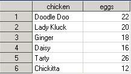

```{r setup, include=FALSE}
library(rio)
library(learnr)
library(knitr)
knitr::opts_chunk$set(echo = TRUE)

file.copy(from = system.file(package = "funcampR","data","chapitre2/pontes_semaine1.sas7bdat"),
          to = "pontes_semaine1.sas7bdat")
file.copy(from = system.file(package = "funcampR","data","chapitre2/pontes_semaine2.xls"),
          to = "pontes_semaine2.xls")
file.copy(from = system.file(package = "funcampR","data","chapitre2/pontes_semaine3.ods"),
          to = "pontes_semaine3.ods")
file.copy(from = system.file(package = "funcampR","data","chapitre2/pontes_semaine4.csv"),
          to = "pontes_semaine4.csv")
          
```


You have just met the farmer in Kokoro village : she is desperate about having lost the egg-laying book in which, every day, she conscientiously notes the number of eggs.

Let's help IcaRius rebuild the egg-laying book. The latter is not entirely lost: a copy has been broken up into several fragments by the dreaded wizard SaSSoS! Furthermore, each fragment has been bewitched and seems indecipherable ... They are indeed each in strange formats: SAS, Excel, Calc...

**Ouch !!!**

## A SAS user knows how to SAS... on R?

Let's start with the bewitched fragment in SAS format - which may bring back some memories to the oldest (and wisest?) statisticians of us. We are therefore going to learn how to read a SAS file... in R!

Content of this file - which can only be understood by the baleful SaSSoS - is as follows:



To load a file, we use a spell provided for this purpose in R. In the Runes' language, a spell is identified by **its name followed by parentheses**: `spellname()`. We will explain more about this in next chapters.

For then, let's discover a first spell, called `import()`, which allows, as its name suggests, to *import* a file into R. To use `import()`, an ingredient has to be specified: the location of the file to read.

`` '{r, collapse = TRUE, eval = FALSE}
# I import the file
import("file_path")
`` ``

Let's tidy up what you are importing in R. For that, assign the content of the imported file to a new object in R, by choosing cleverly the name of this object. For example, let's call `egglaying_book_1` the new object that will hold in R information read from the SAS file.

`` '{r, collapse = TRUE, eval = FALSE}
# I import the file and assign it to the egglaying_book_1 object
egglaying_book_1 <- import ("file_path")
`` ``
In this way, by calling the `egglaying_book_1` object in R console, it is easy to explore its content. In our case:

`` '{r, echo = FALSE}
egglaying_book_1 <- import("spawns_week1.sas7bdat")
`` ``

`` '{r, collapse = FALSE}
# I display the content of the egglaying_book_1 object
egglaying_book_1
`` ``

Here it is : it's already over for the first file! The latter gives the number of eggs per hen for a full week. It contains two types of information: the name of the hen (`Hen` column) and the number of eggs laid (`Eggs` column). There are 6 observations, one per hen. For example, Tarty hen laid 26 eggs - by the way, she is the best layer of the week!

Let's pratice now ! First, you must find the location of the file to be read. If you have launched this tutorial from local content on your workstation, files can be found in local directory you create when downloading the FuncampR ressources. It is the case for instance if you use a FuncampR USB Key. So let's find the location from the explorer in windows (note that it will be different if you are reading tutorials online, see below).


<p style = "border: 1px; border-style: solid; border-color: # 000000; padding: 1em;">
**Warning:** to specify the file path, you will have to juggle with the cabalistic signs `/` and `\` (this is not called the Runes language for nothing). Unlike Windows where the backslash `\` is used to specify a path, in R you must write it with a slash `/`. Remember to change directory path when copying and pasting it from the explorer. Finally, don't forget to add the name of the file (`egglaying_book_1`) with its extension (`.sas7bdat`) at the end.
</p>


In the example above, the correct address for spawning file is `E:/data/chapter2/pontes_semaine1.sas7bdat`. **Please note, in your case, the first letter may be different and depends on your workstation (letter D, E, F ...)**. Having taken care to check the letter corresponding to the one assigned for your USB key or local directory, load the file in an object named `egglaying_book_1`

`` '{r ok-chapter2-step1, exercise = TRUE}
# Load the file spawns_week1.sas7bdat by indicating its path
# and assign the result to the object named egglaying_book_1


# Display the content of the egglaying_book_1 object

`` ``

<div id = "ok-chapter2-step1-hint">
**Help 1:** Use the `import()` function. Be sure to indicate the correct path in parentheses.
</div>

## Tremblez, messieurs les tableurs


Bon, il nous reste à ouvrir les autres fragments. Deux d'entre eux correspondent à des fichiers produits par des tableurs, comme Excel (extension `.xls` ou `xlsx`) et Calc (extension `.ods`). Pour les ouvrir... nous allons utiliser le même sortilège que précédemment. Et oui : le sortilège `import()` permet aussi d'ouvrir les documents des tableurs ! Magiques !

Comme précédemment, il nous faut spécifier le chemin du fichier, et bien veiller à renseigner son extension (ce qui figure après le `.`). Une astuce à ce sujet : dans l'explorateur Windows, l'extension d'un fichier est parfois masquée. Comment dans ce cas découvrir l'extension des fichiers `pontes_semaine2`, `pontes_semaine3` et `pontes_semaine4` dans l'exemple ci-dessous ? 


Dans l'explorateur Windows, vous pouvez faire un clic-droit sur le nom du fichier que vous souhaitez consulter (par exemple `pontes_semaine2`) puis choisir dans la liste déroulante `Propriétés`. Sur l'onglet qui apparaît, une ligne donne le type de fichier et précise l'extension (ici, `.xls`).


Nous avons donc deux fichiers issus de tableurs :

- `pontes_semaine2.xls` (Excel)
- `pontes_semaine3.ods` (Calc)

Importons dans R le fichier Excel `pontes_semaine2.xls`

```{r, echo=FALSE, message = FALSE}
livre_compte_2 <- import("pontes_semaine2.xls")
```

```{r, eval=FALSE}
# Je charge le fichier pontes_semaine2.xls en indiquant son chemin
livre_compte_2 <- import("E:/data/chapitre2/pontes_semaine2.xls")
```

```{r}
# J'affiche le contenu de l'objet livre_compte_2
livre_compte_2
```

Tiens tiens. Chaque semaine, la poule Kokot l'emporte haut les plumes côté pontes... Serait-ce la meilleure pondeuse de la ferme ?

## À vous de pratiquer

Pour ouvrir le fichier calc `pontes_semaine3.ods`, la marche à suivre est identique à celle vue précédemment : il vous faudra utiliser le sortilège `import()`, en indiquant le chemin du fichier à ouvrir. À vous de jouer !


```{r ok-chapitre2-question2,exercise=TRUE}
# Charger le fichier pontes_semaine3.ods en indiquant son chemin
# et assigner le résultat à l'objet nommé livre_compte_3


# Afficher le contenu de l'objet livre_compte_3


# Trouver dans le tableau quelle est la meilleure pondeuse de la semaine.
``` 

```{r ok-chapitre2-question2-solution}
# Charger le fichier pontes_semaine3.ods en indiquant son chemin
# et assigner le résultat à l'objet nommé livre_compte_3
livre_compte_3 <- import("E:/data/chapitre2/pontes_semaine3.ods")

# Afficher le contenu de l'objet livre_compte_3
livre_compte_3

# Trouver dans le tableau quelle est la meilleure pondeuse de la semaine.
```


##  Découvrons le contenu du fichier

```{r, echo=FALSE}
livre_compte_4 <- import("pontes_semaine4.csv")
```

Maintenant que vous savez charger un fichier, apprenons les sortilèges élémentaires pour décrire le contenu d'un fichier : les variables qu'il comporte, le nombre d'observations (de lignes) et l'affichage d'un extrait du fichier (plutôt que sa totalité). 

Nous allons découvrir ces sortilèges sur l'exemple du livre de compte pour la 4ème semaine : ce dernier est déjà chargé, sous le nom `livre_compte_4`.

<span style="color:#18AC3E;font-size:16px">**Affichage du nom des variables**</span> 

La fonction `names()` permet de connaître les différentes variables comprises dans un fichier, ou dit autrement de connaître le nom des colonnes du tableau de données : 

```{r, collapse = TRUE}
# Affichage du nom des variables
names(livre_compte_4) 
```

<span style="color:#18AC3E;font-size:16px">**Affichage du nombre de lignes**</span> 

Reste à savoir combien d'observations - combien de lignes - comprend un fichier. Mot à mot, nous voulons connaître le **n**ombre de lignes (**row** en anglais), d'où la fonction `nrow()`

```{r, collapse = TRUE}
# Affichage du nombre de lignes (nombre d'observations)
nrow(livre_compte_4) 
```

Il y a 6 enregistrements dans le registre (6 lignes dans le tableau de données).

<span style="color:#18AC3E;font-size:16px">**Affichage des premières lignes du fichier**</span> 

Pour afficher les premières lignes du fichier, nous allons utiliser la fonction `head()` (head = tête, début), en lui indiquant deux paramètres : le nom du fichier concerné, et le nombre de lignes à présenter. Par exemple, pour `livre_compte_4` et le choix des 3 premières lignes :

```{r, collapse = TRUE}
# Affichage des premières lignes contenues dans le fichier
head(livre_compte_4,3) 
```

Vous noterez qu'ici, le sortilège head() a été utilisé avec deux paramètres, séparés par une virgule.

On peut changer le nombre de lignes à afficher, et choisir de consulter les 6 premières lignes (ici, c'est donc la totalité du fichier).

```{r, collapse = TRUE}
# Affichage des premières lignes contenues dans le fichier
head(livre_compte_4,6) 
```

## Revenons à nos oeufs...

Nous avons maintenant le pouvoir de charger dans R des fichiers de différents formats, et d'en connaître les variables. Les quelques exemples ici sont loin d'être exhaustifs : avec `import()`, vous pourriez aussi charger des fichiers au format SPSS, Stata, Matlab... et bien sûr, des fichiers de données R. Nous découvrirons plus loin dans le grimoire comment R permet de sauvegarder les objets que vous avez créés. Mais pour lors, revenons au livre de compte.

><details><summary><font size="3"><b>Pour les plus téméraires : partie optionnelle sur les fichiers CSV - cliquez ici</b></font></summary>
><p><font size="2">
>
>Le livre des pontes pour la 4ème semaine vient d'un fragment qui se termine par l'extension `.csv`. Qu'est-ce donc qu'un fichier CSV ?
>
>CSV, c'est un format de fichier où chaque enregistrement apparaît sur sa propre ligne et dont les champs sont séparés par un caractère unique appelé “séparateur”. En l'occurrence, le séparateur est une virgule ou un point-virgule : c'est d'ailleurs le sens de l'acronyme CSV, pour Comma Separated Value (comma = virgule en anglais). 
>
>Un fichier CSV peut être produit de multiples manières, et a l'avantage d'être "interopérable", c'est à dire qu'il peut être lu et modifié aussi bien avec un tableur comme Excel ou Calc qu'avec des logiciels statistiques comme R. Vous pouvez même créer un fichier CSV "à la main", juste avec le Notepad dans Windows par exemple.
>
>
>
>Dans ce qui a précédé, ce fragment était déjà "chargé" dans le chapitre avec le nom `livre_compte_4`. Mais vous pouvez vous-mêmes réaliser cette opération. D'après-vous, comment allons-nous charger ce fichier csv dans R ? Eh oui: toujours avec le même sortilège `import()` ! Vous savez désormais comment procéder : à vous de charger le fichier `pontes_semaine4.csv` dans la console R, en la sauvegardant dans l'objet nommé `livre_compte_4` 
>
>```{r module2-question3,exercise=TRUE}
# Chargez le fichier pontes_semaine4.csv en indiquant son chemin


# Affichez le contenu de l'objet livre_compte_4


# C'est fini !
``` 
>
></font></p></details>


Nous avons ouverts différents fragments, ce qui répond aux attentes de la fermière. Il ne reste plus qu'à trouver quelle est la meilleure poule pondeuse. Celle qui, chaque semaine, sort en tête des résultats de ponte. Si vous avez bien suivi ce tutoriel, un nom de poule doit vous venir à l'esprit...


```{r ok-chapitre2-quiz1,echo=FALSE}
question("Alors, quelle est la meilleure poule pondeuse ? Ne reste plus qu'à cocher la bonne réponse...pour poursuivre l'aventure!",
type="single",
allow_retry = TRUE,
incorrect="Retente ta chance",
answer("Daisy"),
answer("Poupoule"),
answer("Kokot",correct=TRUE),
correct="Félicitations, vous avez reconstitué le livre de compte et trouvé la meilleure poule pondeuse. Renseignez la réponse Kokot (avec un K majuscule) dans le jeu pour continuer l'aventure !"
)

```   

Vous avez trouvé ? **Reportez le nom de la meilleure poule pondeuse dans le jeu Icarius** pour reprendre la partie...

**Fin du chapitre 2 >> reprenez la partie d'Icarius !!!**

*(version du chapitre : 0.9.2)*
